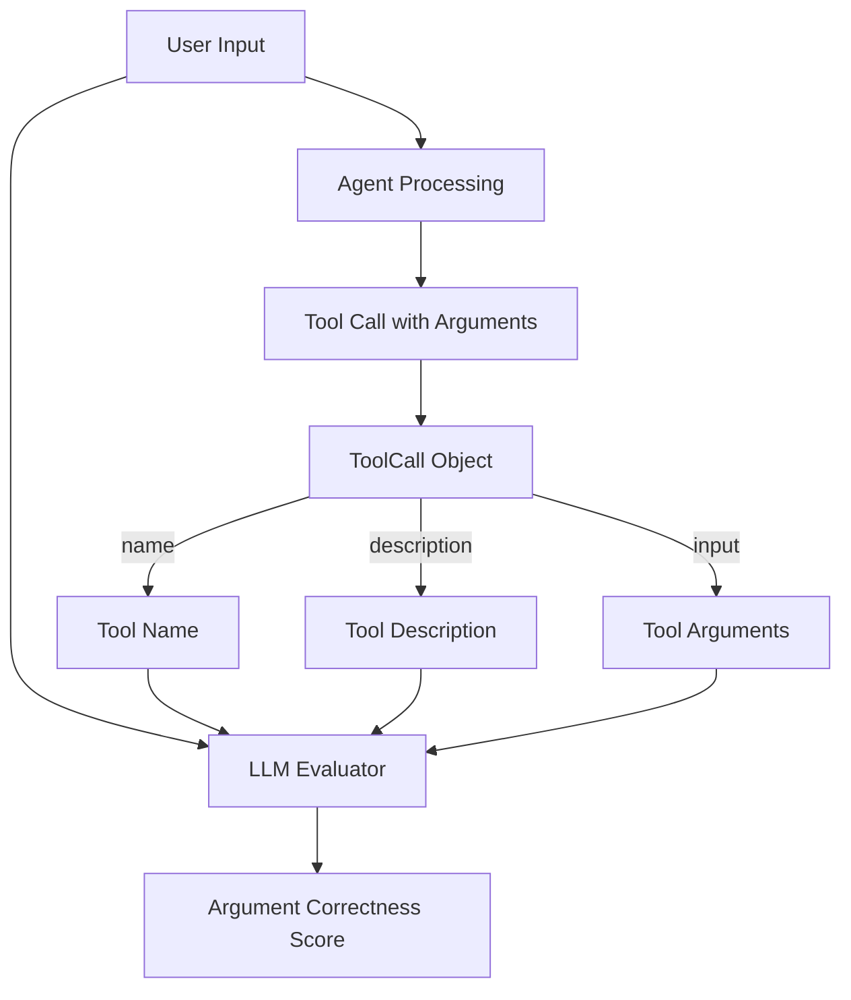
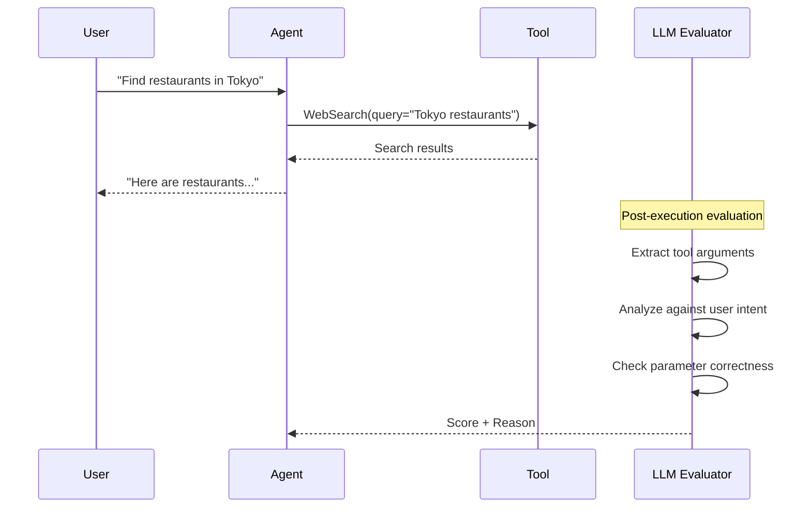

# Argument Correctness Metric

## 1. Definition & Purpose

### What It Measures

The **Argument Correctness** metric is an agentic LLM metric that evaluates whether your AI agent generates correct arguments (parameters) for the tools it calls. Unlike Tool Correctness which focuses on *which* tools are called, this metric focuses on *how* tools are called - specifically, whether the input parameters are appropriate for the given task.

### Why It Matters

Even when an agent selects the correct tool, providing wrong arguments can lead to:

- **Incorrect results**: Wrong search queries return irrelevant data
- **Failed operations**: Missing required parameters cause errors
- **Inefficient execution**: Suboptimal parameters require retry attempts
- **Security issues**: Malformed inputs may cause unexpected behavior

This metric ensures your agent not only picks the right tool but uses it correctly.

### When to Use This Metric

- **Tool usage validation**: Verify agents pass correct parameters
- **Query generation testing**: Ensure search/database tools receive appropriate queries
- **API call verification**: Validate parameter formatting for external APIs
- **Input sanitization**: Check that user inputs are correctly transformed
- **Multi-parameter tools**: Test complex tools with many arguments

## 2. Key Characteristics

| Property | Value |
|----------|-------|
| **Metric Type** | LLM-as-a-judge |
| **Evaluation Mode** | Referenceless |
| **Requires Tracing** | No |
| **Reference Required** | No |
| **Score Range** | 0.0 to 1.0 |

### Required Parameters

For `LLMTestCase`:

- `input`: The user's request/query
- `actual_output`: The agent's final response
- `tools_called`: List of `ToolCall` objects with their inputs

### Optional Parameters

| Parameter | Type | Default | Description |
|-----------|------|---------|-------------|
| `threshold` | float | 0.5 | Minimum score to pass evaluation |
| `include_reason` | bool | True | Include explanation for the score |
| `verbose_mode` | bool | False | Enable detailed logging |
| `model` | DeepEvalBaseLLM | Default model | LLM for evaluation |

## 3. Conceptual Visualization

### Evaluation Flow



### Argument Analysis Process



### Multi-Tool Argument Evaluation

```mermaid
graph LR
    subgraph "Tool Call 1"
        T1[WebSearch] --> A1[query: "Tokyo restaurants"]
        A1 --> E1{Correct for intent?}
    end
    
    subgraph "Tool Call 2"
        T2[BookingAPI] --> A2[city: "Tokyo", date: "2024-03"]
        A2 --> E2{Correct for intent?}
    end
    
    E1 --> |Score| Aggregate[Aggregate Scores]
    E2 --> |Score| Aggregate
    Aggregate --> Final[Final Score]
```

## 4. Measurement Formula

### Core Formula

```
Argument Correctness = Number of Correctly Generated Input Parameters / Total Number of Tool Calls
```

### Evaluation Criteria

For each tool call, the LLM evaluates:

1. **Relevance**: Are the arguments relevant to the user's input?
2. **Completeness**: Are all necessary parameters provided?
3. **Accuracy**: Are the parameter values correct?
4. **Format**: Are parameters in the expected format?

### Scoring per Tool Call

| Score | Meaning | Example |
|-------|---------|---------|
| 1.0 | Perfect arguments | Search for "Tokyo restaurants" when asked about Tokyo restaurants |
| 0.75 | Mostly correct | Correct query but wrong optional parameter |
| 0.5 | Partially correct | Some arguments right, some wrong |
| 0.25 | Mostly incorrect | Right format but wrong values |
| 0.0 | Incorrect | Completely wrong or missing arguments |

### Example Calculations

**Scenario 1: Correct Arguments**
```
Input: "When did Trump first raise tariffs?"
Tool: WebSearch(query="Trump first raised tariffs year")
Evaluation: Query directly addresses the user's question
Score: 1.0
```

**Scenario 2: Partially Correct**
```
Input: "Find cheap flights from NYC to London in March"
Tool: FlightSearch(origin="NYC", destination="London")
Evaluation: Missing date parameter, missing price filter
Score: 0.5
```

**Scenario 3: Incorrect Arguments**
```
Input: "What's the weather in Paris?"
Tool: WebSearch(query="best restaurants Paris")
Evaluation: Query doesn't match user intent
Score: 0.0
```

**Scenario 4: Multiple Tools**
```
Input: "Research Python programming and calculate 15% of 200"
Tools: 
  - WebSearch(query="Python programming tutorial") ✓ (1.0)
  - Calculator(operation="percentage", value=200, percent=15) ✓ (1.0)
Average Score: (1.0 + 1.0) / 2 = 1.0
```

## 5. Usage Patterns with PydanticAI

### Basic Usage

```python
from deepeval import evaluate
from deepeval.metrics import ArgumentCorrectnessMetric
from deepeval.test_case import LLMTestCase, ToolCall
from deepeval.models.llms import LocalModel
from settings import ProjectSettings

settings = ProjectSettings()

# Initialize evaluator model
model = LocalModel(
    model=settings.llm_model,
    api_key=settings.llm_api_key,
    base_url=settings.llm_base_url,
    temperature=settings.llm_temperature,
)

# Create metric
metric = ArgumentCorrectnessMetric(
    model=model,
    threshold=0.7,
    include_reason=True,
)

# Define test case with tool calls
test_case = LLMTestCase(
    input="When did Trump first raise tariffs?",
    actual_output="Trump first raised tariffs in 2018 during the U.S.-China trade war.",
    tools_called=[
        ToolCall(
            name="WebSearch Tool",
            description="Tool to search for information on the web.",
            input={"search_query": "Trump first raised tariffs year"},
        ),
        ToolCall(
            name="History FunFact Tool",
            description="Tool to provide a fun fact about the topic.",
            input={"topic": "Trump tariffs"},
        ),
    ],
)

# Evaluate
result = evaluate(test_cases=[test_case], metrics=[metric])
```

### With PydanticAI Agent

```python
from pydantic import BaseModel
from pydantic_ai import Agent

class SearchQuery(BaseModel):
    query: str
    max_results: int = 10

agent = Agent(
    model=model,
    system_prompt="You are a research assistant.",
)

@agent.tool
def web_search(query: SearchQuery) -> str:
    """Search the web for information."""
    return f"Results for: {query.query}"

@agent.tool
def database_query(table: str, conditions: dict) -> str:
    """Query the internal database."""
    return f"Data from {table}"

# Run agent
result = agent.run_sync("Find information about climate change effects")

# Extract tool calls for evaluation
tools_called = []
for call in result.tool_calls:
    tools_called.append(ToolCall(
        name=call.name,
        description=call.tool_description,
        input=call.args,
    ))

# Create test case
test_case = LLMTestCase(
    input="Find information about climate change effects",
    actual_output=result.data,
    tools_called=tools_called,
)

# Evaluate argument correctness
metric.measure(test_case)
print(f"Score: {metric.score}")
print(f"Reason: {metric.reason}")
```

### Testing Different Argument Scenarios

```python
# Test case: Correct arguments
correct_args_test = LLMTestCase(
    input="Search for Python tutorials",
    actual_output="Here are Python tutorials...",
    tools_called=[
        ToolCall(
            name="WebSearch",
            description="Search the web",
            input={"query": "Python programming tutorials"},
        ),
    ],
)

# Test case: Missing arguments
missing_args_test = LLMTestCase(
    input="Find flights from NYC to London on March 15",
    actual_output="Here are flights...",
    tools_called=[
        ToolCall(
            name="FlightSearch",
            description="Search for flights",
            input={"origin": "NYC", "destination": "London"},  # Missing date!
        ),
    ],
)

# Test case: Wrong arguments
wrong_args_test = LLMTestCase(
    input="What's the weather in Tokyo?",
    actual_output="The weather in Tokyo...",
    tools_called=[
        ToolCall(
            name="WeatherAPI",
            description="Get weather information",
            input={"city": "London"},  # Wrong city!
        ),
    ],
)

# Evaluate all test cases
for test_case in [correct_args_test, missing_args_test, wrong_args_test]:
    metric.measure(test_case)
    print(f"Input: {test_case.input}")
    print(f"Score: {metric.score}")
    print(f"Reason: {metric.reason}\n")
```

## 6. Best Practices & Tips

### Common Pitfalls

| Pitfall | Problem | Solution |
|---------|---------|----------|
| No tool description | LLM lacks context for evaluation | Always provide meaningful descriptions |
| Vague input parameters | Hard to evaluate correctness | Use structured parameter schemas |
| Missing input field | Can't evaluate arguments | Ensure `input` dict is populated |
| Complex nested objects | Difficult to evaluate | Flatten or simplify argument structures |

### Optimization Strategies

1. **Clear Tool Descriptions**: Help the evaluator understand expected arguments
2. **Typed Parameters**: Use Pydantic models for tool inputs
3. **Meaningful Parameter Names**: `search_query` instead of `q`
4. **Comprehensive Test Cases**: Cover edge cases and error scenarios

### Tool Definition Best Practices

```python
# Good: Clear description and meaningful parameter names
ToolCall(
    name="FlightSearch",
    description="Search for available flights between two airports on a specific date",
    input={
        "origin_airport": "JFK",
        "destination_airport": "LHR",
        "departure_date": "2024-03-15",
        "cabin_class": "economy"
    }
)

# Bad: Vague and unclear
ToolCall(
    name="search",
    description="search stuff",
    input={"q": "JFK LHR"}
)
```

### Debugging Low Scores

1. **Review the reason field**: Understand what went wrong
2. **Check parameter completeness**: Are all required args present?
3. **Verify parameter values**: Do values match user intent?
4. **Examine tool descriptions**: Is the purpose clear to the evaluator?

### When Arguments Matter Most

Argument correctness is especially critical for:

- **Database queries**: Wrong conditions return wrong data
- **API calls**: Invalid parameters cause failures
- **Search operations**: Poor queries yield irrelevant results
- **Financial operations**: Wrong amounts/accounts are catastrophic
- **User data operations**: Wrong IDs affect wrong users

## 7. API Reference

### ArgumentCorrectnessMetric

```python
from deepeval.metrics import ArgumentCorrectnessMetric

metric = ArgumentCorrectnessMetric(
    model=model,              # Required: LLM for evaluation
    threshold=0.5,            # Optional: Pass/fail threshold
    include_reason=True,      # Optional: Include explanation
    verbose_mode=False,       # Optional: Detailed logging
)
```

### ToolCall with Arguments

```python
from deepeval.test_case import ToolCall

tool_call = ToolCall(
    name="tool_name",                   # Required: Tool identifier
    description="What the tool does",   # Highly recommended for evaluation
    input={                             # Required: Tool arguments
        "param1": "value1",
        "param2": "value2",
    },
    output="Tool result",               # Optional: Tool output
)
```

## 8. Comparison with Related Metrics

| Metric | Focus | Evaluates |
|--------|-------|-----------|
| **Tool Correctness** | Which tools were called | Tool selection |
| **Argument Correctness** | How tools were called | Parameter values |
| **Task Completion** | Did the task succeed | End-to-end result |

### Using Both Metrics Together

```python
from deepeval.metrics import ToolCorrectnessMetric, ArgumentCorrectnessMetric

# Tool correctness: Did we call the right tool?
tool_metric = ToolCorrectnessMetric(model=model, threshold=0.7)

# Argument correctness: Did we call it correctly?
arg_metric = ArgumentCorrectnessMetric(model=model, threshold=0.7)

# Evaluate both aspects
evaluate(test_cases=[test_case], metrics=[tool_metric, arg_metric])
```

## 9. References

- [DeepEval Argument Correctness Documentation](https://deepeval.com/docs/metrics-argument-correctness)
- [PydanticAI Tools Documentation](https://ai.pydantic.dev/tools/)
- [Existing Implementation](../metrics/argument_correctness.py)
