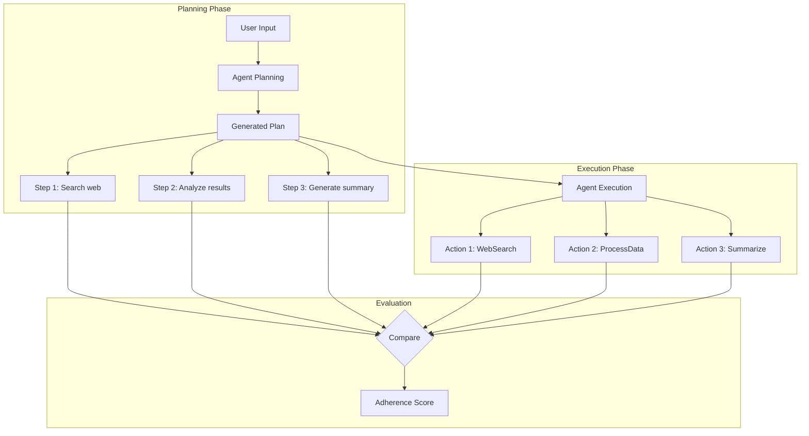
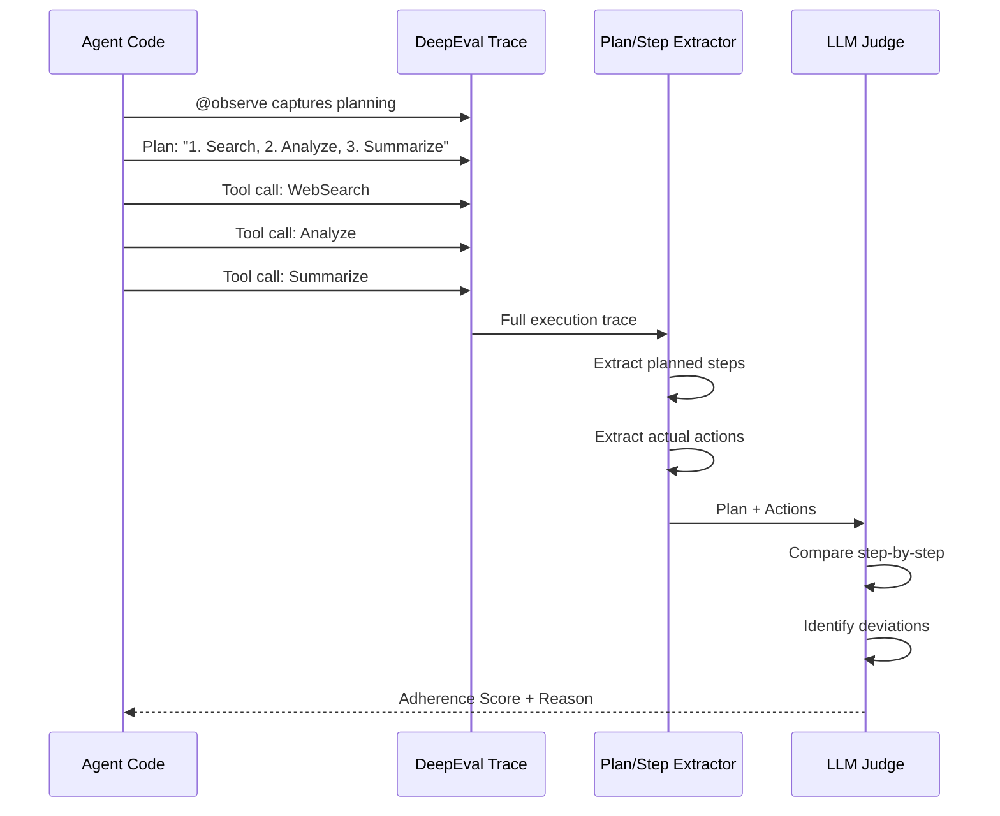
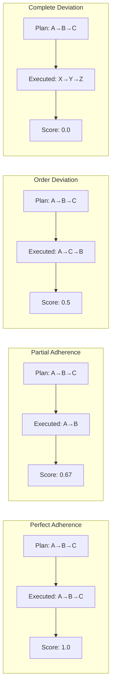

# Plan Adherence Metric

## 1. Definition & Purpose

### What It Measures

The **Plan Adherence** metric is an agentic LLM metric that evaluates whether your AI agent follows the plan it created during task execution. It extracts the agent's plan from the execution trace and measures how closely the actual execution steps align with that plan.

### Why It Matters

Many advanced agents employ explicit planning before execution. Plan adherence matters because:

- **Predictability**: Agents that follow their plans behave consistently
- **Debugging**: Deviations from plans indicate potential issues
- **Trust**: Users can rely on agents to do what they say they'll do
- **Quality assurance**: Ensures planning logic is being utilized
- **Alignment**: Verifies the agent's behavior matches its reasoning

### When to Use This Metric

- **Planning agents**: Agents that create explicit plans before acting
- **Multi-step workflows**: Complex tasks requiring coordinated execution
- **Auditable systems**: Environments requiring traceable decision-making
- **Agent development**: Debugging plan-then-execute architectures
- **Quality assurance**: Verifying planning modules are effective

## 2. Key Characteristics

| Property | Value |
|----------|-------|
| **Metric Type** | LLM-as-a-judge |
| **Evaluation Mode** | Trace-based |
| **Requires Tracing** | Yes (`@observe` decorator) |
| **Reference Required** | No (extracts plan from trace) |
| **Score Range** | 0.0 to 1.0 |

### Required Parameters

When using trace-based evaluation:

- `@observe` decorator on agent functions
- `update_current_trace()` with:
  - `input`: The user's request
  - `output`: The agent's final response
  - `tools_called`: List of tools invoked

The agent should generate an explicit plan as part of its execution, which will be extracted from the trace.

### Optional Parameters

| Parameter | Type | Default | Description |
|-----------|------|---------|-------------|
| `threshold` | float | 0.5 | Minimum score to pass evaluation |
| `include_reason` | bool | True | Include explanation for the score |
| `verbose_mode` | bool | False | Enable detailed logging |
| `model` | DeepEvalBaseLLM | Default model | LLM for evaluation |

## 3. Conceptual Visualization

### Plan vs Execution Flow



### Adherence Evaluation Process



### Adherence vs Deviation Scenarios



## 4. Measurement Formula

### Core Formula

```
Plan Adherence Score = AlignmentScore(Planned Steps, Executed Actions)
```

### Evaluation Criteria

1. **Plan Extraction**: Identify the plan from agent's trace/reasoning
2. **Step Matching**: Compare planned steps with executed actions
3. **Order Compliance**: Check if steps were executed in planned order
4. **Completeness**: Were all planned steps executed?
5. **Addition Detection**: Were unplanned steps added?

### Scoring Rubric

| Score | Meaning | Characteristics |
|-------|---------|-----------------|
| 1.0 | Perfect Adherence | All planned steps executed in order |
| 0.75 | Minor Deviations | Most steps followed, minor order changes |
| 0.5 | Partial Adherence | Some steps followed, some skipped/added |
| 0.25 | Significant Deviation | Major departures from plan |
| 0.0 | No Adherence | Execution doesn't follow plan at all |

### Example Calculations

**Scenario 1: Perfect Adherence**
```
Plan: 
  1. Search for restaurants
  2. Filter by rating
  3. Get details for top 3
  4. Format response

Execution:
  1. WebSearch("restaurants near me")
  2. FilterResults(min_rating=4.0)
  3. GetDetails(restaurant_ids=[1,2,3])
  4. FormatOutput()

Analysis: All planned steps executed in exact order
Score: 1.0
```

**Scenario 2: Partial Adherence (Skipped Step)**
```
Plan:
  1. Search for restaurants
  2. Filter by rating
  3. Get details
  4. Format response

Execution:
  1. WebSearch("restaurants")
  3. GetDetails(restaurant_ids=[1,2,3])
  4. FormatOutput()

Analysis: Step 2 (filter) was skipped
Score: 0.75
```

**Scenario 3: Order Deviation**
```
Plan:
  1. Get weather data
  2. Analyze patterns
  3. Generate forecast

Execution:
  2. AnalyzePatterns()  [executed before data!]
  1. GetWeatherData()
  3. GenerateForecast()

Analysis: Steps executed out of order
Score: 0.5
```

**Scenario 4: Added Steps**
```
Plan:
  1. Search for information
  2. Summarize results

Execution:
  1. SearchWeb("topic")
  X. ValidateResults()  [not in plan]
  X. CrossReference()   [not in plan]
  2. Summarize()

Analysis: Extra steps not in original plan
Score: 0.6 (may still be acceptable depending on context)
```

## 5. Usage Patterns with PydanticAI

### Basic Structure with Explicit Planning

```python
from deepeval.tracing import observe, update_current_trace
from deepeval.dataset import Golden, EvaluationDataset
from deepeval.metrics import PlanAdherenceMetric
from deepeval.test_case import ToolCall
from deepeval.models.llms import LocalModel
from pydantic_ai import Agent
from pydantic import BaseModel

# Define plan structure
class ExecutionPlan(BaseModel):
    steps: list[str]
    reasoning: str

# Initialize model
model = LocalModel(
    model="gpt-4o-mini",
    api_key="your-api-key",
)

# Create planning agent
planning_agent = Agent(
    model=model,
    system_prompt="""You are a planning assistant. 
    When given a task, first create an explicit plan with numbered steps.
    Then execute each step in order.""",
    result_type=ExecutionPlan,
)

@observe
def planning_agent_run(input: str) -> str:
    tools_called = []
    
    # Step 1: Generate plan
    plan_result = planning_agent.run_sync(f"Create a plan to: {input}")
    plan = plan_result.data
    
    # Step 2: Execute plan steps
    results = []
    for i, step in enumerate(plan.steps):
        result = execute_step(step)
        tools_called.append(ToolCall(
            name=f"ExecuteStep_{i+1}",
            description=step,
            input={"step": step},
        ))
        results.append(result)
    
    output = f"Plan executed. Results: {results}"
    
    # Update trace with plan and execution
    update_current_trace(
        input=input,
        output=output,
        tools_called=tools_called
    )
    
    return output

# Create metric
metric = PlanAdherenceMetric(
    model=model,
    threshold=0.7,
    include_reason=True,
)

# Evaluate
dataset = EvaluationDataset(
    goldens=[Golden(input="Research and summarize AI trends")]
)

for golden in dataset.evals_iterator(metrics=[metric]):
    result = planning_agent_run(golden.input)
    print(f"Adherence Score: {metric.score}")
    print(f"Reason: {metric.reason}")
```

### Agent with Chain-of-Thought Planning

```python
@observe
def cot_planning_agent(input: str) -> str:
    """Agent that uses chain-of-thought for planning."""
    
    # First, generate explicit plan with reasoning
    planning_prompt = f"""
    Task: {input}
    
    First, let me plan my approach:
    1. [First step]
    2. [Second step]
    ...
    
    Now I'll execute this plan step by step.
    """
    
    # Agent generates plan as part of its reasoning
    result = agent.run_sync(planning_prompt)
    
    # Extract tools called during execution
    tools_called = extract_tools_from_result(result)
    
    update_current_trace(
        input=input,
        output=result.data,
        tools_called=tools_called
    )
    
    return result.data
```

### Testing Adherence vs Deviation

```python
@observe
def adherent_agent(input: str) -> str:
    """Agent that strictly follows its plan."""
    plan = ["search", "filter", "summarize"]
    tools_called = []
    
    # Execute exactly as planned
    for step in plan:
        result = execute_step(step)
        tools_called.append(ToolCall(name=step, input={"step": step}))
    
    update_current_trace(input=input, output="Done", tools_called=tools_called)
    return "Done"

@observe
def deviant_agent(input: str) -> str:
    """Agent that deviates from its plan."""
    plan = ["search", "filter", "summarize"]  # Stated plan
    tools_called = []
    
    # Execution deviates from plan
    execute_step("validate")  # Not in plan
    tools_called.append(ToolCall(name="validate", input={}))
    
    execute_step("summarize")  # Skip search and filter!
    tools_called.append(ToolCall(name="summarize", input={}))
    
    update_current_trace(input=input, output="Done", tools_called=tools_called)
    return "Done"
```

### Multi-Tool Planning Agent

```python
from pydantic_ai import Agent

agent = Agent(
    model=model,
    system_prompt="""You are a research assistant.
    
    For each task:
    1. First, explicitly state your plan as a numbered list
    2. Then execute each step in order
    3. Report results after completing all steps
    """,
)

@agent.tool
def search_web(query: str) -> str:
    """Search the web for information."""
    return f"Search results for: {query}"

@agent.tool
def analyze_data(data: str) -> str:
    """Analyze the provided data."""
    return f"Analysis of: {data}"

@agent.tool
def generate_report(findings: list[str]) -> str:
    """Generate a report from findings."""
    return f"Report: {findings}"

@observe
def run_research_agent(input: str) -> str:
    result = agent.run_sync(input)
    
    tools_called = [
        ToolCall(name=call.name, input=call.args)
        for call in result.tool_calls
    ]
    
    update_current_trace(
        input=input,
        output=result.data,
        tools_called=tools_called
    )
    
    return result.data
```

## 6. Best Practices & Tips

### Common Pitfalls

| Pitfall | Problem | Solution |
|---------|---------|----------|
| Implicit planning | Plan not extractable from trace | Make plans explicit in agent output |
| Vague plan steps | Hard to match with actions | Use specific, actionable step descriptions |
| No plan captured | Metric can't extract plan | Ensure plan is part of traced output |
| Overly rigid adherence | Good deviations penalized | Consider if deviation was beneficial |

### Designing for Plan Adherence

```python
# Good: Explicit, extractable plan
"""
My plan to complete this task:
1. Search for Python tutorials on the web
2. Filter results to beginner-friendly content
3. Extract key learning points
4. Generate a summary

Now executing step 1...
"""

# Bad: Implicit/unclear plan
"""
I'll look into this and get back to you with information.
"""
```

### When Deviation Is Acceptable

Not all deviations are bad. Consider:

- **Error recovery**: Agent adds retry step after failure
- **Optimization**: Agent skips unnecessary step
- **New information**: Agent adapts plan based on intermediate results
- **Safety**: Agent adds validation step

### Debugging Low Adherence Scores

1. **Review the extracted plan**: Is it what you expected?
2. **Examine the execution trace**: What actually happened?
3. **Identify specific deviations**: Which steps diverged?
4. **Check the reason field**: Why did the evaluator score low?
5. **Consider valid deviations**: Was the deviation justified?

### Balancing Adherence with Flexibility

```python
# Highly structured: Best for predictable workflows
"""
Execute these steps in exact order:
1. [Step 1]
2. [Step 2]
3. [Step 3]
"""

# More flexible: Best for adaptive tasks
"""
General approach:
- First, gather information
- Then, analyze findings  
- Finally, report results

Adapt steps as needed based on intermediate results.
"""
```

## 7. API Reference

### PlanAdherenceMetric

```python
from deepeval.metrics import PlanAdherenceMetric

metric = PlanAdherenceMetric(
    model=model,              # Required: LLM for evaluation
    threshold=0.5,            # Optional: Pass/fail threshold
    include_reason=True,      # Optional: Include explanation
    verbose_mode=False,       # Optional: Detailed logging
)
```

### Tracing with Plan Capture

```python
from deepeval.tracing import observe, update_current_trace

@observe
def planning_agent(input: str) -> str:
    # Generate explicit plan
    plan = generate_plan(input)
    
    # Execute plan steps
    tools_called = []
    for step in plan:
        result = execute_step(step)
        tools_called.append(ToolCall(
            name=step.name,
            input=step.params
        ))
    
    update_current_trace(
        input=input,
        output=final_output,
        tools_called=tools_called
    )
    
    return final_output
```

## 8. Comparison with Related Metrics

| Metric | Focus | Question Answered |
|--------|-------|-------------------|
| **Plan Adherence** | Did agent follow its plan? | Is behavior predictable? |
| **Plan Quality** | Is the plan good? | Was the plan well-designed? |
| **Step Efficiency** | Were steps necessary? | Was execution efficient? |
| **Task Completion** | Was task accomplished? | Did agent succeed? |

### Using Plan Metrics Together

```python
from deepeval.metrics import PlanAdherenceMetric, PlanQualityMetric

# Evaluate both plan quality and adherence
metrics = [
    PlanQualityMetric(model=model),     # Is the plan good?
    PlanAdherenceMetric(model=model),   # Did agent follow the plan?
]

# An agent could have:
# - Good plan + High adherence = Ideal
# - Good plan + Low adherence = Execution problem
# - Poor plan + High adherence = Planning problem
# - Poor plan + Low adherence = Multiple issues
```

## 9. References

- [DeepEval Plan Adherence Documentation](https://deepeval.com/docs/metrics-plan-adherence)
- [PydanticAI Documentation](https://ai.pydantic.dev/)
- [Chain-of-Thought Prompting](https://arxiv.org/abs/2201.11903)
