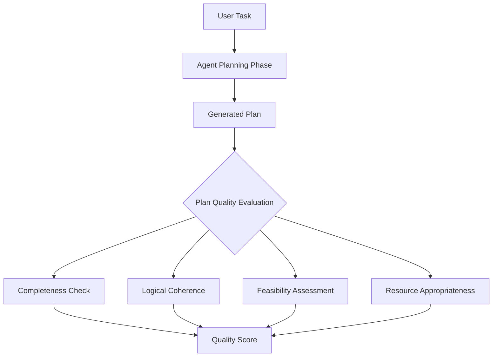
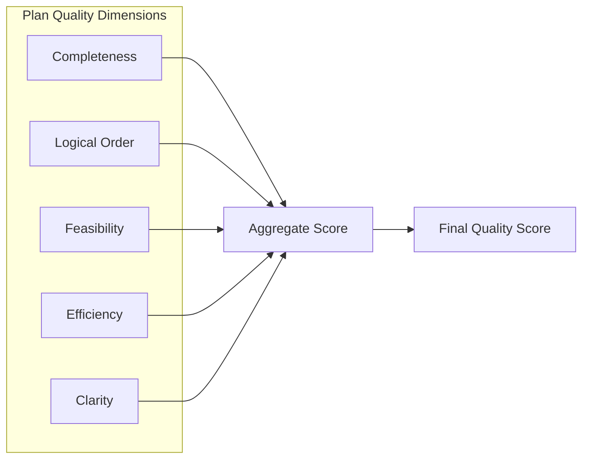
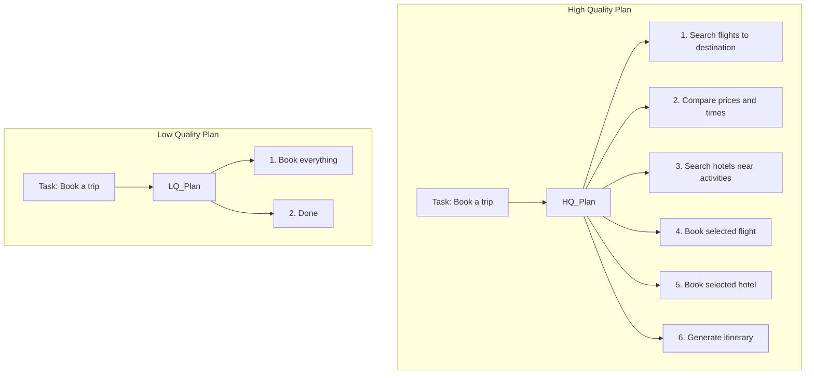

# Plan Quality Metric

## 1. Definition & Purpose

### What It Measures

The **Plan Quality** metric is an agentic LLM metric that evaluates the quality of the plan generated by your AI agent before or during task execution. It assesses whether the plan is comprehensive, logical, feasible, and appropriate for the given task.

### Why It Matters

A good plan is the foundation of successful task execution. Plan quality matters because:

- **Success prediction**: Better plans lead to better outcomes
- **Risk mitigation**: Poor plans can be caught before execution
- **Resource efficiency**: Good plans minimize wasted effort
- **Debugging**: Separates planning issues from execution issues
- **Agent improvement**: Identifies weaknesses in planning logic

### When to Use This Metric

- **Plan-first architectures**: Agents that generate explicit plans
- **Complex multi-step tasks**: Where planning is critical for success
- **High-stakes operations**: When plan failure has significant consequences
- **Agent development**: Improving planning capabilities
- **Quality gates**: Validating plans before expensive execution

## 2. Key Characteristics

| Property | Value |
|----------|-------|
| **Metric Type** | LLM-as-a-judge |
| **Evaluation Mode** | Trace-based |
| **Requires Tracing** | Yes (`@observe` decorator) |
| **Reference Required** | No (evaluates plan quality independently) |
| **Score Range** | 0.0 to 1.0 |

### Required Parameters

When using trace-based evaluation:

- `@observe` decorator on agent functions
- `update_current_trace()` with:
  - `input`: The user's request
  - `output`: The agent's final response (including plan)
  - `tools_called`: List of tools invoked

### Optional Parameters

| Parameter | Type | Default | Description |
|-----------|------|---------|-------------|
| `threshold` | float | 0.5 | Minimum score to pass evaluation |
| `include_reason` | bool | True | Include explanation for the score |
| `verbose_mode` | bool | False | Enable detailed logging |
| `model` | DeepEvalBaseLLM | Default model | LLM for evaluation |

## 3. Conceptual Visualization

### Plan Quality Evaluation Flow



### Quality Dimensions



### Good vs Poor Plan Comparison



## 4. Measurement Formula

### Core Formula

```
Plan Quality Score = QualityAssessment(Plan, Task)
```

The LLM evaluates the plan across multiple quality dimensions relative to the task requirements.

### Evaluation Criteria

1. **Completeness**: Does the plan cover all aspects of the task?
2. **Logical Ordering**: Are steps in a sensible sequence?
3. **Feasibility**: Can the steps actually be executed?
4. **Specificity**: Are steps concrete and actionable?
5. **Efficiency**: Does the plan avoid unnecessary steps?
6. **Error Handling**: Does the plan account for potential issues?

### Scoring Rubric

| Score | Meaning | Characteristics |
|-------|---------|-----------------|
| 1.0 | Excellent | Complete, logical, feasible, efficient, clear |
| 0.75 | Good | Mostly complete, minor gaps or ordering issues |
| 0.5 | Adequate | Covers basics but lacks detail or has issues |
| 0.25 | Poor | Significant gaps, illogical, or infeasible steps |
| 0.0 | Very Poor | Incomplete, incoherent, or impossible to execute |

### Example Evaluations

**Scenario 1: High Quality Plan**
```
Task: "Research and write a summary about renewable energy"

Plan:
1. Search for recent articles on renewable energy trends
2. Identify key types: solar, wind, hydro, geothermal
3. Gather statistics on adoption rates and costs
4. Analyze environmental impact data
5. Synthesize findings into structured summary
6. Review and refine the summary

Evaluation:
- Completeness: All aspects covered ✓
- Logic: Steps follow natural research flow ✓
- Feasibility: All steps are executable ✓
- Specificity: Clear, actionable items ✓
- Efficiency: No redundant steps ✓

Score: 0.95
```

**Scenario 2: Medium Quality Plan**
```
Task: "Research and write a summary about renewable energy"

Plan:
1. Search for information
2. Write summary

Evaluation:
- Completeness: Missing intermediate steps ✗
- Logic: Basic flow okay ✓
- Feasibility: Steps are possible ✓
- Specificity: Too vague ✗
- Efficiency: N/A (too few steps)

Score: 0.4
```

**Scenario 3: Poor Quality Plan**
```
Task: "Research and write a summary about renewable energy"

Plan:
1. Write the summary about renewable energy
2. Do some research if needed
3. Maybe check facts

Evaluation:
- Completeness: Missing research steps ✗
- Logic: Writing before research? ✗
- Feasibility: "If needed" is unclear ✗
- Specificity: Vague language ✗
- Efficiency: Illogical ordering ✗

Score: 0.15
```

**Scenario 4: Infeasible Plan**
```
Task: "Get today's stock prices"

Plan:
1. Travel to the year 2030
2. Look up historical stock data
3. Return to present

Evaluation:
- Feasibility: Time travel impossible ✗

Score: 0.0
```

## 5. Usage Patterns with PydanticAI

### Basic Plan Quality Evaluation

```python
from deepeval.tracing import observe, update_current_trace
from deepeval.dataset import Golden, EvaluationDataset
from deepeval.metrics import PlanQualityMetric
from deepeval.test_case import ToolCall
from deepeval.models.llms import LocalModel
from pydantic_ai import Agent
from pydantic import BaseModel

# Initialize model
model = LocalModel(
    model="gpt-4o-mini",
    api_key="your-api-key",
)

# Define structured plan output
class TaskPlan(BaseModel):
    task_understanding: str
    steps: list[str]
    expected_outcome: str
    potential_challenges: list[str]

# Create planning agent
planning_agent = Agent(
    model=model,
    system_prompt="""You are a planning specialist.
    Given a task, create a detailed execution plan with:
    - Clear understanding of the task
    - Numbered, specific steps
    - Expected outcome
    - Potential challenges
    """,
    result_type=TaskPlan,
)

@observe
def generate_plan(input: str) -> TaskPlan:
    """Generate a plan for the given task."""
    result = planning_agent.run_sync(f"Create a plan for: {input}")
    plan = result.data
    
    # Convert plan steps to tool calls for tracing
    tools_called = [
        ToolCall(name=f"PlanStep_{i+1}", description=step, input={"step": step})
        for i, step in enumerate(plan.steps)
    ]
    
    update_current_trace(
        input=input,
        output=str(plan),
        tools_called=tools_called
    )
    
    return plan

# Create metric
metric = PlanQualityMetric(
    model=model,
    threshold=0.7,
    include_reason=True,
)

# Evaluate plan quality
dataset = EvaluationDataset(
    goldens=[
        Golden(input="Plan a marketing campaign for a new product launch"),
        Golden(input="Research competitive landscape for cloud services"),
    ]
)

for golden in dataset.evals_iterator(metrics=[metric]):
    plan = generate_plan(golden.input)
    print(f"Task: {golden.input}")
    print(f"Plan Quality Score: {metric.score}")
    print(f"Reason: {metric.reason}")
    print("-" * 50)
```

### Comprehensive Planning Agent

```python
from pydantic_ai import Agent
from pydantic import BaseModel
from typing import Optional

class DetailedPlan(BaseModel):
    """Structured plan with quality indicators."""
    objective: str
    prerequisites: list[str]
    steps: list[dict]  # {"step": str, "tools_needed": list, "expected_output": str}
    success_criteria: list[str]
    fallback_strategies: list[str]
    estimated_complexity: str  # "low", "medium", "high"

agent = Agent(
    model=model,
    system_prompt="""You are an expert planner. Create comprehensive plans that include:
    
    1. Clear objective statement
    2. Prerequisites that must be in place
    3. Detailed steps with:
       - Specific action description
       - Tools/resources needed
       - Expected output
    4. Success criteria to verify completion
    5. Fallback strategies for potential issues
    6. Complexity assessment
    
    Be specific and actionable in every step.
    """,
    result_type=DetailedPlan,
)

@observe
def create_comprehensive_plan(input: str) -> DetailedPlan:
    result = agent.run_sync(input)
    plan = result.data
    
    tools_called = []
    for i, step in enumerate(plan.steps):
        tools_called.append(ToolCall(
            name=f"Step_{i+1}",
            description=step.get("step", ""),
            input={
                "tools_needed": step.get("tools_needed", []),
                "expected_output": step.get("expected_output", ""),
            }
        ))
    
    update_current_trace(
        input=input,
        output=plan.model_dump_json(),
        tools_called=tools_called
    )
    
    return plan
```

### Comparing Plan Quality

```python
@observe
def high_quality_planner(input: str) -> str:
    """Generates detailed, comprehensive plans."""
    plan = """
    Objective: Complete the requested task thoroughly
    
    Prerequisites:
    - Access to required tools
    - Clear understanding of requirements
    
    Steps:
    1. Analyze the task requirements in detail
       - Tools: Analysis framework
       - Output: Requirements document
    
    2. Research existing solutions and best practices
       - Tools: Web search, documentation
       - Output: Research summary
    
    3. Design approach based on research
       - Tools: Planning tools
       - Output: Detailed design
    
    4. Implement solution step by step
       - Tools: Execution tools
       - Output: Working solution
    
    5. Validate results against requirements
       - Tools: Testing framework
       - Output: Validation report
    
    6. Document and deliver final output
       - Tools: Documentation tools
       - Output: Final deliverable
    
    Success Criteria:
    - All requirements addressed
    - Solution validated
    - Documentation complete
    
    Fallback Strategies:
    - If research insufficient, expand search scope
    - If implementation fails, try alternative approach
    """
    
    update_current_trace(input=input, output=plan, tools_called=[])
    return plan

@observe
def low_quality_planner(input: str) -> str:
    """Generates vague, incomplete plans."""
    plan = """
    Plan:
    1. Do the thing
    2. Check if it works
    3. Done maybe
    """
    
    update_current_trace(input=input, output=plan, tools_called=[])
    return plan
```

### Pre-Execution Plan Validation

```python
def validate_plan_before_execution(input: str) -> bool:
    """Validate plan quality before spending resources on execution."""
    
    # Generate plan
    plan = generate_plan(input)
    
    # Evaluate quality
    metric = PlanQualityMetric(
        model=model,
        threshold=0.7,
        include_reason=True,
    )
    
    # Create test case for evaluation
    test_case = create_test_case_from_plan(plan)
    metric.measure(test_case)
    
    if metric.score < metric.threshold:
        print(f"Plan quality too low ({metric.score}). Regenerating...")
        print(f"Issues: {metric.reason}")
        return False
    
    print(f"Plan quality acceptable ({metric.score}). Proceeding with execution.")
    return True
```

## 6. Best Practices & Tips

### Common Pitfalls

| Pitfall | Problem | Solution |
|---------|---------|----------|
| Vague steps | Hard to evaluate quality | Use specific, actionable language |
| Missing context | Evaluator lacks information | Include task understanding in plan |
| No error handling | Plan seems incomplete | Add fallback strategies |
| Too few steps | Appears insufficiently detailed | Break down complex steps |

### Characteristics of High-Quality Plans

1. **Specific and Actionable**: Each step clearly describes what to do
2. **Logically Ordered**: Steps follow a sensible sequence
3. **Complete Coverage**: All aspects of the task are addressed
4. **Feasible Steps**: Each step can actually be executed
5. **Clear Dependencies**: Step prerequisites are apparent
6. **Error Handling**: Potential issues are anticipated

### Plan Quality Checklist

```python
# Use this template to ensure plan quality

PLAN_TEMPLATE = """
## Task Understanding
{clear statement of what needs to be accomplished}

## Prerequisites
- {what must be in place before starting}

## Execution Steps
1. {specific action}
   - Tools needed: {list}
   - Expected output: {description}
   - Success indicator: {how to verify}

2. {next specific action}
   ...

## Success Criteria
- {measurable criterion 1}
- {measurable criterion 2}

## Risk Mitigation
- If {potential issue}, then {fallback action}

## Estimated Timeline
{complexity assessment}
"""
```

### Debugging Low Quality Scores

1. **Check completeness**: Are all task aspects covered?
2. **Review step specificity**: Are steps vague or concrete?
3. **Examine logic flow**: Is the order sensible?
4. **Assess feasibility**: Can each step be executed?
5. **Look for gaps**: Are there missing intermediate steps?

### Iterative Plan Improvement

```python
def improve_plan_iteratively(input: str, max_iterations: int = 3) -> str:
    """Iteratively improve plan until quality threshold met."""
    
    for iteration in range(max_iterations):
        plan = generate_plan(input)
        
        metric.measure(create_test_case(plan))
        
        if metric.score >= metric.threshold:
            print(f"Achieved quality score {metric.score} on iteration {iteration + 1}")
            return plan
        
        # Add feedback for improvement
        input = f"""
        Previous plan scored {metric.score}. Issues: {metric.reason}
        
        Original task: {input}
        
        Please create an improved plan addressing these issues.
        """
    
    return plan  # Return best effort after max iterations
```

## 7. API Reference

### PlanQualityMetric

```python
from deepeval.metrics import PlanQualityMetric

metric = PlanQualityMetric(
    model=model,              # Required: LLM for evaluation
    threshold=0.5,            # Optional: Pass/fail threshold
    include_reason=True,      # Optional: Include explanation
    verbose_mode=False,       # Optional: Detailed logging
)
```

### Tracing for Plan Capture

```python
from deepeval.tracing import observe, update_current_trace

@observe
def planning_function(input: str) -> str:
    # Generate plan
    plan = create_plan(input)
    
    # Capture plan in trace
    update_current_trace(
        input=input,
        output=plan,
        tools_called=plan_steps_as_tool_calls
    )
    
    return plan
```

## 8. Comparison with Related Metrics

| Metric | Focus | Question Answered |
|--------|-------|-------------------|
| **Plan Quality** | Is the plan good? | Will this plan lead to success? |
| **Plan Adherence** | Was plan followed? | Did agent stick to its plan? |
| **Step Efficiency** | Were steps necessary? | Were there redundant actions? |
| **Task Completion** | Was task done? | Did the agent succeed? |

### Comprehensive Planning Evaluation

```python
from deepeval.metrics import PlanQualityMetric, PlanAdherenceMetric

# Evaluate both quality and adherence
plan_quality = PlanQualityMetric(model=model)
plan_adherence = PlanAdherenceMetric(model=model)

# Interpretation:
# High Quality + High Adherence = Ideal
# High Quality + Low Adherence = Execution problem
# Low Quality + High Adherence = Planning problem (but follows it anyway)
# Low Quality + Low Adherence = Multiple issues
```

## 9. References

- [DeepEval Plan Quality Documentation](https://deepeval.com/docs/metrics-plan-quality)
- [PydanticAI Documentation](https://ai.pydantic.dev/)
- [Planning in AI Systems](https://arxiv.org/abs/2402.01817)
