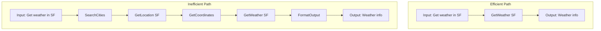
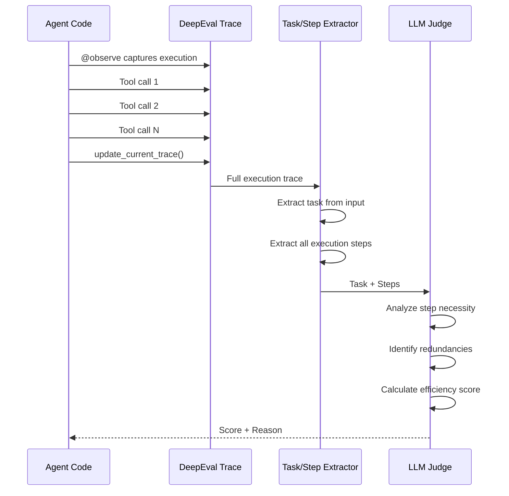
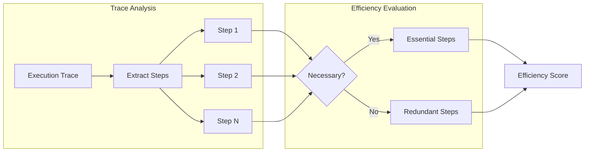

# Step Efficiency Metric

## 1. Definition & Purpose

### What It Measures

The **Step Efficiency** metric is an agentic LLM metric that evaluates how efficiently your AI agent completes a task. It analyzes the agent's full execution trace to determine whether the steps taken were necessary and optimal, or if there were redundant or unnecessary actions.

### Why It Matters

An agent can complete a task successfully while still being inefficient. This matters because:

- **Cost optimization**: Unnecessary tool calls increase API costs
- **Latency reduction**: Extra steps slow down response times
- **User experience**: Efficient agents feel more responsive
- **Resource usage**: Inefficient agents waste computational resources
- **Debugging**: Identifying redundant steps helps improve agent design

### When to Use This Metric

- **Cost optimization**: Identify and eliminate unnecessary tool calls
- **Performance tuning**: Reduce agent latency by streamlining execution
- **Agent comparison**: Compare efficiency between different agent architectures
- **Regression testing**: Ensure optimizations don't add redundant steps
- **Production monitoring**: Track efficiency over time

## 2. Key Characteristics

| Property | Value |
|----------|-------|
| **Metric Type** | LLM-as-a-judge |
| **Evaluation Mode** | Trace-based |
| **Requires Tracing** | Yes (`@observe` decorator) |
| **Reference Required** | No (referenceless) |
| **Score Range** | 0.0 to 1.0 |

### Required Parameters

When using trace-based evaluation:

- `@observe` decorator on agent functions
- `update_current_trace()` with:
  - `input`: The user's request
  - `output`: The agent's final response
  - `tools_called`: List of tools invoked

### Optional Parameters

| Parameter | Type | Default | Description |
|-----------|------|---------|-------------|
| `threshold` | float | 0.5 | Minimum score to pass evaluation |
| `include_reason` | bool | True | Include explanation for the score |
| `verbose_mode` | bool | False | Enable detailed logging |
| `model` | DeepEvalBaseLLM | Default model | LLM for evaluation |

## 3. Conceptual Visualization

### Efficient vs Inefficient Execution



### Evaluation Flow



### Step Analysis Process



## 4. Measurement Formula

### Core Formula

```
Step Efficiency Score = AlignmentScore(Task, Execution Steps)
```

The LLM evaluates how well the execution steps align with the minimal required steps to complete the task.

### Evaluation Criteria

1. **Task Identification**: What was the agent supposed to accomplish?
2. **Step Enumeration**: What steps did the agent actually take?
3. **Necessity Analysis**: Were all steps necessary?
4. **Redundancy Detection**: Were any steps repeated or unnecessary?
5. **Optimality Assessment**: Was this the most efficient path?

### Scoring Rubric

| Score | Meaning | Characteristics |
|-------|---------|-----------------|
| 1.0 | Optimal | Minimal steps, no redundancy, direct path |
| 0.75 | Efficient | Minor inefficiencies, mostly optimal |
| 0.5 | Acceptable | Some unnecessary steps, task completed |
| 0.25 | Inefficient | Many redundant steps, roundabout approach |
| 0.0 | Very Inefficient | Excessive steps, repeated actions |

### Example Calculations

**Scenario 1: Optimal Efficiency**
```
Task: "Get weather in San Francisco"
Steps: [GetWeather(location="SF")]
Analysis: Single direct tool call achieves goal
Score: 1.0
```

**Scenario 2: Minor Inefficiency**
```
Task: "Get weather in San Francisco"
Steps: [GetLocation("San Francisco"), GetWeather(location="SF")]
Analysis: Location lookup unnecessary when city name suffices
Score: 0.75
```

**Scenario 3: Significant Inefficiency**
```
Task: "Get weather in San Francisco"
Steps: [
    SearchCities("California"),
    GetCityList(),
    FilterByName("San Francisco"),
    GetCoordinates(),
    ConvertToAddress(),
    GetWeather(location="SF")
]
Analysis: Multiple unnecessary intermediate steps
Score: 0.25
```

**Scenario 4: Redundant Steps**
```
Task: "Search for Python tutorials"
Steps: [
    WebSearch("Python"),
    WebSearch("Python tutorials"),
    WebSearch("Python programming tutorials"),
    FilterResults()
]
Analysis: Repeated similar searches instead of single refined query
Score: 0.3
```

## 5. Usage Patterns with PydanticAI

### Basic Usage with Tracing

```python
from deepeval.tracing import observe, update_current_trace
from deepeval.dataset import Golden, EvaluationDataset
from deepeval.metrics import StepEfficiencyMetric
from deepeval.test_case import ToolCall
from deepeval.models.llms import LocalModel
from settings import ProjectSettings

settings = ProjectSettings()

# Initialize the LLM model
model = LocalModel(
    model=settings.llm_model,
    api_key=settings.llm_api_key,
    base_url=settings.llm_base_url,
    temperature=settings.llm_temperature,
)

# Define traced tool function
@observe
def get_weather(location: str) -> str:
    """Get weather for a location."""
    return f"Weather in {location}: 72°F, Sunny"

# Main agent function with tracing
@observe
def agent(input: str) -> str:
    """Main agent function that orchestrates tool calls."""
    tools_called = []
    
    if "weather" in input.lower():
        # Extract location (simplified)
        location = "San Francisco"  # In real implementation, extract from input
        result = get_weather(location)
        tools_called.append(ToolCall(
            name="GetWeather",
            description="Gets weather for a location",
            input={"location": location},
        ))
    
    output = f"The weather is: {result}"
    
    # Update trace with execution details
    update_current_trace(
        input=input,
        output=output,
        tools_called=tools_called
    )
    
    return output

# Create metric
metric = StepEfficiencyMetric(
    model=model,
    threshold=0.7,
    include_reason=True,
    verbose_mode=True,
)

# Create dataset
dataset = EvaluationDataset(
    goldens=[
        Golden(input="What's the weather in San Francisco?"),
        Golden(input="Tell me about the weather in New York"),
    ]
)

# Evaluate
for golden in dataset.evals_iterator(metrics=[metric]):
    result = agent(golden.input)
    print(f"Input: {golden.input}")
    print(f"Output: {result}")
    print(f"Efficiency Score: {metric.score}")
    print(f"Reason: {metric.reason}")
    print("-" * 50)
```

### Comparing Efficient vs Inefficient Paths

```python
@observe
def efficient_agent(input: str) -> str:
    """Efficient implementation - direct approach."""
    tools_called = []
    
    if "weather" in input.lower():
        result = get_weather("SF")
        tools_called.append(ToolCall(
            name="GetWeather",
            input={"location": "SF"},
        ))
    
    update_current_trace(input=input, output=result, tools_called=tools_called)
    return result

@observe
def inefficient_agent(input: str) -> str:
    """Inefficient implementation - unnecessary steps."""
    tools_called = []
    
    if "weather" in input.lower():
        # Unnecessary step 1: Search for city
        cities = search_cities("California")
        tools_called.append(ToolCall(name="SearchCities", input={"state": "California"}))
        
        # Unnecessary step 2: Get coordinates
        coords = get_coordinates("San Francisco")
        tools_called.append(ToolCall(name="GetCoordinates", input={"city": "San Francisco"}))
        
        # Finally, get weather
        result = get_weather("SF")
        tools_called.append(ToolCall(name="GetWeather", input={"location": "SF"}))
    
    update_current_trace(input=input, output=result, tools_called=tools_called)
    return result
```

### With PydanticAI Agent

```python
from pydantic_ai import Agent
from pydantic_ai.tools import RunContext

agent = Agent(
    model=model,
    system_prompt="You are a helpful assistant. Be efficient - use the minimum steps necessary.",
)

@agent.tool
def search_web(query: str) -> str:
    """Search the web for information."""
    return f"Results for: {query}"

@agent.tool
def get_details(topic: str) -> str:
    """Get detailed information about a topic."""
    return f"Details about: {topic}"

@observe
def run_agent(input: str) -> str:
    """Run the PydanticAI agent with tracing."""
    result = agent.run_sync(input)
    
    # Extract tool calls
    tools_called = [
        ToolCall(name=call.name, input=call.args)
        for call in result.tool_calls
    ]
    
    update_current_trace(
        input=input,
        output=result.data,
        tools_called=tools_called
    )
    
    return result.data
```

## 6. Best Practices & Tips

### Common Pitfalls

| Pitfall | Problem | Solution |
|---------|---------|----------|
| Missing @observe | Trace not captured | Always decorate agent functions |
| Incomplete trace | Missing steps in evaluation | Call update_current_trace with all tools |
| No tool details | Hard to evaluate efficiency | Include tool names and inputs |
| Overly strict threshold | False failures | Start with 0.5, adjust based on complexity |

### Optimization Strategies

1. **Direct Tool Calls**: Design tools that accomplish goals in single calls
2. **Composite Tools**: Combine frequently sequential operations
3. **Caching**: Avoid repeated lookups for the same data
4. **Clear Agent Prompts**: Guide agents toward efficient paths

### Designing for Efficiency

```python
# Bad: Multiple steps for simple task
@agent.tool
def search_city(city: str) -> str:
    """Step 1: Search for city."""
    pass

@agent.tool  
def get_city_id(results: str) -> str:
    """Step 2: Extract city ID."""
    pass

@agent.tool
def get_weather_by_id(city_id: str) -> str:
    """Step 3: Get weather by ID."""
    pass

# Good: Single consolidated tool
@agent.tool
def get_weather(city: str) -> str:
    """Get weather for a city directly."""
    pass
```

### Debugging Low Efficiency Scores

1. **Review the trace**: Look at all captured steps
2. **Identify redundancies**: Are any steps repeated?
3. **Check step necessity**: Could any step be eliminated?
4. **Examine the reason**: Understand the evaluator's perspective
5. **Compare with optimal**: What would the ideal path look like?

### When Efficiency Trade-offs Are Acceptable

Some scenarios where lower efficiency might be acceptable:

- **Safety checks**: Additional validation steps for critical operations
- **Logging/Auditing**: Extra steps for compliance requirements
- **Fallback mechanisms**: Retry logic for reliability
- **User confirmation**: Interactive steps for sensitive actions

## 7. API Reference

### StepEfficiencyMetric

```python
from deepeval.metrics import StepEfficiencyMetric

metric = StepEfficiencyMetric(
    model=model,              # Required: LLM for evaluation
    threshold=0.5,            # Optional: Pass/fail threshold
    include_reason=True,      # Optional: Include explanation
    verbose_mode=False,       # Optional: Detailed logging
)
```

### Tracing Functions

```python
from deepeval.tracing import observe, update_current_trace

@observe
def agent_function(input: str) -> str:
    # Your agent logic here
    
    update_current_trace(
        input=input,           # Required: User input
        output=output,         # Required: Agent output
        tools_called=tools     # Required: List of ToolCall objects
    )
    
    return output
```

### Using with EvaluationDataset

```python
from deepeval.dataset import Golden, EvaluationDataset

dataset = EvaluationDataset(
    goldens=[
        Golden(input="Query 1"),
        Golden(input="Query 2"),
    ]
)

for golden in dataset.evals_iterator(metrics=[metric]):
    result = agent(golden.input)
    # Metric automatically evaluates from trace
```

## 8. Comparison with Related Metrics

| Metric | Focus | Question Answered |
|--------|-------|-------------------|
| **Step Efficiency** | How efficiently was task done | Were there unnecessary steps? |
| **Task Completion** | Was the task done | Did the agent accomplish the goal? |
| **Tool Correctness** | Were right tools used | Did agent pick appropriate tools? |
| **Argument Correctness** | Were tools used correctly | Were tool parameters correct? |

### Comprehensive Agent Evaluation

```python
from deepeval.metrics import (
    StepEfficiencyMetric,
    TaskCompletionMetric,
    ToolCorrectnessMetric,
    ArgumentCorrectnessMetric,
)

# Combine metrics for complete evaluation
metrics = [
    TaskCompletionMetric(model=model),      # Did it work?
    ToolCorrectnessMetric(model=model),     # Right tools?
    ArgumentCorrectnessMetric(model=model), # Correct usage?
    StepEfficiencyMetric(model=model),      # Efficient?
]

for golden in dataset.evals_iterator(metrics=metrics):
    result = agent(golden.input)
    for metric in metrics:
        print(f"{metric.__class__.__name__}: {metric.score}")
```

## 9. References

- [DeepEval Step Efficiency Documentation](https://deepeval.com/docs/metrics-step-efficiency)
- [PydanticAI Documentation](https://ai.pydantic.dev/)
- [Existing Implementation](../metrics/step_efficiency.py)
