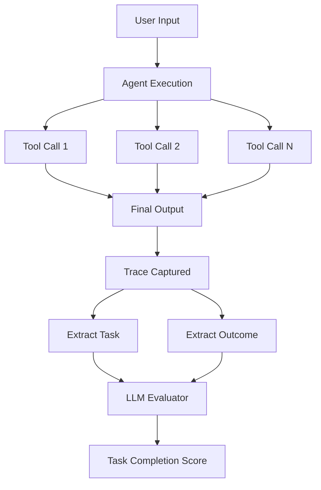
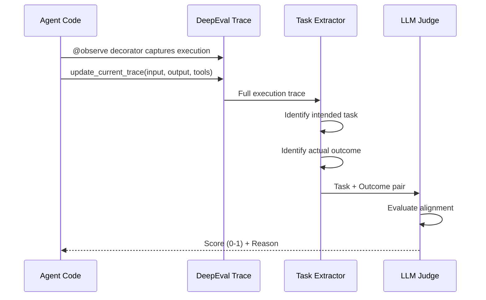
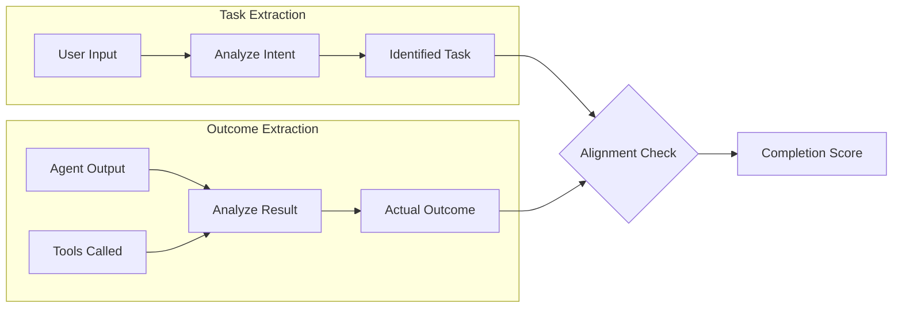

# Task Completion Metric

## 1. Definition & Purpose

### What It Measures

The **Task Completion** metric is an agentic LLM metric that evaluates whether your AI agent successfully accomplishes the task it was given. It extracts the task from the agent's execution trace and determines if the outcome aligns with the intended goal.

### Why It Matters

Task completion is the fundamental measure of agent effectiveness. An agent that uses the right tools with correct arguments but fails to complete the actual task provides no value to users. This metric answers the critical question: **"Did the agent do what it was supposed to do?"**

### When to Use This Metric

- **Production monitoring**: Track agent success rates over time
- **Quality assurance**: Ensure agents reliably complete user requests
- **A/B testing**: Compare different agent architectures or prompts
- **Debugging**: Identify failure patterns in agent behavior
- **Multi-step task evaluation**: Assess complex workflows with multiple sub-tasks

## 2. Key Characteristics

| Property | Value |
|----------|-------|
| **Metric Type** | LLM-as-a-judge |
| **Evaluation Mode** | Trace-based |
| **Requires Tracing** | Yes (`@observe` decorator) |
| **Reference Required** | No (referenceless) |
| **Score Range** | 0.0 to 1.0 |

### Required Parameters

When using trace-based evaluation, you need to set up:

- `@observe` decorator on your agent function
- `update_current_trace()` with:
  - `input`: The user's request/query
  - `output`: The agent's final response
  - `tools_called`: List of tools invoked (optional but recommended)

### Optional Parameters

| Parameter | Type | Default | Description |
|-----------|------|---------|-------------|
| `threshold` | float | 0.5 | Minimum score to pass evaluation |
| `include_reason` | bool | True | Include explanation for the score |
| `verbose_mode` | bool | False | Enable detailed logging |
| `model` | DeepEvalBaseLLM | Default model | LLM to use for evaluation |

## 3. Conceptual Visualization

### Data Flow Diagram



### Evaluation Process



### Task vs Outcome Alignment



## 4. Measurement Formula

### Core Formula

```
Task Completion Score = AlignmentScore(ExtractedTask, ActualOutcome)
```

### Evaluation Criteria

The LLM judge evaluates:

1. **Task Identification**: What was the agent supposed to do?
2. **Outcome Assessment**: What did the agent actually achieve?
3. **Alignment Analysis**: How well does the outcome match the task?

### Scoring Rubric

| Score | Meaning | Description |
|-------|---------|-------------|
| 1.0 | Complete | Task fully accomplished with all requirements met |
| 0.75 | Mostly Complete | Task substantially done with minor gaps |
| 0.5 | Partial | Some task requirements met, others missing |
| 0.25 | Minimal | Only basic task aspects addressed |
| 0.0 | Failed | Task not accomplished at all |

### Example Calculation

**User Input**: "Plan a weekend trip to Tokyo including flights, hotels, and restaurant recommendations"

**Agent Outcome**: "I found flights from LAX to Tokyo for $850 roundtrip and booked the Park Hyatt hotel. Here are 5 top-rated restaurants in Shibuya."

**Evaluation**:
- Task: Plan complete Tokyo trip (flights + hotels + restaurants)
- Outcome: Provided flights, hotel, and restaurants
- Alignment: Full alignment on all three components
- **Score: 1.0** (Complete)

**Partial Example**:

**Agent Outcome**: "Here are some popular restaurants in Tokyo: Sukiyabashi Jiro, Narisawa..."

**Evaluation**:
- Task: Plan complete Tokyo trip (flights + hotels + restaurants)
- Outcome: Only restaurant recommendations provided
- Alignment: 1/3 components addressed
- **Score: 0.33** (Partial)

## 5. Usage Patterns with PydanticAI

### Basic Structure

```python
from deepeval.tracing import observe, update_current_trace
from deepeval.dataset import Golden, EvaluationDataset
from deepeval.metrics import TaskCompletionMetric
from deepeval.models.llms import LocalModel
from pydantic_ai import Agent

# Initialize evaluator model
model = LocalModel(
    model="gpt-4o-mini",
    api_key="your-api-key",
)

# Define your agent with tools
@observe
def run_agent(user_input: str) -> str:
    # Agent logic here
    result = agent.run_sync(user_input)
    
    # Update trace with execution details
    update_current_trace(
        input=user_input,
        output=result.data,
        tools_called=extract_tools_from_result(result)
    )
    return result.data

# Create metric
metric = TaskCompletionMetric(
    model=model,
    threshold=0.7,
    include_reason=True,
)

# Evaluate with dataset
dataset = EvaluationDataset(
    goldens=[
        Golden(input="Plan a weekend trip to Tokyo"),
        Golden(input="Find restaurants near Central Park"),
    ]
)

for golden in dataset.evals_iterator(metrics=[metric]):
    result = run_agent(golden.input)
    print(f"Input: {golden.input}")
    print(f"Score: {metric.score}")
    print(f"Reason: {metric.reason}")
```

### Integration with Langfuse Tracing

```python
from opentelemetry.sdk.trace import TracerProvider
from opentelemetry.exporter.otlp.proto.http.trace_exporter import OTLPSpanExporter
import base64

# Setup Langfuse OTLP exporter
LANGFUSE_AUTH = base64.b64encode(
    f"{public_key}:{secret_key}".encode()
).decode()

exporter = OTLPSpanExporter(
    endpoint=f"{langfuse_url}/api/public/otel/v1/traces",
    headers={"Authorization": f"Basic {LANGFUSE_AUTH}"}
)

# Configure tracing provider
provider = TracerProvider()
provider.add_span_processor(BatchSpanProcessor(exporter))
```

## 6. Best Practices & Tips

### Common Pitfalls

| Pitfall | Problem | Solution |
|---------|---------|----------|
| Missing trace setup | Metric fails to capture execution | Always use `@observe` decorator |
| Incomplete trace data | Low accuracy in task extraction | Include all relevant details in `update_current_trace()` |
| Vague user inputs | Ambiguous task identification | Ensure inputs are specific and actionable |
| Overly strict threshold | Too many false failures | Start with threshold=0.5, adjust based on use case |

### Optimization Strategies

1. **Structured Outputs**: Use Pydantic models for agent outputs to ensure consistency
2. **Clear Tool Descriptions**: Well-documented tools help the evaluator understand intent
3. **Comprehensive Tracing**: Include all intermediate steps for better context
4. **Threshold Tuning**: Analyze score distribution to set appropriate thresholds

### When Task Completion Alone Isn't Enough

Task completion provides a high-level success measure but should be combined with:

- **Tool Correctness**: Verify the right tools were used
- **Argument Correctness**: Ensure tools received correct parameters
- **Step Efficiency**: Check if the task was done efficiently

### Debugging Low Scores

1. Check if `@observe` decorator is properly applied
2. Verify `update_current_trace()` is called with complete data
3. Review the extracted task - is it what you expected?
4. Examine the reason field for specific failure points
5. Consider if the task was ambiguous or multi-part

## 7. API Reference

### TaskCompletionMetric

```python
from deepeval.metrics import TaskCompletionMetric

metric = TaskCompletionMetric(
    model=model,              # Required: LLM for evaluation
    threshold=0.5,            # Optional: Pass/fail threshold
    include_reason=True,      # Optional: Include explanation
    verbose_mode=False,       # Optional: Detailed logging
)
```

### Related Functions

```python
from deepeval.tracing import observe, update_current_trace

@observe
def agent_function(input: str) -> str:
    # Your agent logic
    update_current_trace(
        input=input,
        output=output,
        tools_called=tools
    )
    return output
```

## 8. References

- [DeepEval Task Completion Documentation](https://deepeval.com/docs/metrics-task-completion)
- [PydanticAI Documentation](https://ai.pydantic.dev/)
- [Langfuse Tracing Integration](https://langfuse.com/docs/integrations/opentelemetry)
