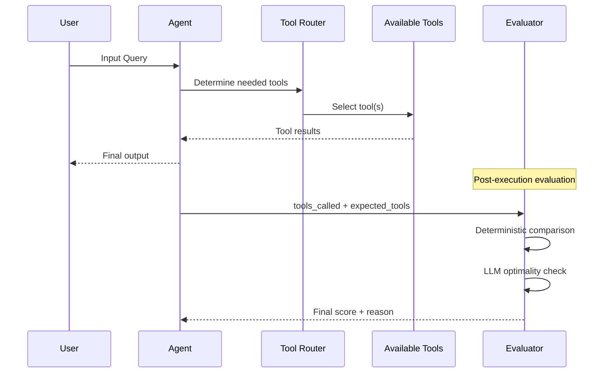

# Tool Correctness Metric

## 1. Definition & Purpose

### What It Measures

The **Tool Correctness** metric is an agentic LLM metric that evaluates whether your AI agent calls the correct tools based on the user's input. It uses a combination of **deterministic comparison** (against expected tools) and **LLM-based evaluation** (for optimality assessment) to provide a comprehensive correctness score.

### Why It Matters

Agents often have access to multiple tools, and selecting the right tool is crucial for task success. This metric helps you:

- **Validate tool selection logic**: Ensure the agent picks appropriate tools for each task
- **Identify tool confusion**: Detect when agents call wrong or irrelevant tools
- **Optimize tool sets**: Understand which tools are under/over-utilized
- **Ensure consistency**: Verify deterministic tool selection for predictable inputs

### When to Use This Metric

- **Tool routing evaluation**: Testing multi-tool agents with clear expected behaviors
- **Regression testing**: Ensuring agent behavior doesn't degrade after changes
- **Production monitoring**: Track tool selection accuracy over time
- **Tool set optimization**: Identify redundant or missing tools
- **Agent comparison**: Benchmark different agent implementations

## 2. Key Characteristics

| Property | Value |
|----------|-------|
| **Metric Type** | Deterministic + LLM-as-a-judge |
| **Evaluation Mode** | Test case based |
| **Requires Tracing** | No |
| **Reference Required** | Yes (`expected_tools`) |
| **Score Range** | 0.0 to 1.0 |

### Required Parameters

For `LLMTestCase`:

- `input`: The user's request/query
- `actual_output`: The agent's final response
- `tools_called`: List of `ToolCall` objects representing tools invoked
- `expected_tools`: List of `ToolCall` objects representing expected tools

### Optional Parameters

| Parameter | Type | Default | Description |
|-----------|------|---------|-------------|
| `threshold` | float | 0.5 | Minimum score to pass evaluation |
| `include_reason` | bool | True | Include explanation for the score |
| `available_tools` | list | None | All tools available to the agent (enables optimality check) |
| `evaluation_params` | list | None | Configure strictness (order, exact_match) |
| `model` | DeepEvalBaseLLM | Default model | LLM for optimality evaluation |

## 3. Conceptual Visualization

### Dual Evaluation Process

```mermaid
graph TD
    subgraph "Deterministic Evaluation"
        TC[Tools Called] --> DC[Compare with Expected]
        ET[Expected Tools] --> DC
        DC --> CS[Correctness Score]
    end
    
    subgraph "LLM Optimality Evaluation"
        TC2[Tools Called] --> LLM[LLM Evaluator]
        AT[Available Tools] --> LLM
        Input[User Input] --> LLM
        LLM --> OS[Optimality Score]
    end
    
    CS --> Final[Final Score = min(CS, OS)]
    OS --> Final
```

### Tool Selection Flow



### Evaluation Decision Tree

```mermaid
graph TD
    Start[Start Evaluation] --> HasExpected{Has Expected Tools?}
    HasExpected -->|Yes| Deterministic[Deterministic Comparison]
    HasExpected -->|No| LLMOnly[LLM-Only Evaluation]
    
    Deterministic --> CorrectMatch{All Expected Called?}
    CorrectMatch -->|Yes| FullScore[Score = 1.0]
    CorrectMatch -->|No| PartialScore[Score = Called/Expected]
    
    FullScore --> HasAvailable{Has Available Tools?}
    PartialScore --> HasAvailable
    
    HasAvailable -->|Yes| Optimality[LLM Optimality Check]
    HasAvailable -->|No| FinalDet[Return Deterministic Score]
    
    Optimality --> OptimalScore[Optimality Score]
    OptimalScore --> MinScore[Final = min(Det, Opt)]
    
    LLMOnly --> MinScore
    FinalDet --> End[Return Score]
    MinScore --> End
```

## 4. Measurement Formula

### Core Formula

```
Final Score = min(Correctness Score, Optimality Score)
```

### Correctness Score (Deterministic)

```
Correctness Score = |Correctly Called Tools| / |Expected Tools|
```

Where:
- **Correctly Called Tools**: Tools in both `tools_called` and `expected_tools`
- **Expected Tools**: All tools that should have been called

### Optimality Score (LLM-based)

The LLM evaluates whether the tools called were optimal given:
- The user's input
- All available tools
- The actual output achieved

### Strictness Parameters

| Parameter | Effect |
|-----------|--------|
| `ToolCorrectnessEvaluationParams.ORDER` | Penalizes incorrect tool call order |
| `ToolCorrectnessEvaluationParams.EXACT_MATCH` | Requires exact tool argument matching |

### Example Calculations

**Scenario 1: Perfect Match**
```
Input: "What's the refund policy?"
Expected: [RefundPolicyTool]
Called: [RefundPolicyTool]
Correctness Score = 1/1 = 1.0
```

**Scenario 2: Partial Match**
```
Input: "Check inventory and refund policy"
Expected: [InventoryTool, RefundPolicyTool]
Called: [RefundPolicyTool]
Correctness Score = 1/2 = 0.5
```

**Scenario 3: Extra Tools Called**
```
Input: "What's the refund policy?"
Expected: [RefundPolicyTool]
Called: [RefundPolicyTool, InventoryTool]
Correctness Score = 1/1 = 1.0 (deterministic)
Optimality Score = 0.7 (LLM penalizes unnecessary tool)
Final Score = min(1.0, 0.7) = 0.7
```

**Scenario 4: Wrong Tool**
```
Input: "What's the refund policy?"
Expected: [RefundPolicyTool]
Called: [WeatherTool]
Correctness Score = 0/1 = 0.0
```

## 5. Usage Patterns with PydanticAI

### Basic Usage

```python
from deepeval import evaluate
from deepeval.test_case import LLMTestCase, ToolCall
from deepeval.metrics import ToolCorrectnessMetric
from deepeval.models.llms import LocalModel
from settings import ProjectSettings

settings = ProjectSettings()

# Initialize evaluator model
model = LocalModel(
    model=settings.llm_model,
    api_key=settings.llm_api_key,
    base_url=settings.llm_base_url,
    temperature=settings.llm_temperature,
)

# Create metric
metric = ToolCorrectnessMetric(
    model=model,
    threshold=0.7,
    include_reason=True,
)

# Define test case
test_case = LLMTestCase(
    input="What if these shoes don't fit?",
    actual_output="We offer a 30-day full refund at no extra cost.",
    tools_called=[
        ToolCall(name="RefundPolicy"),
        ToolCall(name="ProductInfo")
    ],
    expected_tools=[
        ToolCall(name="RefundPolicy")
    ],
)

# Evaluate
evaluate(test_cases=[test_case], metrics=[metric])
```

### With Available Tools (Optimality Check)

```python
from deepeval.test_case import Tool

# Define all available tools
available_tools = [
    Tool(
        name="RefundPolicy",
        description="Get information about refund and return policies"
    ),
    Tool(
        name="ProductInfo",
        description="Get detailed product information"
    ),
    Tool(
        name="OrderStatus",
        description="Check the status of an order"
    ),
    Tool(
        name="InventoryCheck",
        description="Check product availability"
    ),
]

metric = ToolCorrectnessMetric(
    model=model,
    threshold=0.7,
    include_reason=True,
    available_tools=available_tools,  # Enables optimality check
)
```

### With Evaluation Parameters

```python
from deepeval.metrics.tool_correctness import ToolCorrectnessEvaluationParams

metric = ToolCorrectnessMetric(
    model=model,
    threshold=0.7,
    evaluation_params=[
        ToolCorrectnessEvaluationParams.ORDER,        # Check tool call order
        ToolCorrectnessEvaluationParams.EXACT_MATCH,  # Require exact args
    ],
)
```

### With PydanticAI Agent

```python
from pydantic_ai import Agent
from pydantic_ai.tools import Tool as PydanticTool

# Define PydanticAI tools
@agent.tool
def refund_policy() -> str:
    """Get the company's refund policy."""
    return "30-day full refund available"

@agent.tool  
def product_info(product_id: str) -> str:
    """Get product information by ID."""
    return f"Product {product_id}: Running shoes, $99"

# Run agent and extract tools
result = agent.run_sync("What if these shoes don't fit?")

# Convert to DeepEval ToolCalls
tools_called = [
    ToolCall(name=call.name, input=call.args)
    for call in result.tool_calls
]

# Create test case and evaluate
test_case = LLMTestCase(
    input="What if these shoes don't fit?",
    actual_output=result.data,
    tools_called=tools_called,
    expected_tools=[ToolCall(name="refund_policy")],
)
```

## 6. Best Practices & Tips

### Common Pitfalls

| Pitfall | Problem | Solution |
|---------|---------|----------|
| Tool name mismatch | `RefundPolicy` vs `refund_policy` | Standardize naming conventions |
| Missing expected tools | Incomplete test case | Define all expected tools for each scenario |
| Ignoring tool arguments | Only checking tool names | Use `EXACT_MATCH` for strict evaluation |
| No available_tools | Missing optimality check | Always provide available_tools for comprehensive evaluation |

### Optimization Strategies

1. **Consistent Tool Naming**: Use snake_case or CamelCase consistently
2. **Comprehensive Tool Descriptions**: Help the LLM understand tool purposes
3. **Scenario Coverage**: Test edge cases where tool selection is ambiguous
4. **Threshold Tuning**: Adjust based on how critical correct tool selection is

### Tool Definition Best Practices

```python
# Good: Clear, specific description
Tool(
    name="get_order_status",
    description="Retrieves the current status of a customer order given the order ID. Returns shipping status, estimated delivery date, and tracking number."
)

# Bad: Vague description
Tool(
    name="status",
    description="Gets status"
)
```

### Multi-Tool Scenarios

When testing agents with multiple tools:

1. **Test single-tool cases first**: Verify basic tool routing
2. **Add complexity gradually**: Combine tools in expected ways
3. **Test negative cases**: Inputs that shouldn't trigger certain tools
4. **Order matters**: Use `ORDER` param when sequence is important

### Debugging Low Scores

1. **Check tool names**: Ensure exact match between expected and called
2. **Review the reason**: Understand why tools were deemed incorrect
3. **Verify available_tools**: LLM needs context for optimality
4. **Consider partial credit**: Is the threshold appropriate?

## 7. API Reference

### ToolCorrectnessMetric

```python
from deepeval.metrics import ToolCorrectnessMetric

metric = ToolCorrectnessMetric(
    model=model,                    # Required: LLM for evaluation
    threshold=0.5,                  # Optional: Pass/fail threshold
    include_reason=True,            # Optional: Include explanation
    available_tools=tools,          # Optional: Enable optimality check
    evaluation_params=params,       # Optional: Strictness settings
)
```

### ToolCall

```python
from deepeval.test_case import ToolCall

tool_call = ToolCall(
    name="tool_name",                   # Required: Tool identifier
    description="What the tool does",   # Optional: Tool description
    input={"param": "value"},           # Optional: Tool arguments
    output="Tool result",               # Optional: Tool output
)
```

### Tool

```python
from deepeval.test_case import Tool

tool = Tool(
    name="tool_name",                   # Required: Tool identifier
    description="What the tool does",   # Required for optimality check
)
```

## 8. Comparison with Related Metrics

| Metric | Focus | Use Case |
|--------|-------|----------|
| **Tool Correctness** | Which tools were called | Validating tool selection |
| **Argument Correctness** | How tools were called | Validating tool parameters |
| **Task Completion** | Did the task succeed | End-to-end success measure |

## 9. References

- [DeepEval Tool Correctness Documentation](https://deepeval.com/docs/metrics-tool-correctness)
- [PydanticAI Tools Documentation](https://ai.pydantic.dev/tools/)
- [Existing Implementation](../metrics/tool_correctness.py)
