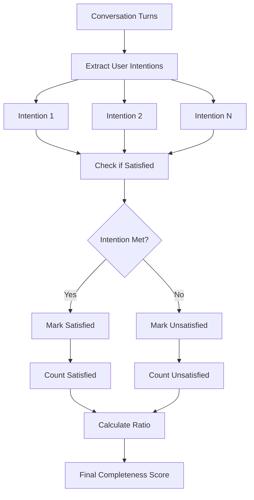
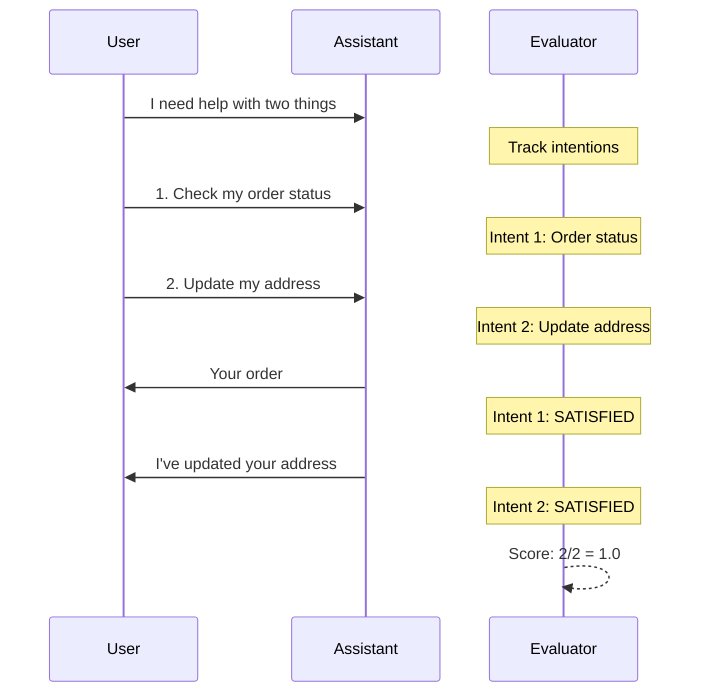

# Conversation Completeness Metric

## 1. Definition & Purpose

### What It Measures

The **Conversation Completeness** metric is a conversational metric that determines whether your LLM chatbot is able to complete an end-to-end conversation by satisfying user needs **throughout a conversation**. It evaluates if all user intentions expressed during the dialogue are eventually addressed.

### Why It Matters

Conversation completeness is critical for:

- **User satisfaction**: Users expect their requests to be fully addressed
- **Task completion**: Multi-step tasks require all parts to be completed
- **Quality assurance**: Incomplete conversations indicate bot limitations
- **Customer experience**: Dropped intentions frustrate users

### When to Use This Metric

- **Customer support**: Ensuring all user issues are resolved
- **Task-oriented dialogs**: Booking, ordering, information gathering
- **FAQ chatbots**: Verifying all questions are answered
- **Proxy for user satisfaction**: When direct feedback is unavailable

## 2. Key Characteristics

| Property | Value |
|----------|-------|
| **Metric Type** | LLM-as-a-judge |
| **Evaluation Mode** | Multi-turn |
| **Reference Required** | No (referenceless) |
| **Score Range** | 0.0 to 1.0 |
| **Primary Use Case** | Chatbot |
| **Multimodal Support** | Yes |

### Required Arguments

When creating a `ConversationalTestCase`:

| Argument | Type | Description |
|----------|------|-------------|
| `turns` | List[Turn] | List of conversation turns with `role` and `content` |

Each `Turn` must have:
- `role`: Either "user" or "assistant"
- `content`: The message content

### Optional Parameters

| Parameter | Type | Default | Description |
|-----------|------|---------|-------------|
| `threshold` | float | 0.5 | Minimum passing score |
| `model` | str/DeepEvalBaseLLM | gpt-4.1 | LLM for evaluation |
| `include_reason` | bool | True | Include explanation for score |
| `strict_mode` | bool | False | Binary scoring (0 or 1) |
| `async_mode` | bool | True | Enable concurrent execution |
| `verbose_mode` | bool | False | Print intermediate steps |

## 3. Conceptual Visualization

### Evaluation Flow



### Intention Tracking



## 4. Measurement Formula

### Core Formula

```
Conversation Completeness = Number of Satisfied User Intentions / Total Number of User Intentions
```

### Evaluation Process

1. **Intention Extraction**: LLM identifies all high-level user intentions from `turns`
2. **Satisfaction Check**: For each intention, determine if it was met by assistant responses
3. **Score Calculation**: Ratio of satisfied intentions to total intentions

### What Counts as User Intention

| Type | Example |
|------|---------|
| **Questions** | "What are your hours?" → Intent: Get business hours |
| **Requests** | "Book me a table" → Intent: Complete reservation |
| **Problems** | "My order is wrong" → Intent: Resolve order issue |
| **Multi-part** | "Tell me price and availability" → Intent 1: Price, Intent 2: Availability |

### Scoring Rubric

| Score Range | Interpretation |
|-------------|----------------|
| 0.9 - 1.0 | Excellent - All intentions satisfied |
| 0.7 - 0.9 | Good - Most intentions satisfied |
| 0.5 - 0.7 | Fair - Some intentions unsatisfied |
| 0.3 - 0.5 | Poor - Many intentions dropped |
| 0.0 - 0.3 | Critical - Most intentions unsatisfied |

## 5. Usage Examples

### Basic Usage

```python
from deepeval import evaluate
from deepeval.test_case import Turn, ConversationalTestCase
from deepeval.metrics import ConversationCompletenessMetric

# Create a conversation with multiple intentions
convo_test_case = ConversationalTestCase(
    turns=[
        Turn(role="user", content="I need to know your return policy and also track my recent order."),
        Turn(role="assistant", content="I'd be happy to help with both! Our return policy allows returns within 30 days with receipt."),
        Turn(role="user", content="Great, and my order?"),
        Turn(role="assistant", content="Let me look that up. Your order #45678 shipped yesterday and will arrive Friday."),
        Turn(role="user", content="Perfect, thanks!"),
        Turn(role="assistant", content="You're welcome! Is there anything else I can help with?"),
    ]
)

# Create metric
metric = ConversationCompletenessMetric(threshold=0.5)

# Evaluate
evaluate(test_cases=[convo_test_case], metrics=[metric])
```

### Standalone Measurement

```python
metric = ConversationCompletenessMetric(
    threshold=0.7,
    include_reason=True,
    verbose_mode=True,
)

metric.measure(convo_test_case)
print(f"Score: {metric.score}")
print(f"Reason: {metric.reason}")
```

## 6. Example Scenarios

### Scenario 1: Complete Conversation (Score ~1.0)

```python
turns = [
    Turn(role="user", content="I want to book a flight to Paris and need hotel recommendations."),
    Turn(role="assistant", content="I'll help with both! When would you like to travel?"),
    Turn(role="user", content="Next month, around the 15th."),
    Turn(role="assistant", content="I found flights on March 15th starting at $650. For hotels, the Hotel Le Marais is highly rated at $180/night."),
    Turn(role="user", content="Book the flight please."),
    Turn(role="assistant", content="Your flight is booked! Confirmation #ABC123. Would you like me to book the hotel too?"),
]
# Both intentions (flight + hotel recommendation) satisfied
```

### Scenario 2: Incomplete Conversation (Score ~0.5)

```python
turns = [
    Turn(role="user", content="I want to book a flight to Paris and need hotel recommendations."),
    Turn(role="assistant", content="I'll help with that! When would you like to travel?"),
    Turn(role="user", content="Next month, around the 15th."),
    Turn(role="assistant", content="I found flights on March 15th starting at $650. Would you like to book?"),
    Turn(role="user", content="Yes, and what about hotels?"),
    Turn(role="assistant", content="Your flight is booked! Confirmation #ABC123."),
    # Hotel recommendation intention was never satisfied
]
```

### Scenario 3: Failed Conversation (Score ~0.0)

```python
turns = [
    Turn(role="user", content="I need help resetting my password."),
    Turn(role="assistant", content="I understand you're having trouble. Can you tell me more?"),
    Turn(role="user", content="I forgot my password and can't log in."),
    Turn(role="assistant", content="I see. Is there anything else you'd like to know?"),
    # Password reset intention completely unsatisfied
]
```

## 7. Best Practices

### Do's

- **Test multi-intention conversations**: Real users often have multiple needs
- **Include implicit intentions**: "I'm frustrated" implies need for resolution
- **Test conversation endings**: Verify all threads are closed
- **Use with other metrics**: Combine with Turn Relevancy for comprehensive view

### Don'ts

- **Don't ignore partial satisfaction**: Half-answered questions count as incomplete
- **Don't test single-turn only**: Completeness shines in multi-turn scenarios
- **Don't set threshold too high**: Some intentions may be legitimately deferred

### Identifying Common Failure Patterns

| Pattern | Description | Solution |
|---------|-------------|----------|
| **Topic switching** | Bot changes subject before resolving | Implement intention tracking |
| **Premature closure** | Bot ends conversation early | Add completion checks |
| **Partial responses** | Only part of multi-part request addressed | Parse requests thoroughly |
| **Lost context** | Bot forgets earlier intentions | Use conversation state |

## 8. API Reference

### ConversationCompletenessMetric

```python
from deepeval.metrics import ConversationCompletenessMetric

metric = ConversationCompletenessMetric(
    threshold=0.5,           # Minimum passing score
    model="gpt-4.1",         # Evaluation model
    include_reason=True,     # Include explanation
    strict_mode=False,       # Binary scoring
    async_mode=True,         # Concurrent execution
    verbose_mode=False,      # Detailed logging
)
```

### ConversationalTestCase

```python
from deepeval.test_case import Turn, ConversationalTestCase

test_case = ConversationalTestCase(
    turns=[
        Turn(role="user", content="User intention..."),
        Turn(role="assistant", content="Response addressing intention..."),
    ]
)
```

## 9. References

- [DeepEval Conversation Completeness Documentation](https://deepeval.com/docs/metrics-conversation-completeness)
- [ConversationalTestCase Documentation](https://deepeval.com/docs/evaluation-test-cases)
