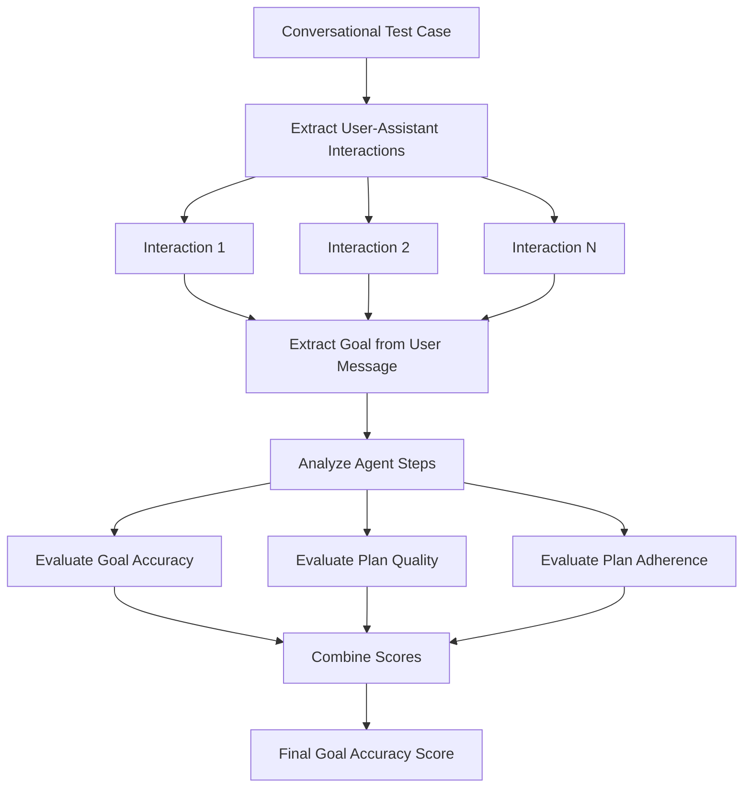
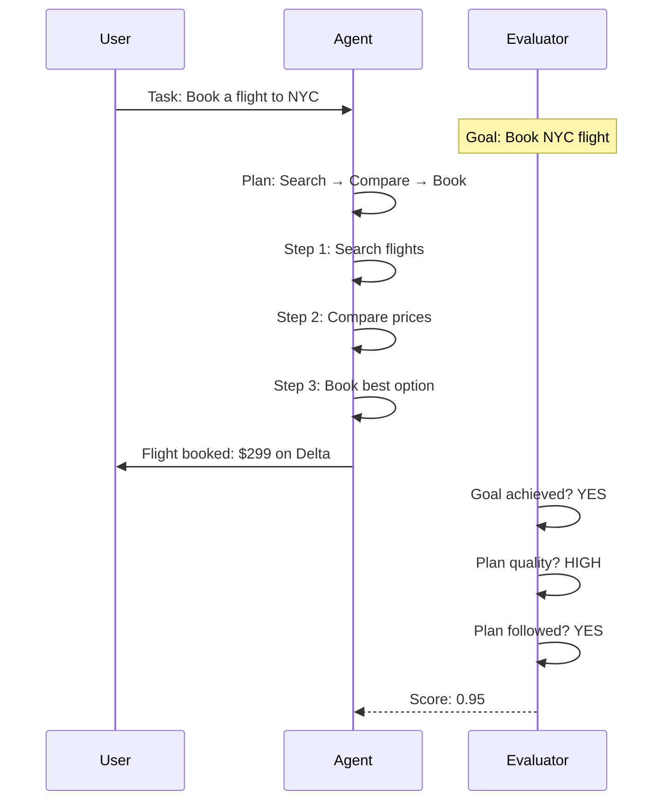

# Goal Accuracy Metric

## 1. Definition & Purpose

### What It Measures

The **Goal Accuracy** metric is a multi-turn agentic metric that evaluates your LLM agent's abilities **on planning and executing the plan to finish a task or reach a goal**. It assesses both the quality of the agent's plan and how well it executes that plan.

### Why It Matters

Goal accuracy is essential for:

- **Agent effectiveness**: Measuring if agents achieve user objectives
- **Planning quality**: Evaluating how well agents formulate strategies
- **Execution tracking**: Assessing if agents follow through on plans
- **End-to-end evaluation**: Combining planning and execution assessment

### When to Use This Metric

- **Task-oriented agents**: Agents that need to complete specific goals
- **Multi-step workflows**: Complex tasks requiring planning
- **Autonomous systems**: Agents making decisions to reach objectives
- **Agent development**: Comparing different agent architectures

## 2. Key Characteristics

| Property | Value |
|----------|-------|
| **Metric Type** | LLM-as-a-judge |
| **Evaluation Mode** | Multi-turn, Agentic |
| **Reference Required** | No (referenceless) |
| **Score Range** | 0.0 to 1.0 |
| **Primary Use Case** | Agent |
| **Multimodal Support** | Yes |

### Required Arguments

When creating a `ConversationalTestCase`:

| Argument | Type | Description |
|----------|------|-------------|
| `turns` | List[Turn] | List of conversation turns with `role`, `content`, and optionally `tools_called` |

Each `Turn` can have:
- `role`: Either "user" or "assistant"
- `content`: The message content
- `tools_called`: List of ToolCall objects (for assistant turns)

### Optional Parameters

| Parameter | Type | Default | Description |
|-----------|------|---------|-------------|
| `threshold` | float | 0.5 | Minimum passing score |
| `model` | str/DeepEvalBaseLLM | gpt-4o | LLM for evaluation |
| `include_reason` | bool | True | Include explanation for score |
| `strict_mode` | bool | False | Binary scoring (0 or 1) |
| `async_mode` | bool | True | Enable concurrent execution |
| `verbose_mode` | bool | False | Print intermediate steps |

## 3. Conceptual Visualization

### Evaluation Flow



### Goal and Plan Evaluation



## 4. Measurement Formula

### Core Formula

```
Goal Accuracy Score = (Goal Accuracy Score + Plan Evaluation Score) / 2
```

### Component Scores

1. **Goal Accuracy Score**: Did the agent achieve the intended goal?
2. **Plan Evaluation Score**: Combined assessment of:
   - Plan Quality: How good was the agent's strategy?
   - Plan Adherence: How well did the agent follow its plan?

### Evaluation Process

1. **Goal Extraction**: Extract the task/goal from user messages
2. **Step Analysis**: Analyze steps taken by the agent
3. **Goal Achievement**: Determine if the goal was reached
4. **Plan Assessment**: Evaluate planning and execution quality

### Scoring Rubric

| Score Range | Interpretation |
|-------------|----------------|
| 0.9 - 1.0 | Excellent - Goal achieved with optimal planning |
| 0.7 - 0.9 | Good - Goal achieved with minor planning issues |
| 0.5 - 0.7 | Fair - Partial goal achievement |
| 0.3 - 0.5 | Poor - Goal mostly unachieved |
| 0.0 - 0.3 | Critical - Complete failure to achieve goal |

## 5. Usage Examples

### Basic Usage

```python
from deepeval import evaluate
from deepeval.test_case import Turn, ConversationalTestCase, ToolCall
from deepeval.metrics import GoalAccuracyMetric

# Create a conversation with agent actions
convo_test_case = ConversationalTestCase(
    turns=[
        Turn(role="user", content="Find me the cheapest flight to New York for next Friday."),
        Turn(
            role="assistant",
            content="I'll search for flights to New York for next Friday.",
            tools_called=[
                ToolCall(
                    name="SearchFlights",
                    input={"destination": "NYC", "date": "2024-03-15"},
                )
            ]
        ),
        Turn(
            role="assistant",
            content="I found several options. The cheapest is Delta at $299. Would you like to book it?",
            tools_called=[
                ToolCall(
                    name="CompareFlights",
                    input={"sort_by": "price"},
                )
            ]
        ),
        Turn(role="user", content="Yes, book it."),
        Turn(
            role="assistant",
            content="Your flight is booked! Confirmation: DL-789456. You'll depart at 8:00 AM.",
            tools_called=[
                ToolCall(
                    name="BookFlight",
                    input={"flight_id": "DL-299", "passenger": "user"},
                )
            ]
        ),
    ]
)

# Create metric
metric = GoalAccuracyMetric(threshold=0.5)

# Evaluate
evaluate(test_cases=[convo_test_case], metrics=[metric])
```

### Standalone Measurement

```python
metric = GoalAccuracyMetric(
    threshold=0.7,
    include_reason=True,
    verbose_mode=True,
)

metric.measure(convo_test_case)
print(f"Score: {metric.score}")
print(f"Reason: {metric.reason}")
```

## 6. Example Scenarios

### Scenario 1: High Goal Accuracy (Score ~1.0)

```python
# Clear goal, good planning, successful execution
turns = [
    Turn(role="user", content="Set a reminder for my meeting tomorrow at 3 PM."),
    Turn(
        role="assistant",
        content="I'll create a reminder for your meeting tomorrow at 3 PM.",
        tools_called=[
            ToolCall(name="CreateReminder", input={"time": "tomorrow 3 PM", "title": "Meeting"})
        ]
    ),
    Turn(role="assistant", content="Done! I've set a reminder for tomorrow at 3 PM for your meeting."),
]
```

### Scenario 2: Medium Goal Accuracy (Score ~0.6)

```python
# Goal achieved but with inefficient planning
turns = [
    Turn(role="user", content="What's the weather in Paris?"),
    Turn(
        role="assistant",
        content="Let me check multiple sources...",
        tools_called=[
            ToolCall(name="SearchWeb", input={"query": "Paris"}),  # Vague search
            ToolCall(name="SearchWeb", input={"query": "Paris weather"}),  # Redundant
            ToolCall(name="GetWeather", input={"city": "Paris"}),  # Finally correct
        ]
    ),
    Turn(role="assistant", content="The weather in Paris is 18°C and sunny."),
]
```

### Scenario 3: Low Goal Accuracy (Score ~0.2)

```python
# Goal not achieved, poor planning
turns = [
    Turn(role="user", content="Book a table for 4 at an Italian restaurant tonight."),
    Turn(
        role="assistant",
        content="Here are some Italian restaurants in your area.",
        tools_called=[
            ToolCall(name="SearchRestaurants", input={"cuisine": "Italian"})
        ]
    ),
    Turn(role="assistant", content="Would you like me to provide more options?"),
    # Booking never completed
]
```

## 7. Best Practices

### Do's

- **Include tool calls**: Add `tools_called` to assistant turns for accurate evaluation
- **Test multi-step goals**: Evaluate complex workflows with multiple actions
- **Verify goal completion**: Ensure the final state matches the user's intent
- **Track planning efficiency**: Monitor if agents take optimal paths

### Don'ts

- **Don't ignore partial success**: Partial goal achievement should be reflected
- **Don't skip tool documentation**: Clear tool descriptions help evaluation
- **Don't test trivial goals only**: Include challenging multi-step scenarios

### Improving Goal Accuracy

| Issue | Solution |
|-------|----------|
| Poor planning | Implement better reasoning/planning prompts |
| Goal misunderstanding | Improve intent extraction |
| Execution failures | Add error handling and retries |
| Incomplete tasks | Implement completion verification |

## 8. API Reference

### GoalAccuracyMetric

```python
from deepeval.metrics import GoalAccuracyMetric

metric = GoalAccuracyMetric(
    threshold=0.5,           # Minimum passing score
    model="gpt-4o",          # Evaluation model
    include_reason=True,     # Include explanation
    strict_mode=False,       # Binary scoring
    async_mode=True,         # Concurrent execution
    verbose_mode=False,      # Detailed logging
)
```

### ConversationalTestCase with Tools

```python
from deepeval.test_case import Turn, ConversationalTestCase, ToolCall

test_case = ConversationalTestCase(
    turns=[
        Turn(role="user", content="User goal..."),
        Turn(
            role="assistant",
            content="Agent response...",
            tools_called=[
                ToolCall(name="ToolName", input={"param": "value"})
            ]
        ),
    ]
)
```

## 9. References

- [DeepEval Goal Accuracy Documentation](https://deepeval.com/docs/metrics-goal-accuracy)
- [ConversationalTestCase Documentation](https://deepeval.com/docs/evaluation-test-cases)
