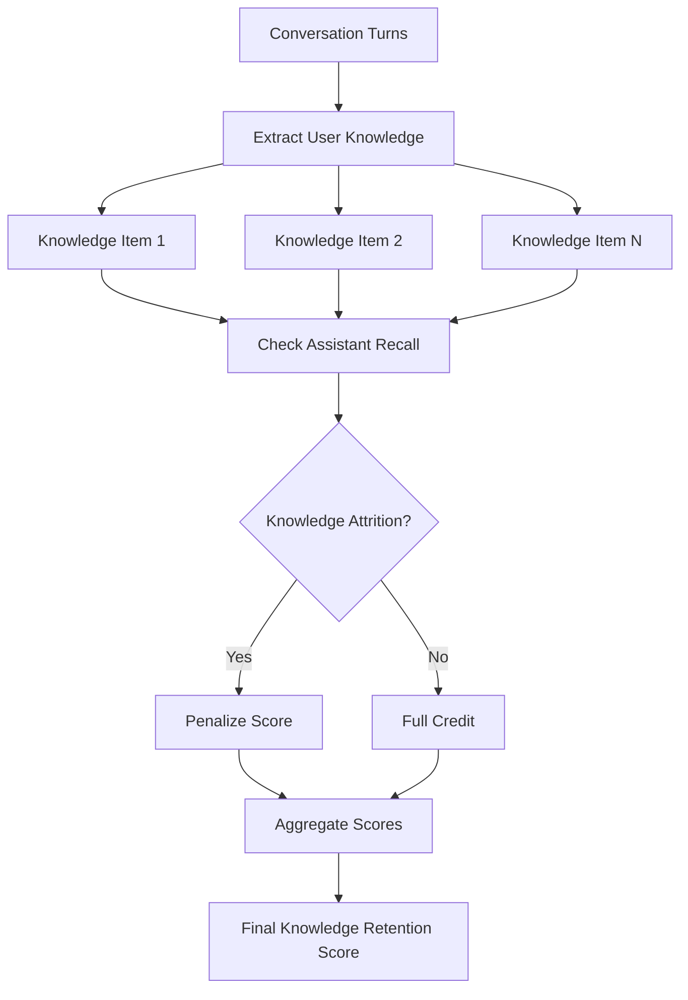
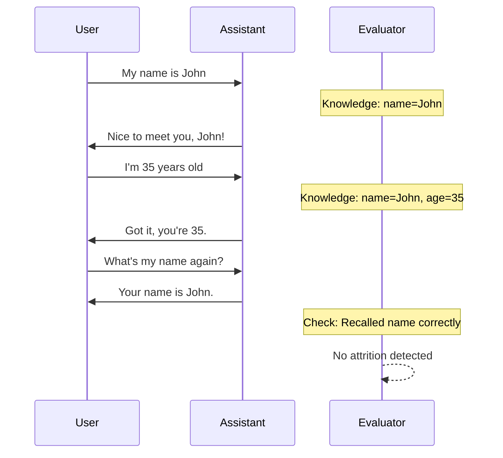

# Knowledge Retention Metric

## 1. Definition & Purpose

### What It Measures

The **Knowledge Retention** metric is a conversational metric that determines whether your LLM chatbot is able to retain factual information presented **throughout a conversation**. It evaluates if the assistant remembers and correctly recalls facts that were shared earlier in the dialogue.

### Why It Matters

Knowledge retention is essential for:

- **Conversational continuity**: Users expect the chatbot to remember what was discussed
- **Questionnaire use cases**: Chatbots collecting information must retain user-provided data
- **Personalization**: Building on previously shared preferences and information
- **Trust building**: Forgetting user information damages credibility

### When to Use This Metric

- **Information collection**: Forms, surveys, intake questionnaires
- **Multi-step processes**: Booking systems, application workflows
- **Personalized assistants**: Chatbots that build user profiles over time
- **Support conversations**: Where context from earlier exchanges matters

## 2. Key Characteristics

| Property | Value |
|----------|-------|
| **Metric Type** | LLM-as-a-judge |
| **Evaluation Mode** | Multi-turn |
| **Reference Required** | No (referenceless) |
| **Score Range** | 0.0 to 1.0 |
| **Primary Use Case** | Chatbot, Questionnaire |
| **Multimodal Support** | Yes |

### Required Arguments

When creating a `ConversationalTestCase`:

| Argument | Type | Description |
|----------|------|-------------|
| `turns` | List[Turn] | List of conversation turns with `role` and `content` |

Each `Turn` must have:
- `role`: Either "user" or "assistant"
- `content`: The message content

### Optional Parameters

| Parameter | Type | Default | Description |
|-----------|------|---------|-------------|
| `threshold` | float | 0.5 | Maximum passing threshold |
| `model` | str/DeepEvalBaseLLM | gpt-4.1 | LLM for evaluation |
| `include_reason` | bool | True | Include explanation for score |
| `strict_mode` | bool | False | Binary scoring (0 or 1) |
| `verbose_mode` | bool | False | Print intermediate steps |

## 3. Conceptual Visualization

### Evaluation Flow



### Knowledge Tracking



## 4. Measurement Formula

### Core Formula

```
Knowledge Retention = Number of Assistant Turns without Knowledge Attritions / Total Number of Assistant Turns
```

### Evaluation Process

1. **Knowledge Extraction**: LLM extracts factual information from user messages
2. **Attrition Detection**: For each assistant turn, check if it contradicts or forgets extracted knowledge
3. **Score Calculation**: Ratio of turns without attrition to total assistant turns

### What Counts as Knowledge Attrition

| Type | Example |
|------|---------|
| **Forgetting** | User says "I'm allergic to nuts" → Bot later suggests nut-based dish |
| **Contradiction** | User says "My budget is $500" → Bot recommends $800 option |
| **Confusion** | User mentions "my daughter Sarah" → Bot refers to "your son" |
| **Misremembering** | User says "I live in Boston" → Bot asks "How's the weather in Chicago?" |

### Scoring Rubric

| Score Range | Interpretation |
|-------------|----------------|
| 0.9 - 1.0 | Excellent - Perfect knowledge retention |
| 0.7 - 0.9 | Good - Minor memory lapses |
| 0.5 - 0.7 | Fair - Some information forgotten |
| 0.3 - 0.5 | Poor - Significant memory issues |
| 0.0 - 0.3 | Critical - Frequent forgetting/contradictions |

## 5. Usage Examples

### Basic Usage

```python
from deepeval import evaluate
from deepeval.test_case import Turn, ConversationalTestCase
from deepeval.metrics import KnowledgeRetentionMetric

# Create a conversation with knowledge to retain
convo_test_case = ConversationalTestCase(
    turns=[
        Turn(role="user", content="Hi, I'm planning a trip. My name is Sarah."),
        Turn(role="assistant", content="Hello Sarah! I'd be happy to help you plan your trip. Where would you like to go?"),
        Turn(role="user", content="I want to visit Japan. My budget is $3000."),
        Turn(role="assistant", content="Japan is wonderful, Sarah! With a $3000 budget, you have great options."),
        Turn(role="user", content="What's my budget again?"),
        Turn(role="assistant", content="Your budget is $3000 for your Japan trip."),
    ]
)

# Create metric
metric = KnowledgeRetentionMetric(threshold=0.5)

# Evaluate
evaluate(test_cases=[convo_test_case], metrics=[metric])
```

### Standalone Measurement

```python
metric = KnowledgeRetentionMetric(
    threshold=0.7,
    include_reason=True,
    verbose_mode=True,
)

metric.measure(convo_test_case)
print(f"Score: {metric.score}")
print(f"Reason: {metric.reason}")
```

## 6. Example Scenarios

### Scenario 1: High Retention (Score ~1.0)

```python
turns = [
    Turn(role="user", content="I'm vegetarian and allergic to gluten."),
    Turn(role="assistant", content="I'll note that you're vegetarian and have a gluten allergy."),
    Turn(role="user", content="Suggest a restaurant for me."),
    Turn(role="assistant", content="Based on your vegetarian diet and gluten allergy, I recommend 'Green Leaf Bistro' - they have excellent gluten-free vegetarian options."),
]
# Perfect retention of dietary restrictions
```

### Scenario 2: Low Retention (Score ~0.3)

```python
turns = [
    Turn(role="user", content="I'm vegetarian and allergic to gluten."),
    Turn(role="assistant", content="Got it!"),
    Turn(role="user", content="Suggest a restaurant for me."),
    Turn(role="assistant", content="Try 'Pasta Palace' - they have amazing wheat pasta and meatballs!"),  # Forgets both restrictions
]
# Severe knowledge attrition
```

### Scenario 3: Questionnaire Use Case

```python
convo_test_case = ConversationalTestCase(
    turns=[
        Turn(role="user", content="I want to apply for a loan."),
        Turn(role="assistant", content="I'll help you with that. What's your annual income?"),
        Turn(role="user", content="$75,000"),
        Turn(role="assistant", content="Thank you. And your monthly expenses?"),
        Turn(role="user", content="About $3,500"),
        Turn(role="assistant", content="With an income of $75,000 and monthly expenses of $3,500, you have good loan eligibility."),
    ]
)
```

## 7. Best Practices

### Do's

- **Test with complex information**: Include numbers, names, preferences
- **Include recall requests**: Ask the bot to repeat earlier information
- **Test over long conversations**: Memory issues often appear in longer dialogues
- **Vary information types**: Test retention of dates, quantities, preferences, facts

### Don'ts

- **Don't test only immediate recall**: Test information from earlier in the conversation
- **Don't ignore partial attrition**: Getting details wrong is also attrition
- **Don't test trivial information only**: Include important user-provided data

### Improving Knowledge Retention

1. **Use explicit state management**: Track user information in structured format
2. **Implement memory summaries**: Periodically recap important information
3. **Add retrieval mechanisms**: Store and retrieve user facts
4. **Test with increasing complexity**: Start simple, add more facts progressively

## 8. API Reference

### KnowledgeRetentionMetric

```python
from deepeval.metrics import KnowledgeRetentionMetric

metric = KnowledgeRetentionMetric(
    threshold=0.5,           # Maximum passing threshold
    model="gpt-4.1",         # Evaluation model
    include_reason=True,     # Include explanation
    strict_mode=False,       # Binary scoring
    verbose_mode=False,      # Detailed logging
)
```

### ConversationalTestCase

```python
from deepeval.test_case import Turn, ConversationalTestCase

test_case = ConversationalTestCase(
    turns=[
        Turn(role="user", content="Information to remember..."),
        Turn(role="assistant", content="I'll remember that..."),
    ]
)
```

## 9. References

- [DeepEval Knowledge Retention Documentation](https://deepeval.com/docs/metrics-knowledge-retention)
- [ConversationalTestCase Documentation](https://deepeval.com/docs/evaluation-test-cases)
