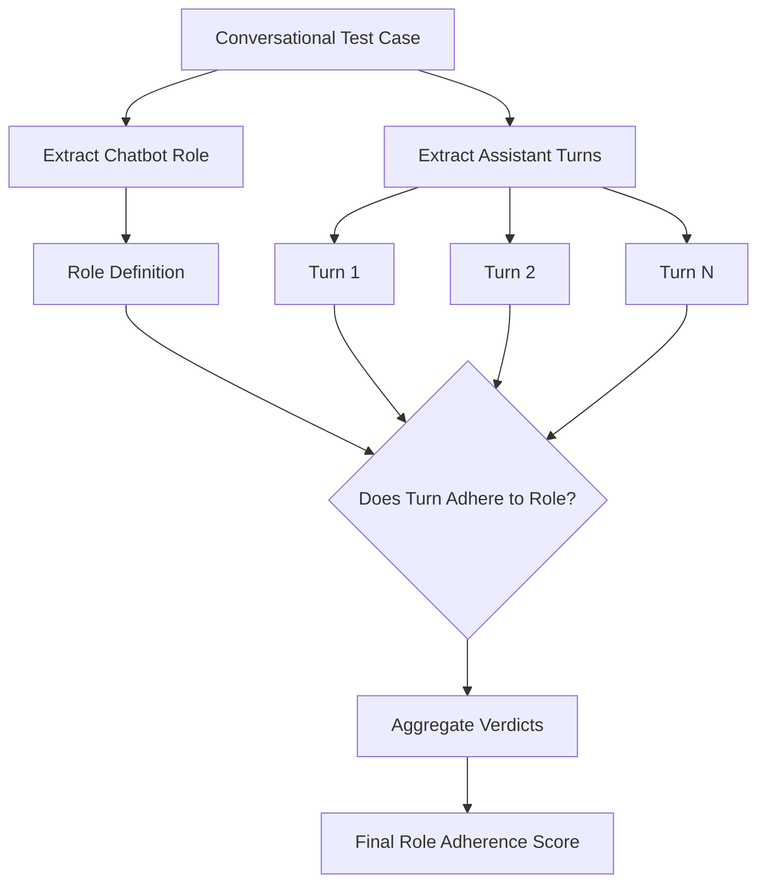
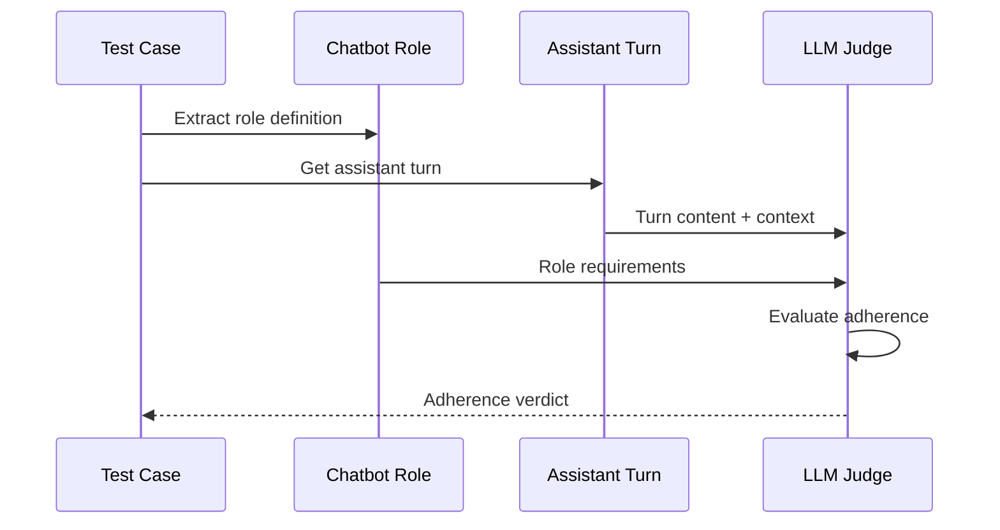

# Role Adherence Metric

## 1. Definition & Purpose

### What It Measures

The **Role Adherence** metric is a conversational metric that determines whether your LLM chatbot is able to adhere to its given role **throughout a conversation**. It evaluates if the assistant consistently maintains the persona, tone, and boundaries defined by its assigned role.

### Why It Matters

Role adherence is critical for:

- **Brand consistency**: Ensuring the chatbot maintains company voice and guidelines
- **Use case specificity**: Keeping the bot focused on its designated purpose
- **User expectations**: Delivering consistent experience aligned with the chatbot's stated role
- **Safety guardrails**: Preventing role-breaking that could lead to inappropriate responses

### When to Use This Metric

- **Role-playing chatbots**: Characters, personas, or specialized assistants
- **Customer service bots**: Agents with specific service boundaries
- **Domain-specific assistants**: Legal, medical, or technical advisors
- **Brand ambassadors**: Chatbots representing company values

## 2. Key Characteristics

| Property | Value |
|----------|-------|
| **Metric Type** | LLM-as-a-judge |
| **Evaluation Mode** | Multi-turn |
| **Reference Required** | No (referenceless) |
| **Score Range** | 0.0 to 1.0 |
| **Primary Use Case** | Chatbot, Role-playing |
| **Multimodal Support** | Yes |

### Required Arguments

When creating a `ConversationalTestCase`:

| Argument | Type | Description |
|----------|------|-------------|
| `turns` | List[Turn] | List of conversation turns with `role` and `content` |
| `chatbot_role` | str | Description of the chatbot's assigned role |

Each `Turn` must have:
- `role`: Either "user" or "assistant"
- `content`: The message content

### Optional Parameters

| Parameter | Type | Default | Description |
|-----------|------|---------|-------------|
| `threshold` | float | 0.5 | Minimum passing score |
| `model` | str/DeepEvalBaseLLM | gpt-4.1 | LLM for evaluation |
| `include_reason` | bool | True | Include explanation for score |
| `strict_mode` | bool | False | Binary scoring (0 or 1) |
| `async_mode` | bool | True | Enable concurrent execution |
| `verbose_mode` | bool | False | Print intermediate steps |

## 3. Conceptual Visualization

### Evaluation Flow



### Per-Turn Evaluation



## 4. Measurement Formula

### Core Formula

```
Role Adherence = Number of Assistant Turns that Adhered to Chatbot Role / Total Number of Assistant Turns
```

### Evaluation Criteria

The LLM judge evaluates each assistant turn against:

1. **Persona Consistency**: Does the response match the role's personality?
2. **Boundary Respect**: Does the response stay within role limitations?
3. **Tone Alignment**: Does the communication style match the role?
4. **Knowledge Scope**: Does the response align with role's expertise?

### Scoring Rubric

| Score Range | Interpretation |
|-------------|----------------|
| 0.9 - 1.0 | Excellent - Perfect role adherence |
| 0.7 - 0.9 | Good - Minor deviations from role |
| 0.5 - 0.7 | Fair - Some role-breaking detected |
| 0.3 - 0.5 | Poor - Frequent role deviations |
| 0.0 - 0.3 | Critical - Consistently breaks role |

## 5. Usage Examples

### Basic Usage

```python
from deepeval import evaluate
from deepeval.test_case import Turn, ConversationalTestCase
from deepeval.metrics import RoleAdherenceMetric

# Create a conversation with chatbot role
convo_test_case = ConversationalTestCase(
    chatbot_role="A friendly customer service agent for an electronics store who helps with product inquiries and returns",
    turns=[
        Turn(role="user", content="Hi, I bought a laptop last week and it's not working."),
        Turn(role="assistant", content="I'm sorry to hear that! I'd be happy to help you with your laptop issue. Could you tell me more about the problem?"),
        Turn(role="user", content="The screen won't turn on."),
        Turn(role="assistant", content="That sounds frustrating. Let's troubleshoot this together. Have you tried holding the power button for 10 seconds?"),
    ]
)

# Create metric
metric = RoleAdherenceMetric(threshold=0.5)

# Evaluate
evaluate(test_cases=[convo_test_case], metrics=[metric])
```

### Standalone Measurement

```python
metric = RoleAdherenceMetric(
    threshold=0.7,
    include_reason=True,
    verbose_mode=True,
)

metric.measure(convo_test_case)
print(f"Score: {metric.score}")
print(f"Reason: {metric.reason}")
```

### Role-Playing Example

```python
convo_test_case = ConversationalTestCase(
    chatbot_role="A medieval blacksmith named Grimwald who speaks in old English and only discusses weapons, armor, and smithing",
    turns=[
        Turn(role="user", content="Can you help me with my homework?"),
        Turn(role="assistant", content="Hark! I am Grimwald, a humble smith. I know not of this 'homework' ye speak of. Mayhaps ye seek a scholar? I deal only in steel and iron."),
    ]
)
```

## 6. Example Scenarios

### Scenario 1: High Adherence (Score ~1.0)

```python
convo_test_case = ConversationalTestCase(
    chatbot_role="A professional legal assistant who provides general legal information but always recommends consulting a licensed attorney",
    turns=[
        Turn(role="user", content="Can I sue my neighbor for noise?"),
        Turn(role="assistant", content="You may have grounds for a nuisance claim. However, I strongly recommend consulting with a licensed attorney to discuss your specific situation and local noise ordinances."),
    ]
)
```

### Scenario 2: Low Adherence (Score ~0.3)

```python
convo_test_case = ConversationalTestCase(
    chatbot_role="A professional legal assistant who provides general legal information but always recommends consulting a licensed attorney",
    turns=[
        Turn(role="user", content="Can I sue my neighbor for noise?"),
        Turn(role="assistant", content="Sure! Just go ahead and file a lawsuit. Here's exactly how to do it step by step..."),  # Breaks role by giving specific legal advice
    ]
)
```

## 7. Best Practices

### Do's

- **Define clear roles**: Be specific about persona, boundaries, and expertise
- **Include tone guidelines**: Specify communication style in the role definition
- **Set explicit boundaries**: Define what the role should NOT do
- **Test edge cases**: Include attempts to break the role in your test cases

### Don'ts

- **Don't be vague**: "A helpful assistant" is too generic for meaningful evaluation
- **Don't ignore context**: Role adherence should consider conversation flow
- **Don't set impossible standards**: Allow for natural conversation flexibility

### Writing Effective Role Definitions

```python
# Poor role definition (too vague)
chatbot_role = "A helpful assistant"

# Good role definition (specific and bounded)
chatbot_role = """
A senior technical support specialist for CloudTech Inc. who:
- Helps troubleshoot cloud infrastructure issues
- Speaks professionally but warmly
- Never shares internal company policies
- Always escalates billing issues to human agents
- Uses technical terms but explains them when asked
"""
```

## 8. API Reference

### RoleAdherenceMetric

```python
from deepeval.metrics import RoleAdherenceMetric

metric = RoleAdherenceMetric(
    threshold=0.5,           # Minimum passing score
    model="gpt-4.1",         # Evaluation model
    include_reason=True,     # Include explanation
    strict_mode=False,       # Binary scoring
    async_mode=True,         # Concurrent execution
    verbose_mode=False,      # Detailed logging
)
```

### ConversationalTestCase with Role

```python
from deepeval.test_case import Turn, ConversationalTestCase

test_case = ConversationalTestCase(
    chatbot_role="Description of the chatbot's role and persona",
    turns=[
        Turn(role="user", content="..."),
        Turn(role="assistant", content="..."),
    ]
)
```

## 9. References

- [DeepEval Role Adherence Documentation](https://deepeval.com/docs/metrics-role-adherence)
- [ConversationalTestCase Documentation](https://deepeval.com/docs/evaluation-test-cases)
