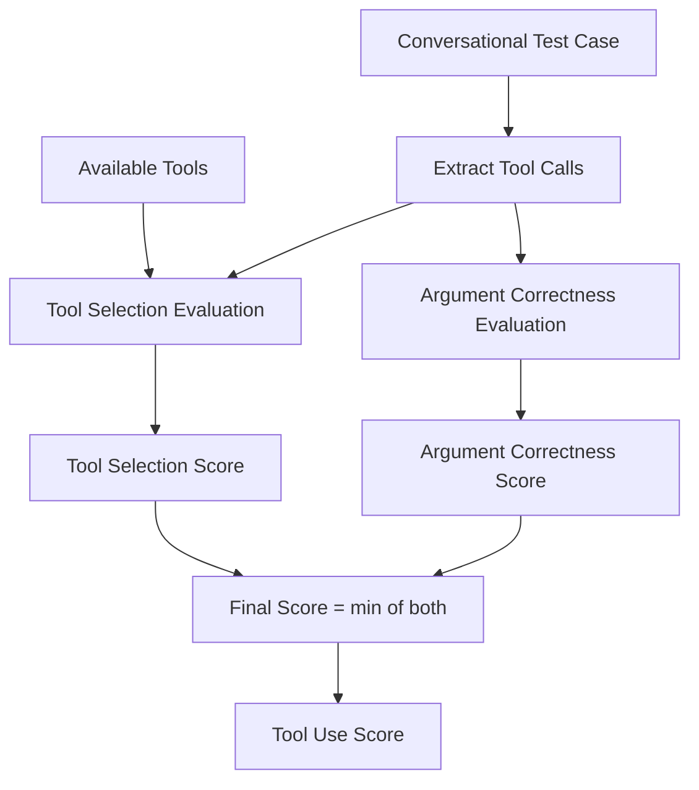
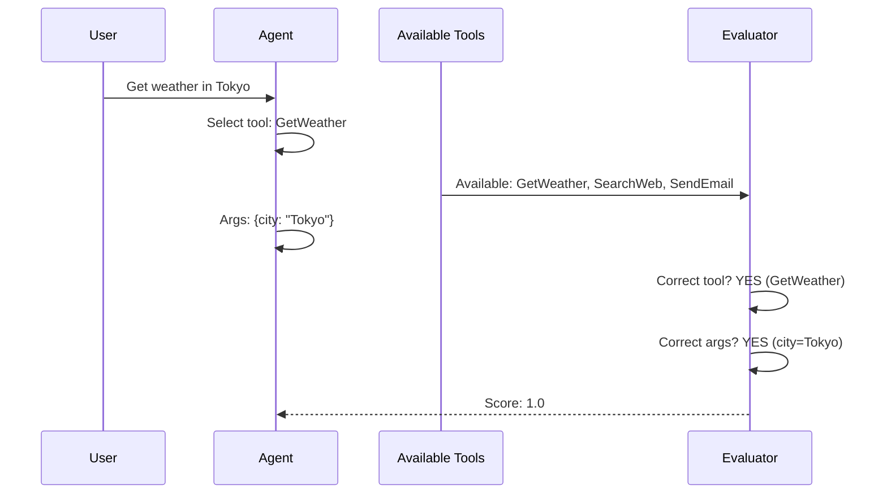

# Tool Use Metric

## 1. Definition & Purpose

### What It Measures

The **Tool Use** metric is a multi-turn agentic metric that evaluates whether your LLM agent's **tool selection and argument generation** capabilities are effective. It assesses both choosing the right tool for the task and providing correct arguments.

### Why It Matters

Tool use evaluation is critical for:

- **Agent reliability**: Ensuring agents use available tools correctly
- **Argument accuracy**: Verifying parameters are properly formatted
- **Tool selection**: Confirming the right tool is chosen for each task
- **Error prevention**: Catching incorrect tool usage before production

### When to Use This Metric

- **Tool-calling agents**: Agents with access to external functions
- **API integration**: Agents making external service calls
- **Function calling evaluation**: Testing LLM function calling accuracy
- **MCP (Model Context Protocol)**: Evaluating MCP tool usage

## 2. Key Characteristics

| Property | Value |
|----------|-------|
| **Metric Type** | LLM-as-a-judge |
| **Evaluation Mode** | Multi-turn, Agentic |
| **Reference Required** | No (referenceless) |
| **Score Range** | 0.0 to 1.0 |
| **Primary Use Case** | Agent |
| **Multimodal Support** | Yes |

### Required Arguments

When creating the metric:

| Argument | Type | Description |
|----------|------|-------------|
| `available_tools` | List[ToolCall] | List of all tools available to the agent |

When creating a `ConversationalTestCase`:

| Argument | Type | Description |
|----------|------|-------------|
| `turns` | List[Turn] | List of conversation turns with `role`, `content`, and `tools_called` |

### Optional Parameters

| Parameter | Type | Default | Description |
|-----------|------|---------|-------------|
| `threshold` | float | 0.5 | Minimum passing score |
| `model` | str/DeepEvalBaseLLM | gpt-4o | LLM for evaluation |
| `include_reason` | bool | True | Include explanation for score |
| `strict_mode` | bool | False | Binary scoring (0 or 1) |
| `async_mode` | bool | True | Enable concurrent execution |
| `verbose_mode` | bool | False | Print intermediate steps |

## 3. Conceptual Visualization

### Evaluation Flow



### Tool Evaluation Process



## 4. Measurement Formula

### Core Formula

```
Tool Use Score = min(Tool Selection Score, Argument Correctness Score)
```

### Component Scores

1. **Tool Selection Score**: Was the most appropriate tool chosen from available options?
2. **Argument Correctness Score**: Were the arguments accurate and properly formatted?

### Why Minimum?

The minimum function ensures that both components must be correct:
- Right tool + wrong arguments = Low score
- Wrong tool + right arguments = Low score
- Right tool + right arguments = High score

### Scoring Rubric

| Score Range | Interpretation |
|-------------|----------------|
| 0.9 - 1.0 | Excellent - Perfect tool selection and arguments |
| 0.7 - 0.9 | Good - Correct tools with minor argument issues |
| 0.5 - 0.7 | Fair - Some tool selection or argument errors |
| 0.3 - 0.5 | Poor - Significant tool usage issues |
| 0.0 - 0.3 | Critical - Wrong tools or severely incorrect arguments |

## 5. Usage Examples

### Basic Usage

```python
from deepeval import evaluate
from deepeval.test_case import Turn, ConversationalTestCase, ToolCall
from deepeval.metrics import ToolUseMetric

# Define available tools
available_tools = [
    ToolCall(
        name="GetWeather",
        description="Get current weather for a city",
        input={"city": "string - city name"},
    ),
    ToolCall(
        name="SearchWeb",
        description="Search the web for information",
        input={"query": "string - search query"},
    ),
    ToolCall(
        name="SendEmail",
        description="Send an email",
        input={"to": "string - recipient", "subject": "string", "body": "string"},
    ),
]

# Create conversation with tool usage
convo_test_case = ConversationalTestCase(
    turns=[
        Turn(role="user", content="What's the weather like in Tokyo?"),
        Turn(
            role="assistant",
            content="Let me check the weather in Tokyo for you.",
            tools_called=[
                ToolCall(
                    name="GetWeather",
                    input={"city": "Tokyo"},
                )
            ]
        ),
        Turn(role="assistant", content="It's 22°C and sunny in Tokyo today."),
    ]
)

# Create metric with available tools
metric = ToolUseMetric(
    available_tools=available_tools,
    threshold=0.5,
)

# Evaluate
evaluate(test_cases=[convo_test_case], metrics=[metric])
```

### Standalone Measurement

```python
metric = ToolUseMetric(
    available_tools=available_tools,
    threshold=0.7,
    include_reason=True,
    verbose_mode=True,
)

metric.measure(convo_test_case)
print(f"Score: {metric.score}")
print(f"Reason: {metric.reason}")
```

## 6. Example Scenarios

### Scenario 1: Correct Tool Use (Score ~1.0)

```python
available_tools = [
    ToolCall(name="GetWeather", description="Get weather", input={"city": "string"}),
    ToolCall(name="GetNews", description="Get news", input={"topic": "string"}),
]

turns = [
    Turn(role="user", content="What's the weather in Paris?"),
    Turn(
        role="assistant",
        content="The weather in Paris is 15°C.",
        tools_called=[
            ToolCall(name="GetWeather", input={"city": "Paris"})  # Correct tool & args
        ]
    ),
]
```

### Scenario 2: Wrong Tool Selection (Score ~0.3)

```python
turns = [
    Turn(role="user", content="What's the weather in Paris?"),
    Turn(
        role="assistant",
        content="Here's what I found about Paris weather.",
        tools_called=[
            ToolCall(name="GetNews", input={"topic": "Paris weather"})  # Wrong tool
        ]
    ),
]
```

### Scenario 3: Wrong Arguments (Score ~0.4)

```python
turns = [
    Turn(role="user", content="What's the weather in Paris?"),
    Turn(
        role="assistant",
        content="The weather in France is...",
        tools_called=[
            ToolCall(name="GetWeather", input={"city": "France"})  # Country, not city
        ]
    ),
]
```

## 7. Best Practices

### Do's

- **Define all available tools**: Include complete tool definitions with descriptions
- **Specify input schemas**: Document expected argument types and formats
- **Test edge cases**: Include scenarios with similar tools
- **Include tool descriptions**: Help the evaluator understand tool purposes

### Don'ts

- **Don't omit tool descriptions**: Descriptions help evaluate selection accuracy
- **Don't test without available_tools**: The metric requires tool context
- **Don't ignore argument types**: Type mismatches affect scores

### Defining Good Tool Specifications

```python
# Good tool definition
ToolCall(
    name="GetWeather",
    description="Get current weather conditions for a specific city including temperature, humidity, and conditions",
    input={
        "city": "string - name of the city",
        "units": "string - 'celsius' or 'fahrenheit', optional, defaults to celsius"
    },
)

# Poor tool definition (missing description)
ToolCall(
    name="GetWeather",
    input={"city": "string"},
)
```

## 8. API Reference

### ToolUseMetric

```python
from deepeval.metrics import ToolUseMetric

metric = ToolUseMetric(
    available_tools=[...],   # Required: List of available tools
    threshold=0.5,           # Minimum passing score
    model="gpt-4o",          # Evaluation model
    include_reason=True,     # Include explanation
    strict_mode=False,       # Binary scoring
    async_mode=True,         # Concurrent execution
    verbose_mode=False,      # Detailed logging
)
```

### ToolCall

```python
from deepeval.test_case import ToolCall

tool = ToolCall(
    name="ToolName",                    # Required: Tool identifier
    description="What this tool does",  # Recommended: Tool purpose
    input={"param": "value"},           # Required: Input parameters
)
```

### ConversationalTestCase with Tools

```python
from deepeval.test_case import Turn, ConversationalTestCase, ToolCall

test_case = ConversationalTestCase(
    turns=[
        Turn(role="user", content="User request..."),
        Turn(
            role="assistant",
            content="Response...",
            tools_called=[
                ToolCall(name="Tool", input={"arg": "value"})
            ]
        ),
    ]
)
```

## 9. References

- [DeepEval Tool Use Documentation](https://deepeval.com/docs/metrics-tool-use)
- [ConversationalTestCase Documentation](https://deepeval.com/docs/evaluation-test-cases)
