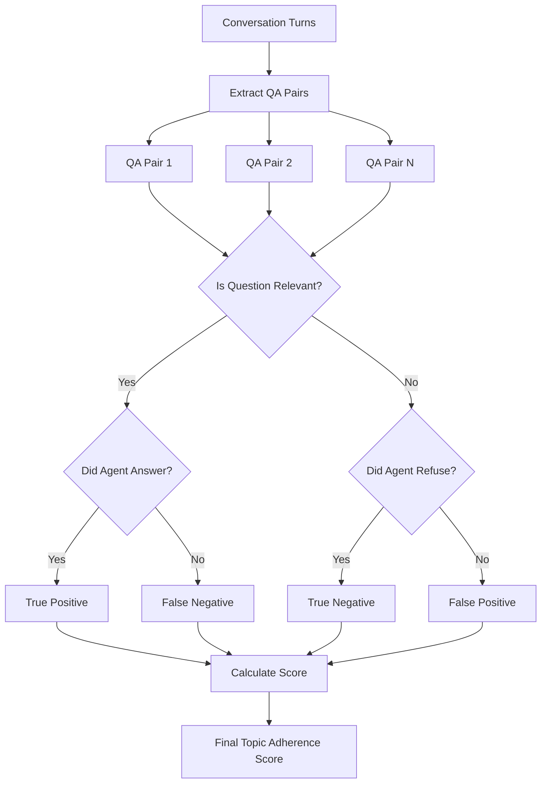
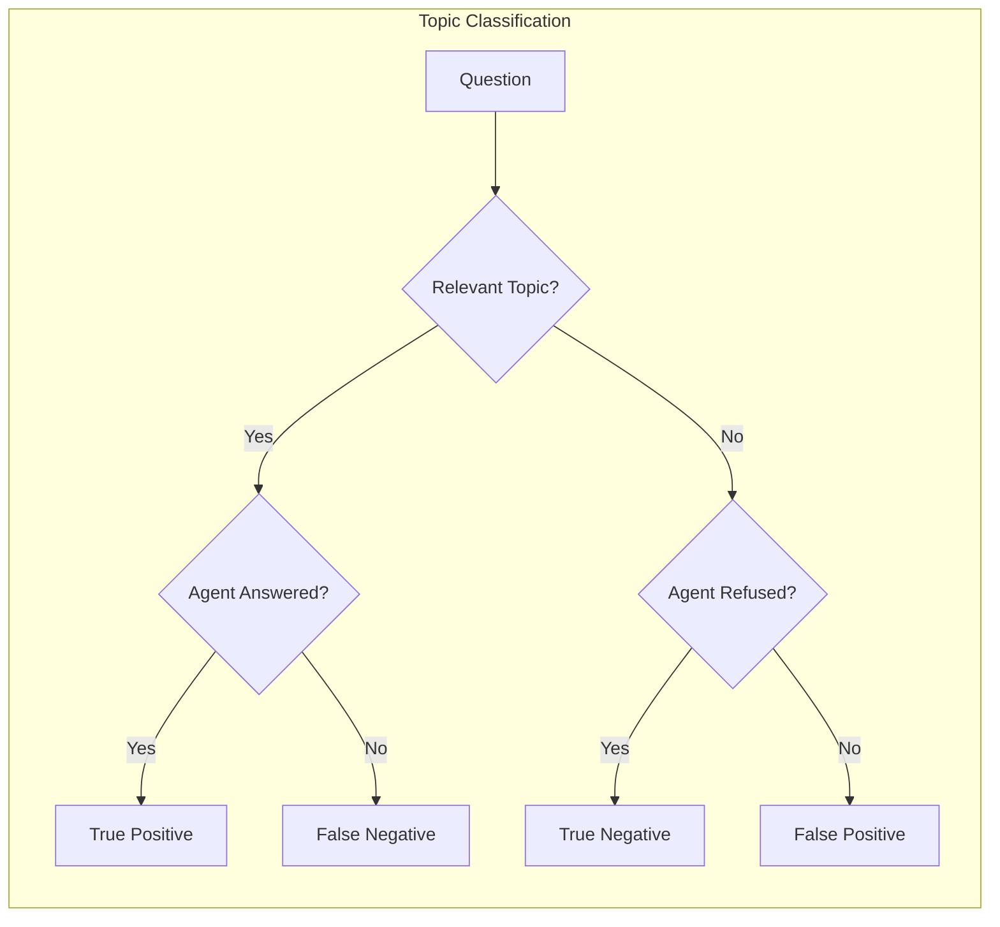

# Topic Adherence Metric

## 1. Definition & Purpose

### What It Measures

The **Topic Adherence** metric is a multi-turn agentic metric that evaluates whether your **agent has answered questions only if they adhere to relevant topics**. It ensures the agent stays within its designated domain and appropriately declines off-topic queries.

### Why It Matters

Topic adherence is essential for:

- **Domain boundaries**: Keeping agents focused on their area of expertise
- **Safety guardrails**: Preventing agents from answering inappropriate topics
- **Brand protection**: Ensuring agents don't discuss competitors or sensitive topics
- **User experience**: Providing clear scope expectations

### When to Use This Metric

- **Specialized assistants**: Legal, medical, financial advisors
- **Customer support**: Agents with defined service scope
- **Content moderation**: Ensuring agents stay on-topic
- **Enterprise chatbots**: Agents with strict domain boundaries

## 2. Key Characteristics

| Property | Value |
|----------|-------|
| **Metric Type** | LLM-as-a-judge |
| **Evaluation Mode** | Multi-turn |
| **Reference Required** | No (referenceless) |
| **Score Range** | 0.0 to 1.0 |
| **Primary Use Case** | Agent |
| **Multimodal Support** | Yes |

### Required Arguments

When creating a `TopicAdherenceMetric`:

| Argument | Type | Description |
|----------|------|-------------|
| `relevant_topics` | List[str] | List of topics the agent is allowed to discuss |

When creating a `ConversationalTestCase`:

| Argument | Type | Description |
|----------|------|-------------|
| `turns` | List[Turn] | List of conversation turns with `role` and `content` |

### Optional Parameters

| Parameter | Type | Default | Description |
|-----------|------|---------|-------------|
| `threshold` | float | 0.5 | Minimum passing score |
| `model` | str/DeepEvalBaseLLM | gpt-4o | LLM for evaluation |
| `include_reason` | bool | True | Include explanation for score |
| `strict_mode` | bool | False | Binary scoring (0 or 1) |
| `async_mode` | bool | True | Enable concurrent execution |
| `verbose_mode` | bool | False | Print intermediate steps |

## 3. Conceptual Visualization

### Evaluation Flow



### Truth Table Classification



## 4. Measurement Formula

### Core Formula

```
Topic Adherence Score = (True Positives + True Negatives) / Total Number of QA Pairs
```

### Truth Table Values

| Question Type | Agent Response | Classification | Impact |
|---------------|----------------|----------------|--------|
| Relevant | Answered correctly | True Positive | Positive |
| Relevant | Refused/ignored | False Negative | Negative |
| Irrelevant | Refused appropriately | True Negative | Positive |
| Irrelevant | Answered anyway | False Positive | Negative |

### Scoring Rubric

| Score Range | Interpretation |
|-------------|----------------|
| 0.9 - 1.0 | Excellent - Perfect topic adherence |
| 0.7 - 0.9 | Good - Minor topic boundary issues |
| 0.5 - 0.7 | Fair - Some off-topic responses |
| 0.3 - 0.5 | Poor - Frequent topic violations |
| 0.0 - 0.3 | Critical - Ignores topic boundaries |

## 5. Usage Examples

### Basic Usage

```python
from deepeval import evaluate
from deepeval.test_case import Turn, ConversationalTestCase
from deepeval.metrics import TopicAdherenceMetric

# Define relevant topics
relevant_topics = [
    "product information",
    "pricing",
    "shipping",
    "returns and refunds",
    "order status"
]

# Create conversation
convo_test_case = ConversationalTestCase(
    turns=[
        Turn(role="user", content="What's your return policy?"),
        Turn(role="assistant", content="We offer 30-day returns with full refund."),
        Turn(role="user", content="What's your opinion on the stock market?"),
        Turn(role="assistant", content="I'm a product assistant and can only help with product-related questions. Is there anything about our products I can help with?"),
    ]
)

# Create metric with relevant topics
metric = TopicAdherenceMetric(
    relevant_topics=relevant_topics,
    threshold=0.5
)

# Evaluate
evaluate(test_cases=[convo_test_case], metrics=[metric])
```

### Standalone Measurement

```python
metric = TopicAdherenceMetric(
    relevant_topics=["cloud computing", "AWS services", "pricing"],
    threshold=0.7,
    include_reason=True,
    verbose_mode=True,
)

metric.measure(convo_test_case)
print(f"Score: {metric.score}")
print(f"Reason: {metric.reason}")
```

## 6. Example Scenarios

### Scenario 1: Perfect Adherence (Score ~1.0)

```python
relevant_topics = ["cooking", "recipes", "ingredients"]

turns = [
    Turn(role="user", content="How do I make pasta?"),
    Turn(role="assistant", content="Boil water, add pasta, cook for 8-10 minutes until al dente."),
    Turn(role="user", content="What's the best programming language?"),
    Turn(role="assistant", content="I'm a cooking assistant and can only help with culinary questions. Would you like a recipe recommendation instead?"),
]
# True Positive (cooking question answered) + True Negative (programming question refused)
```

### Scenario 2: Poor Adherence (Score ~0.5)

```python
relevant_topics = ["cooking", "recipes", "ingredients"]

turns = [
    Turn(role="user", content="How do I make pasta?"),
    Turn(role="assistant", content="Boil water, add pasta, cook for 8-10 minutes."),  # TP
    Turn(role="user", content="What's the best programming language?"),
    Turn(role="assistant", content="Python is great for beginners, while JavaScript is popular for web development."),  # FP - answered off-topic
]
```

### Scenario 3: Medical Assistant Example

```python
relevant_topics = ["symptoms", "medications", "appointment scheduling", "general health"]

convo_test_case = ConversationalTestCase(
    turns=[
        Turn(role="user", content="I have a headache."),
        Turn(role="assistant", content="I'm sorry to hear that. Headaches can have many causes. Have you been drinking enough water?"),
        Turn(role="user", content="Can you help me with my taxes?"),
        Turn(role="assistant", content="I'm a health assistant and can only help with medical questions. For tax help, please consult a tax professional."),
    ]
)
```

## 7. Best Practices

### Do's

- **Define comprehensive topic lists**: Cover all legitimate use cases
- **Include boundary topics**: Topics that are close but should be excluded
- **Test refusal responses**: Verify agent declines appropriately
- **Use clear topic descriptions**: Be specific about what's included

### Don'ts

- **Don't be too restrictive**: Allow natural conversation flexibility
- **Don't forget edge cases**: Test topics that are borderline relevant
- **Don't ignore false negatives**: Agent should answer relevant questions

### Writing Effective Topic Lists

```python
# Poor topic definition (too vague)
relevant_topics = ["help", "support"]

# Good topic definition (specific and comprehensive)
relevant_topics = [
    "product features and specifications",
    "pricing and discounts",
    "shipping and delivery",
    "returns and refunds",
    "order tracking",
    "account management",
    "technical support for products",
    "warranty information"
]
```

## 8. API Reference

### TopicAdherenceMetric

```python
from deepeval.metrics import TopicAdherenceMetric

metric = TopicAdherenceMetric(
    relevant_topics=["topic1", "topic2"],  # Required
    threshold=0.5,           # Minimum passing score
    model="gpt-4o",          # Evaluation model
    include_reason=True,     # Include explanation
    strict_mode=False,       # Binary scoring
    async_mode=True,         # Concurrent execution
    verbose_mode=False,      # Detailed logging
)
```

### ConversationalTestCase

```python
from deepeval.test_case import Turn, ConversationalTestCase

test_case = ConversationalTestCase(
    turns=[
        Turn(role="user", content="..."),
        Turn(role="assistant", content="..."),
    ]
)
```

## 9. References

- [DeepEval Topic Adherence Documentation](https://deepeval.com/docs/metrics-topic-adherence)
- [ConversationalTestCase Documentation](https://deepeval.com/docs/evaluation-test-cases)
