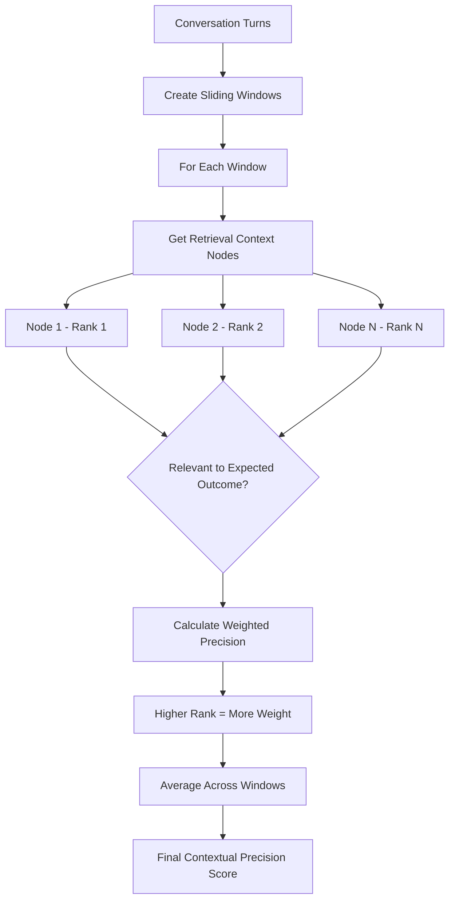
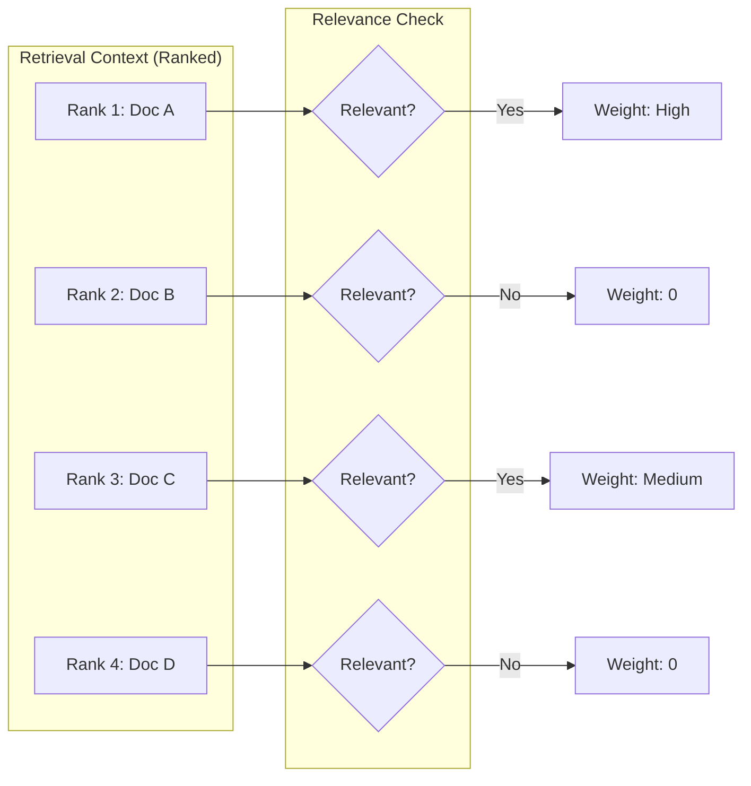

# Turn Contextual Precision Metric

## 1. Definition & Purpose

### What It Measures

The **Turn Contextual Precision** metric is a conversational metric that evaluates whether relevant nodes in your retrieval context are ranked higher than irrelevant nodes **throughout a conversation**. It measures the quality of your retrieval system's ranking.

### Why It Matters

Contextual precision is essential for:

- **Retrieval quality**: Ensuring the most relevant documents appear first
- **Response quality**: Better-ranked context leads to better responses
- **Efficiency**: Models process earlier context more effectively
- **RAG optimization**: Identifying retrieval ranking issues

### When to Use This Metric

- **RAG system evaluation**: Assessing retrieval ranking quality
- **Search optimization**: Improving document ranking algorithms
- **Context window optimization**: When context length is limited
- **A/B testing retrievers**: Comparing different retrieval strategies

## 2. Key Characteristics

| Property | Value |
|----------|-------|
| **Metric Type** | LLM-as-a-judge |
| **Evaluation Mode** | Multi-turn |
| **Reference Required** | Yes (retrieval_context, expected_outcome) |
| **Score Range** | 0.0 to 1.0 |
| **Primary Use Case** | RAG, Chatbot |
| **Multimodal Support** | Yes |

### Required Arguments

When creating a `ConversationalTestCase`:

| Argument | Type | Description |
|----------|------|-------------|
| `turns` | List[Turn] | List of conversation turns |
| `expected_outcome` | str | Expected behavior/response for evaluation |

Each `Turn` must have:
- `role`: Either "user" or "assistant"
- `content`: The message content
- `retrieval_context`: List of context strings (ordered by rank)

### Optional Parameters

| Parameter | Type | Default | Description |
|-----------|------|---------|-------------|
| `threshold` | float | 0.5 | Minimum passing score |
| `model` | str/DeepEvalBaseLLM | gpt-4.1 | LLM for evaluation |
| `include_reason` | bool | True | Include explanation for score |
| `strict_mode` | bool | False | Binary scoring (0 or 1) |
| `async_mode` | bool | True | Enable concurrent execution |
| `verbose_mode` | bool | False | Print intermediate steps |
| `window_size` | int | 10 | Sliding window size for evaluation |

## 3. Conceptual Visualization

### Evaluation Flow



### Ranking Evaluation



## 4. Measurement Formula

### Core Formula

```
Turn Contextual Precision = Sum of Turn Contextual Precision Scores / Total Number of Assistant Turns
```

### Per-Turn Weighted Precision

```
Contextual Precision = (1 / Number of Relevant Nodes) × Σ(Relevant Nodes Up to Position k / k × r_k)
```

Where:
- `k` is the position (1-indexed) in the retrieval context
- `r_k` is 1 if node at position k is relevant, 0 otherwise

### Why Weighting Matters

| Scenario | Rank 1 | Rank 2 | Rank 3 | Score |
|----------|--------|--------|--------|-------|
| Best | Relevant | Relevant | Irrelevant | ~1.0 |
| Good | Relevant | Irrelevant | Relevant | ~0.75 |
| Poor | Irrelevant | Irrelevant | Relevant | ~0.33 |

### Scoring Rubric

| Score Range | Interpretation |
|-------------|----------------|
| 0.9 - 1.0 | Excellent - Relevant docs ranked first |
| 0.7 - 0.9 | Good - Mostly good ranking |
| 0.5 - 0.7 | Fair - Some ranking issues |
| 0.3 - 0.5 | Poor - Relevant docs ranked low |
| 0.0 - 0.3 | Critical - Irrelevant docs ranked first |

## 5. Usage Examples

### Basic Usage

```python
from deepeval import evaluate
from deepeval.test_case import Turn, ConversationalTestCase
from deepeval.metrics import TurnContextualPrecisionMetric

# Create conversation with ranked retrieval context
convo_test_case = ConversationalTestCase(
    turns=[
        Turn(role="user", content="What if these shoes don't fit?"),
        Turn(
            role="assistant",
            content="We offer a 30-day full refund at no extra cost.",
            retrieval_context=[
                "All customers are eligible for a 30 day full refund at no extra cost.",  # Relevant - Rank 1
                "Shoes come in sizes 5-13 for men and 4-11 for women.",  # Less relevant - Rank 2
                "Free shipping on orders over $50.",  # Irrelevant - Rank 3
            ]
        ),
    ],
    expected_outcome="The chatbot must explain the store policies like refunds, discounts, etc.",
)

# Create metric
metric = TurnContextualPrecisionMetric(threshold=0.5)

# Evaluate
evaluate(test_cases=[convo_test_case], metrics=[metric])
```

### Standalone Measurement

```python
metric = TurnContextualPrecisionMetric(
    threshold=0.7,
    include_reason=True,
    verbose_mode=True,
)

metric.measure(convo_test_case)
print(f"Score: {metric.score}")
print(f"Reason: {metric.reason}")
```

## 6. Example Scenarios

### Scenario 1: Perfect Ranking (Score ~1.0)

```python
convo_test_case = ConversationalTestCase(
    turns=[
        Turn(role="user", content="What's the warranty period?"),
        Turn(
            role="assistant",
            content="All products come with a 2-year warranty.",
            retrieval_context=[
                "Warranty: All products include a 2-year manufacturer warranty.",  # Relevant - Rank 1
                "Extended warranty available for purchase.",  # Relevant - Rank 2
                "Store hours: 9AM-6PM",  # Irrelevant - Rank 3
            ]
        ),
    ],
    expected_outcome="Explain warranty coverage and duration.",
)
# Relevant documents are ranked at the top
```

### Scenario 2: Poor Ranking (Score ~0.4)

```python
convo_test_case = ConversationalTestCase(
    turns=[
        Turn(role="user", content="What's the warranty period?"),
        Turn(
            role="assistant",
            content="All products come with a 2-year warranty.",
            retrieval_context=[
                "Store hours: 9AM-6PM",  # Irrelevant - Rank 1
                "Free parking available.",  # Irrelevant - Rank 2
                "Warranty: All products include a 2-year manufacturer warranty.",  # Relevant - Rank 3
            ]
        ),
    ],
    expected_outcome="Explain warranty coverage and duration.",
)
# Relevant document is ranked last
```

## 7. Best Practices

### Do's

- **Order context by retrieval score**: Maintain ranking from your retriever
- **Define clear expected outcomes**: Be specific about what should be addressed
- **Test with varying context sizes**: Different numbers of retrieved documents
- **Compare retrieval strategies**: Use metric to optimize ranking algorithms

### Don'ts

- **Don't shuffle context randomly**: Order matters for this metric
- **Don't ignore low scores**: They indicate retrieval issues
- **Don't use without expected_outcome**: The metric needs a reference point

### Improving Contextual Precision

1. **Better embeddings**: Use domain-specific embedding models
2. **Reranking**: Add a reranking step after initial retrieval
3. **Query expansion**: Improve query understanding
4. **Hybrid search**: Combine semantic and keyword search

## 8. API Reference

### TurnContextualPrecisionMetric

```python
from deepeval.metrics import TurnContextualPrecisionMetric

metric = TurnContextualPrecisionMetric(
    threshold=0.5,           # Minimum passing score
    model="gpt-4.1",         # Evaluation model
    include_reason=True,     # Include explanation
    strict_mode=False,       # Binary scoring
    async_mode=True,         # Concurrent execution
    verbose_mode=False,      # Detailed logging
    window_size=10,          # Context window size
)
```

### ConversationalTestCase with Expected Outcome

```python
from deepeval.test_case import Turn, ConversationalTestCase

test_case = ConversationalTestCase(
    turns=[
        Turn(role="user", content="..."),
        Turn(
            role="assistant",
            content="...",
            retrieval_context=["doc1", "doc2", "doc3"]  # Ordered by rank
        ),
    ],
    expected_outcome="Description of expected response behavior",
)
```

## 9. References

- [DeepEval Turn Contextual Precision Documentation](https://deepeval.com/docs/metrics-turn-contextual-precision)
- [ConversationalTestCase Documentation](https://deepeval.com/docs/evaluation-test-cases)
- [RAG Evaluation Best Practices](https://deepeval.com/docs/metrics-introduction)
