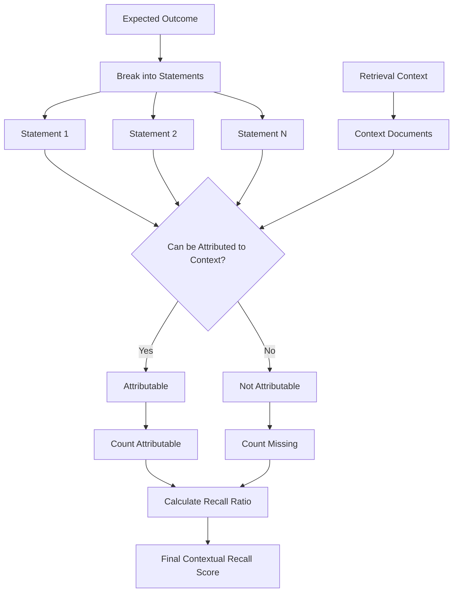
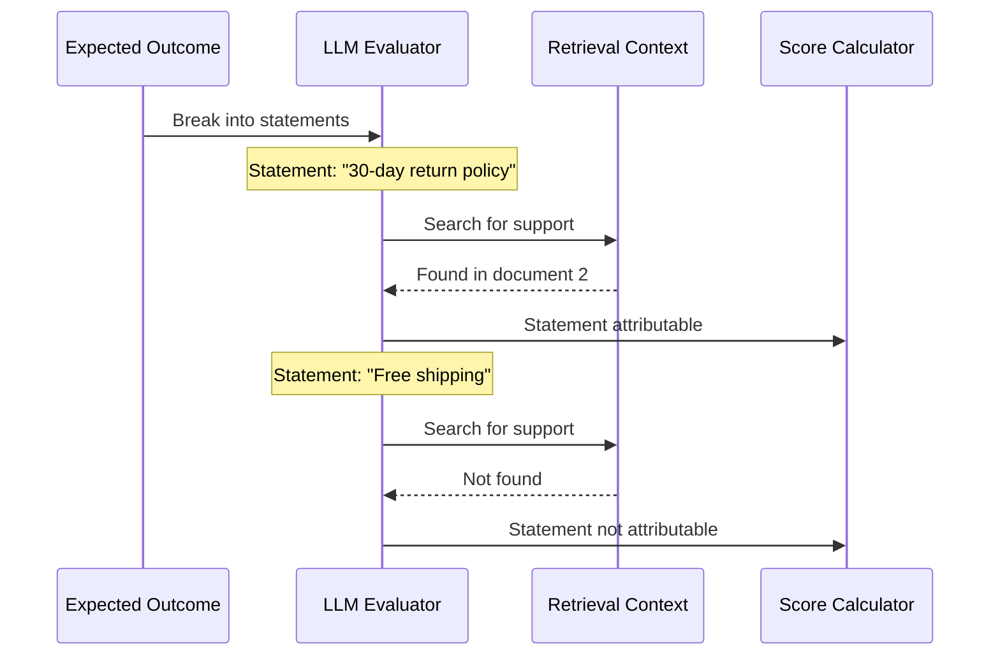

# Turn Contextual Recall Metric

## 1. Definition & Purpose

### What It Measures

The **Turn Contextual Recall** metric is a conversational metric that evaluates whether the retrieval context contains sufficient information to support the expected outcome **throughout a conversation**. It measures the completeness of your retrieval system.

### Why It Matters

Contextual recall is essential for:

- **Information completeness**: Ensuring all necessary information is retrieved
- **Response quality**: Missing context leads to incomplete answers
- **RAG coverage**: Identifying gaps in document retrieval
- **Knowledge base adequacy**: Verifying documents cover required topics

### When to Use This Metric

- **RAG system evaluation**: Assessing retrieval coverage
- **Knowledge base auditing**: Finding content gaps
- **Response completeness**: When answers need to be comprehensive
- **A/B testing**: Comparing retrieval strategies for completeness

## 2. Key Characteristics

| Property | Value |
|----------|-------|
| **Metric Type** | LLM-as-a-judge |
| **Evaluation Mode** | Multi-turn |
| **Reference Required** | Yes (retrieval_context, expected_outcome) |
| **Score Range** | 0.0 to 1.0 |
| **Primary Use Case** | RAG, Chatbot |
| **Multimodal Support** | Yes |

### Required Arguments

When creating a `ConversationalTestCase`:

| Argument | Type | Description |
|----------|------|-------------|
| `turns` | List[Turn] | List of conversation turns |
| `expected_outcome` | str | Expected behavior/response for evaluation |

Each `Turn` must have:
- `role`: Either "user" or "assistant"
- `content`: The message content
- `retrieval_context`: List of context strings

### Optional Parameters

| Parameter | Type | Default | Description |
|-----------|------|---------|-------------|
| `threshold` | float | 0.5 | Minimum passing score |
| `model` | str/DeepEvalBaseLLM | gpt-4.1 | LLM for evaluation |
| `include_reason` | bool | True | Include explanation for score |
| `strict_mode` | bool | False | Binary scoring (0 or 1) |
| `async_mode` | bool | True | Enable concurrent execution |
| `verbose_mode` | bool | False | Print intermediate steps |
| `window_size` | int | 10 | Sliding window size for evaluation |

## 3. Conceptual Visualization

### Evaluation Flow



### Attribution Check



## 4. Measurement Formula

### Core Formula

```
Turn Contextual Recall = Sum of Turn Contextual Recall Scores / Total Number of Assistant Turns
```

### Per-Turn Calculation

```
Contextual Recall = Number of Attributable Statements / Total Number of Statements
```

### Evaluation Process

1. **Statement Extraction**: Break expected outcome into individual statements
2. **Attribution Check**: For each statement, determine if it can be attributed to context
3. **Score Calculation**: Ratio of attributable statements to total statements

### Scoring Rubric

| Score Range | Interpretation |
|-------------|----------------|
| 0.9 - 1.0 | Excellent - Context covers all requirements |
| 0.7 - 0.9 | Good - Most information present |
| 0.5 - 0.7 | Fair - Partial coverage |
| 0.3 - 0.5 | Poor - Significant gaps |
| 0.0 - 0.3 | Critical - Most information missing |

## 5. Usage Examples

### Basic Usage

```python
from deepeval import evaluate
from deepeval.test_case import Turn, ConversationalTestCase
from deepeval.metrics import TurnContextualRecallMetric

# Create conversation with retrieval context
convo_test_case = ConversationalTestCase(
    turns=[
        Turn(role="user", content="What's your return policy?"),
        Turn(
            role="assistant",
            content="We offer a 30-day full refund policy.",
            retrieval_context=[
                "Return Policy: All customers are eligible for a 30 day full refund at no extra cost.",
                "Items must be returned in original packaging.",
                "Refunds are processed within 5-7 business days."
            ]
        ),
    ],
    expected_outcome="The chatbot should explain the return policy including the 30-day window, refund process, and packaging requirements.",
)

# Create metric
metric = TurnContextualRecallMetric(threshold=0.5)

# Evaluate
evaluate(test_cases=[convo_test_case], metrics=[metric])
```

### Standalone Measurement

```python
metric = TurnContextualRecallMetric(
    threshold=0.7,
    include_reason=True,
    verbose_mode=True,
)

metric.measure(convo_test_case)
print(f"Score: {metric.score}")
print(f"Reason: {metric.reason}")
```

## 6. Example Scenarios

### Scenario 1: Full Recall (Score ~1.0)

```python
convo_test_case = ConversationalTestCase(
    turns=[
        Turn(role="user", content="Tell me about shipping options."),
        Turn(
            role="assistant",
            content="We offer free standard shipping and express options.",
            retrieval_context=[
                "Shipping: Free standard shipping on all orders (5-7 days).",
                "Express shipping available for $9.99 (2-3 days).",
                "Overnight shipping available for $24.99.",
            ]
        ),
    ],
    expected_outcome="Explain shipping options including free standard, express, and overnight with prices and delivery times.",
)
# Context contains all information needed for expected outcome
```

### Scenario 2: Partial Recall (Score ~0.5)

```python
convo_test_case = ConversationalTestCase(
    turns=[
        Turn(role="user", content="Tell me about shipping options."),
        Turn(
            role="assistant",
            content="We offer shipping options.",
            retrieval_context=[
                "Shipping: Free standard shipping on all orders (5-7 days).",
                # Missing: Express and overnight shipping info
            ]
        ),
    ],
    expected_outcome="Explain shipping options including free standard, express, and overnight with prices and delivery times.",
)
# Context missing express and overnight shipping information
```

### Scenario 3: Low Recall (Score ~0.2)

```python
convo_test_case = ConversationalTestCase(
    turns=[
        Turn(role="user", content="What's the warranty and return policy?"),
        Turn(
            role="assistant",
            content="We have policies in place.",
            retrieval_context=[
                "Store hours: Monday-Friday 9AM-6PM.",
                "Contact us at support@store.com.",
            ]
        ),
    ],
    expected_outcome="Explain warranty duration, coverage, and return policy including timeframe and conditions.",
)
# Context completely missing required information
```

## 7. Best Practices

### Do's

- **Define comprehensive expected outcomes**: Include all information the response should cover
- **Ensure diverse context**: Retrieve from multiple relevant documents
- **Test edge cases**: Include scenarios where context might be insufficient
- **Combine with Precision**: Use both metrics for complete RAG evaluation

### Don'ts

- **Don't use vague expected outcomes**: Be specific about required information
- **Don't ignore low scores**: They indicate retrieval or knowledge base gaps
- **Don't test without context**: The metric requires retrieval context to evaluate

### Improving Contextual Recall

1. **Expand retrieval**: Increase number of retrieved documents
2. **Better chunking**: Ensure important information isn't split across chunks
3. **Query expansion**: Retrieve for related terms and concepts
4. **Knowledge base coverage**: Add missing documents to your knowledge base

## 8. API Reference

### TurnContextualRecallMetric

```python
from deepeval.metrics import TurnContextualRecallMetric

metric = TurnContextualRecallMetric(
    threshold=0.5,           # Minimum passing score
    model="gpt-4.1",         # Evaluation model
    include_reason=True,     # Include explanation
    strict_mode=False,       # Binary scoring
    async_mode=True,         # Concurrent execution
    verbose_mode=False,      # Detailed logging
    window_size=10,          # Context window size
)
```

### ConversationalTestCase with Expected Outcome

```python
from deepeval.test_case import Turn, ConversationalTestCase

test_case = ConversationalTestCase(
    turns=[
        Turn(role="user", content="..."),
        Turn(
            role="assistant",
            content="...",
            retrieval_context=["doc1", "doc2", "doc3"]
        ),
    ],
    expected_outcome="Comprehensive description of what the response should cover",
)
```

## 9. References

- [DeepEval Turn Contextual Recall Documentation](https://deepeval.com/docs/metrics-turn-contextual-recall)
- [ConversationalTestCase Documentation](https://deepeval.com/docs/evaluation-test-cases)
- [RAG Evaluation Best Practices](https://deepeval.com/docs/metrics-introduction)
