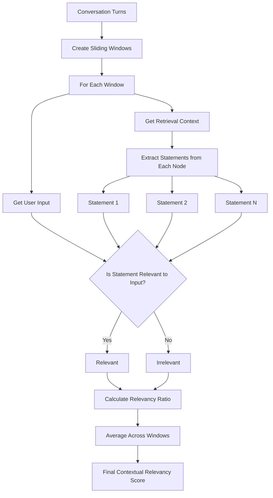
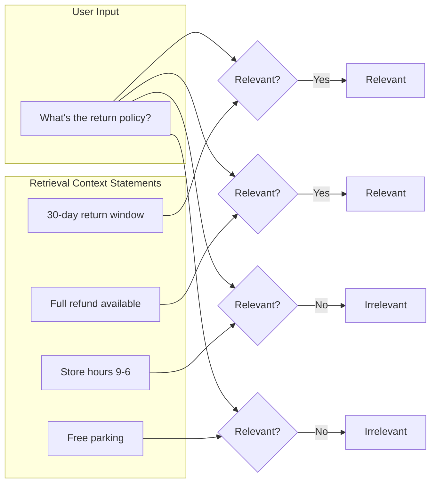

# Turn Contextual Relevancy Metric

## 1. Definition & Purpose

### What It Measures

The **Turn Contextual Relevancy** metric is a conversational metric that evaluates whether the retrieval context contains relevant information to address the user's input **throughout a conversation**. It measures how much of the retrieved context is actually useful.

### Why It Matters

Contextual relevancy is essential for:

- **Retrieval efficiency**: Identifying noise in retrieved documents
- **Context window optimization**: Ensuring limited context space is well-used
- **Response quality**: Irrelevant context can confuse the model
- **Cost optimization**: Less irrelevant context means fewer tokens processed

### When to Use This Metric

- **RAG system evaluation**: Assessing retrieval relevance
- **Context filtering**: Identifying documents to filter out
- **Retriever tuning**: Optimizing relevance thresholds
- **A/B testing**: Comparing retrieval strategies

## 2. Key Characteristics

| Property | Value |
|----------|-------|
| **Metric Type** | LLM-as-a-judge |
| **Evaluation Mode** | Multi-turn |
| **Reference Required** | Yes (retrieval_context) |
| **Score Range** | 0.0 to 1.0 |
| **Primary Use Case** | RAG, Chatbot |
| **Multimodal Support** | Yes |

### Required Arguments

When creating a `ConversationalTestCase`:

| Argument | Type | Description |
|----------|------|-------------|
| `turns` | List[Turn] | List of conversation turns |

Each `Turn` must have:
- `role`: Either "user" or "assistant"
- `content`: The message content
- `retrieval_context`: List of context strings

### Optional Parameters

| Parameter | Type | Default | Description |
|-----------|------|---------|-------------|
| `threshold` | float | 0.5 | Minimum passing score |
| `model` | str/DeepEvalBaseLLM | gpt-4.1 | LLM for evaluation |
| `include_reason` | bool | True | Include explanation for score |
| `strict_mode` | bool | False | Binary scoring (0 or 1) |
| `async_mode` | bool | True | Enable concurrent execution |
| `verbose_mode` | bool | False | Print intermediate steps |
| `window_size` | int | 10 | Sliding window size for evaluation |

## 3. Conceptual Visualization

### Evaluation Flow



### Relevancy Assessment



## 4. Measurement Formula

### Core Formula

```
Turn Contextual Relevancy = Sum of Turn Contextual Relevancy Scores / Total Number of Assistant Turns
```

### Per-Turn Calculation

```
Contextual Relevancy = Number of Relevant Statements / Total Number of Statements
```

### Evaluation Process

1. **Statement Extraction**: Extract individual statements from each context node
2. **Relevance Evaluation**: Determine if each statement is relevant to the user's input
3. **Score Calculation**: Ratio of relevant statements to total statements

### Scoring Rubric

| Score Range | Interpretation |
|-------------|----------------|
| 0.9 - 1.0 | Excellent - All context highly relevant |
| 0.7 - 0.9 | Good - Most context relevant |
| 0.5 - 0.7 | Fair - Mixed relevance |
| 0.3 - 0.5 | Poor - Significant noise |
| 0.0 - 0.3 | Critical - Mostly irrelevant context |

## 5. Usage Examples

### Basic Usage

```python
from deepeval import evaluate
from deepeval.test_case import Turn, ConversationalTestCase
from deepeval.metrics import TurnContextualRelevancyMetric

# Create conversation with retrieval context
convo_test_case = ConversationalTestCase(
    turns=[
        Turn(role="user", content="What's your return policy?"),
        Turn(
            role="assistant",
            content="We offer a 30-day full refund at no extra cost.",
            retrieval_context=[
                "Return Policy: 30 day full refund available for all purchases.",
                "Items must be unused and in original packaging for returns.",
                "Store location: 123 Main Street, open Monday-Friday.",  # Less relevant
            ]
        ),
    ],
)

# Create metric
metric = TurnContextualRelevancyMetric(threshold=0.5)

# Evaluate
evaluate(test_cases=[convo_test_case], metrics=[metric])
```

### Standalone Measurement

```python
metric = TurnContextualRelevancyMetric(
    threshold=0.7,
    include_reason=True,
    verbose_mode=True,
)

metric.measure(convo_test_case)
print(f"Score: {metric.score}")
print(f"Reason: {metric.reason}")
```

## 6. Example Scenarios

### Scenario 1: High Relevancy (Score ~1.0)

```python
convo_test_case = ConversationalTestCase(
    turns=[
        Turn(role="user", content="How do I reset my password?"),
        Turn(
            role="assistant",
            content="To reset your password, click 'Forgot Password' on the login page.",
            retrieval_context=[
                "Password Reset: Click 'Forgot Password' on the login page.",
                "Enter your email address to receive a reset link.",
                "Reset links expire after 24 hours for security.",
            ]
        ),
    ],
)
# All context documents are relevant to password reset
```

### Scenario 2: Low Relevancy (Score ~0.3)

```python
convo_test_case = ConversationalTestCase(
    turns=[
        Turn(role="user", content="How do I reset my password?"),
        Turn(
            role="assistant",
            content="You can reset your password from the login page.",
            retrieval_context=[
                "Company History: Founded in 2010 in San Francisco.",
                "Our team has grown to 500 employees worldwide.",
                "Password Reset: Use the 'Forgot Password' link.",  # Only relevant one
                "Office locations in 12 countries.",
            ]
        ),
    ],
)
# Only 1 of 4 context documents is relevant
```

### Scenario 3: Multi-Turn Example

```python
convo_test_case = ConversationalTestCase(
    turns=[
        Turn(role="user", content="What products do you sell?"),
        Turn(
            role="assistant",
            content="We sell electronics including phones, laptops, and tablets.",
            retrieval_context=[
                "Product Catalog: Smartphones, Laptops, Tablets, Accessories.",
                "All electronics come with 1-year warranty.",
            ]
        ),
        Turn(role="user", content="What's the warranty on laptops?"),
        Turn(
            role="assistant",
            content="Laptops come with a 1-year manufacturer warranty.",
            retrieval_context=[
                "Laptop Warranty: 1-year manufacturer warranty included.",
                "Extended warranty available for $99/year.",
                "Free shipping on orders over $50.",  # Less relevant to warranty question
            ]
        ),
    ],
)
```

## 7. Best Practices

### Do's

- **Filter aggressively**: Remove clearly irrelevant documents before evaluation
- **Test retrieval thresholds**: Different similarity thresholds affect relevancy
- **Use with other RAG metrics**: Combine with Precision and Recall for full picture
- **Monitor over time**: Relevancy can change as your knowledge base grows

### Don'ts

- **Don't ignore low scores**: They indicate retrieval noise issues
- **Don't over-retrieve**: More documents often means lower relevancy scores
- **Don't confuse with recall**: High relevancy doesn't mean complete coverage

### Improving Contextual Relevancy

1. **Better embeddings**: Use domain-specific embedding models
2. **Relevance filtering**: Add post-retrieval relevance filtering
3. **Chunking strategy**: Smaller, focused chunks reduce noise
4. **Query preprocessing**: Clean and expand queries for better matching

## 8. API Reference

### TurnContextualRelevancyMetric

```python
from deepeval.metrics import TurnContextualRelevancyMetric

metric = TurnContextualRelevancyMetric(
    threshold=0.5,           # Minimum passing score
    model="gpt-4.1",         # Evaluation model
    include_reason=True,     # Include explanation
    strict_mode=False,       # Binary scoring
    async_mode=True,         # Concurrent execution
    verbose_mode=False,      # Detailed logging
    window_size=10,          # Context window size
)
```

### Turn with Retrieval Context

```python
from deepeval.test_case import Turn, ConversationalTestCase

test_case = ConversationalTestCase(
    turns=[
        Turn(role="user", content="User question..."),
        Turn(
            role="assistant",
            content="Assistant response...",
            retrieval_context=["Relevant context 1", "Context 2", "Context 3"]
        ),
    ],
)
```

## 9. Comparison with Related Metrics

| Metric | Focus | Question Answered |
|--------|-------|-------------------|
| **Contextual Relevancy** | Is context relevant to input? | "Is this context useful for this query?" |
| **Contextual Precision** | Is relevant context ranked higher? | "Are good documents at the top?" |
| **Contextual Recall** | Does context cover expected info? | "Is all needed information present?" |
| **Faithfulness** | Is response faithful to context? | "Does response match what's in context?" |

## 10. References

- [DeepEval Turn Contextual Relevancy Documentation](https://deepeval.com/docs/metrics-turn-contextual-relevancy)
- [ConversationalTestCase Documentation](https://deepeval.com/docs/evaluation-test-cases)
- [RAG Evaluation Best Practices](https://deepeval.com/docs/metrics-introduction)
