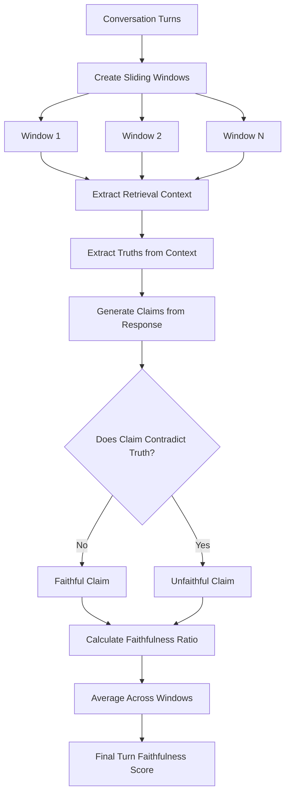
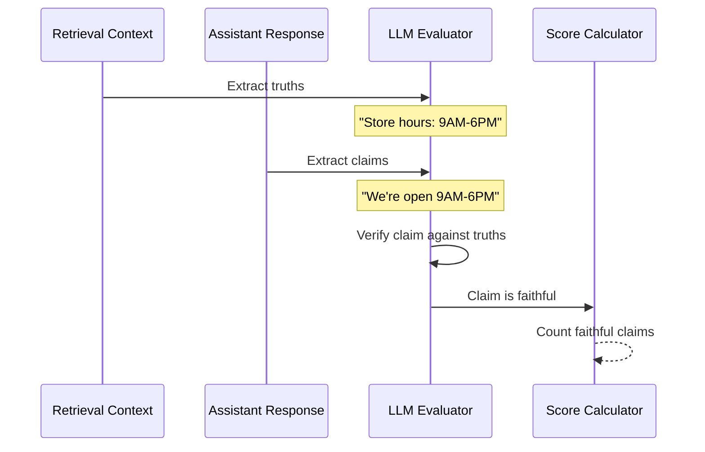

# Turn Faithfulness Metric

## 1. Definition & Purpose

### What It Measures

The **Turn Faithfulness** metric is a conversational metric that determines whether your LLM chatbot generates factually accurate responses grounded in the retrieval context **throughout a conversation**. It evaluates if assistant responses are faithful to the information provided in the retrieval context without hallucination.

### Why It Matters

Turn faithfulness is critical for:

- **Factual accuracy**: Ensuring responses are grounded in provided context
- **Hallucination prevention**: Detecting when the model makes up information
- **RAG quality**: Validating that retrieval-augmented generation works correctly
- **Trust and reliability**: Building user confidence in the chatbot's answers

### When to Use This Metric

- **RAG chatbots**: Chatbots that retrieve and use external context
- **Knowledge base assistants**: Agents grounded in documentation
- **Customer support**: Where accuracy based on policies is critical
- **Fact-checking applications**: Verifying claims against sources

## 2. Key Characteristics

| Property | Value |
|----------|-------|
| **Metric Type** | LLM-as-a-judge |
| **Evaluation Mode** | Multi-turn |
| **Reference Required** | Yes (retrieval_context) |
| **Score Range** | 0.0 to 1.0 |
| **Primary Use Case** | RAG, Chatbot |
| **Multimodal Support** | Yes |

### Required Arguments

When creating a `ConversationalTestCase`:

| Argument | Type | Description |
|----------|------|-------------|
| `turns` | List[Turn] | List of conversation turns |

Each `Turn` must have:
- `role`: Either "user" or "assistant"
- `content`: The message content
- `retrieval_context`: List of context strings (for assistant turns)

### Optional Parameters

| Parameter | Type | Default | Description |
|-----------|------|---------|-------------|
| `threshold` | float | 0.5 | Minimum passing score |
| `model` | str/DeepEvalBaseLLM | gpt-4.1 | LLM for evaluation |
| `include_reason` | bool | True | Include explanation for score |
| `strict_mode` | bool | False | Binary scoring (0 or 1) |
| `async_mode` | bool | True | Enable concurrent execution |
| `verbose_mode` | bool | False | Print intermediate steps |
| `truths_extraction_limit` | int | None | Limit truths extracted per document |
| `penalize_ambiguous_claims` | bool | False | Penalize unverifiable claims |
| `window_size` | int | 10 | Sliding window size for evaluation |

## 3. Conceptual Visualization

### Evaluation Flow



### Claim Verification Process



## 4. Measurement Formula

### Core Formula

```
Turn Faithfulness = Sum of Turn Faithfulness Scores / Total Number of Assistant Turns
```

### Per-Turn Calculation

```
Turn Score = Number of Truthful Claims / Total Number of Claims
```

### Evaluation Process

1. **Truth Extraction**: Extract factual statements from retrieval context
2. **Claim Generation**: Extract claims made in assistant responses
3. **Verdict Evaluation**: Check if each claim contradicts extracted truths
4. **Score Aggregation**: Average faithfulness across all turns

### Scoring Rubric

| Score Range | Interpretation |
|-------------|----------------|
| 0.9 - 1.0 | Excellent - All claims faithful to context |
| 0.7 - 0.9 | Good - Minor hallucinations detected |
| 0.5 - 0.7 | Fair - Some unfaithful claims |
| 0.3 - 0.5 | Poor - Significant hallucinations |
| 0.0 - 0.3 | Critical - Mostly unfaithful to context |

## 5. Usage Examples

### Basic Usage

```python
from deepeval import evaluate
from deepeval.test_case import Turn, ConversationalTestCase
from deepeval.metrics import TurnFaithfulnessMetric

# Create conversation with retrieval context
convo_test_case = ConversationalTestCase(
    turns=[
        Turn(role="user", content="What are your store hours?"),
        Turn(
            role="assistant",
            content="Our store is open Monday through Friday from 9 AM to 6 PM, and Saturday from 10 AM to 4 PM.",
            retrieval_context=[
                "Store Hours: Monday-Friday 9:00 AM - 6:00 PM, Saturday 10:00 AM - 4:00 PM, Closed Sunday."
            ]
        ),
        Turn(role="user", content="Are you open on Sunday?"),
        Turn(
            role="assistant",
            content="No, we are closed on Sundays.",
            retrieval_context=[
                "Store Hours: Monday-Friday 9:00 AM - 6:00 PM, Saturday 10:00 AM - 4:00 PM, Closed Sunday."
            ]
        ),
    ]
)

# Create metric
metric = TurnFaithfulnessMetric(threshold=0.5)

# Evaluate
evaluate(test_cases=[convo_test_case], metrics=[metric])
```

### Standalone Measurement

```python
metric = TurnFaithfulnessMetric(
    threshold=0.7,
    include_reason=True,
    verbose_mode=True,
    truths_extraction_limit=10,
    penalize_ambiguous_claims=True,
)

metric.measure(convo_test_case)
print(f"Score: {metric.score}")
print(f"Reason: {metric.reason}")
```

## 6. Example Scenarios

### Scenario 1: Fully Faithful (Score ~1.0)

```python
turns = [
    Turn(role="user", content="What's the return policy?"),
    Turn(
        role="assistant",
        content="You can return items within 30 days for a full refund with the original receipt.",
        retrieval_context=[
            "Return Policy: Full refund within 30 days with original receipt. Items must be unused and in original packaging."
        ]
    ),
]
# Response faithfully represents the context
```

### Scenario 2: Hallucination (Score ~0.3)

```python
turns = [
    Turn(role="user", content="What's the return policy?"),
    Turn(
        role="assistant",
        content="You can return items within 90 days, no receipt needed, and we'll give you store credit plus a 10% bonus.",
        retrieval_context=[
            "Return Policy: Full refund within 30 days with original receipt. Items must be unused and in original packaging."
        ]
    ),
]
# Response contains hallucinated information (90 days, no receipt, bonus)
```

### Scenario 3: Partial Faithfulness (Score ~0.6)

```python
turns = [
    Turn(role="user", content="Tell me about the product warranty."),
    Turn(
        role="assistant",
        content="The product comes with a 2-year warranty covering manufacturing defects. We also offer extended warranty options up to 5 years.",
        retrieval_context=[
            "Warranty: 2-year limited warranty covers manufacturing defects. Does not cover accidental damage."
        ]
    ),
]
# First part faithful, second part (extended warranty) may be hallucinated
```

## 7. Best Practices

### Do's

- **Provide comprehensive context**: Include all relevant information
- **Test edge cases**: Include scenarios where context is ambiguous
- **Use `penalize_ambiguous_claims`**: When strict accuracy is required
- **Combine with other RAG metrics**: Use with Contextual Precision/Recall

### Don'ts

- **Don't omit retrieval context**: The metric requires context for each assistant turn
- **Don't ignore partial hallucinations**: Even small inaccuracies matter
- **Don't set threshold too low**: Faithfulness is critical for trust

### Improving Faithfulness Scores

1. **Better retrieval**: Ensure relevant context is retrieved
2. **Prompt engineering**: Instruct the model to only use provided context
3. **Citation requirements**: Ask the model to cite sources
4. **Confidence thresholds**: Have the model express uncertainty when context is insufficient

## 8. API Reference

### TurnFaithfulnessMetric

```python
from deepeval.metrics import TurnFaithfulnessMetric

metric = TurnFaithfulnessMetric(
    threshold=0.5,                    # Minimum passing score
    model="gpt-4.1",                  # Evaluation model
    include_reason=True,              # Include explanation
    strict_mode=False,                # Binary scoring
    async_mode=True,                  # Concurrent execution
    verbose_mode=False,               # Detailed logging
    truths_extraction_limit=None,     # Limit truths per document
    penalize_ambiguous_claims=False,  # Penalize unverifiable claims
    window_size=10,                   # Context window size
)
```

### Turn with Retrieval Context

```python
from deepeval.test_case import Turn, ConversationalTestCase

test_case = ConversationalTestCase(
    turns=[
        Turn(role="user", content="User question..."),
        Turn(
            role="assistant",
            content="Assistant response...",
            retrieval_context=["Context document 1", "Context document 2"]
        ),
    ]
)
```

## 9. References

- [DeepEval Turn Faithfulness Documentation](https://deepeval.com/docs/metrics-turn-faithfulness)
- [ConversationalTestCase Documentation](https://deepeval.com/docs/evaluation-test-cases)
- [RAG Evaluation Best Practices](https://deepeval.com/docs/metrics-introduction)
