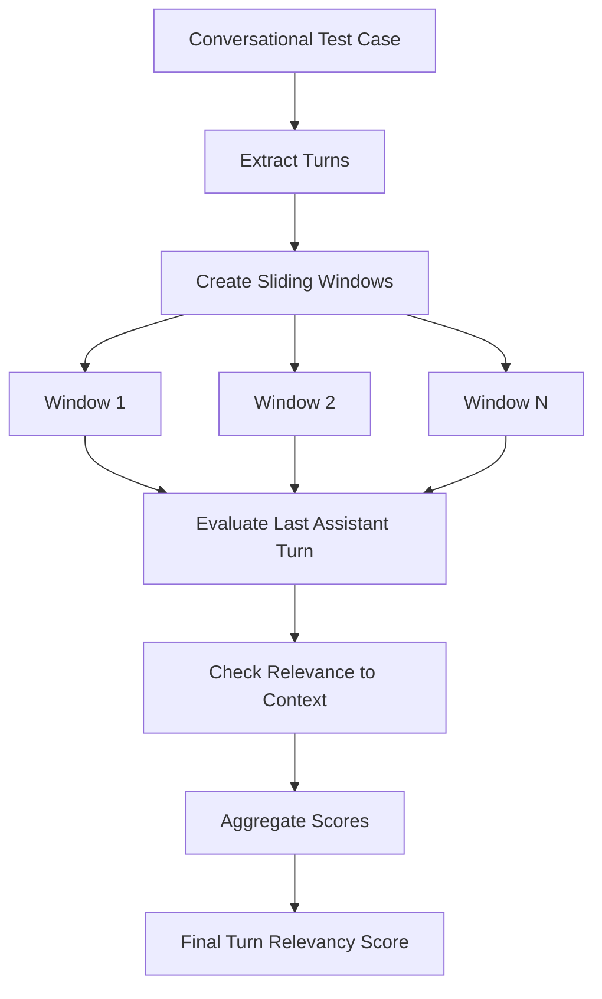
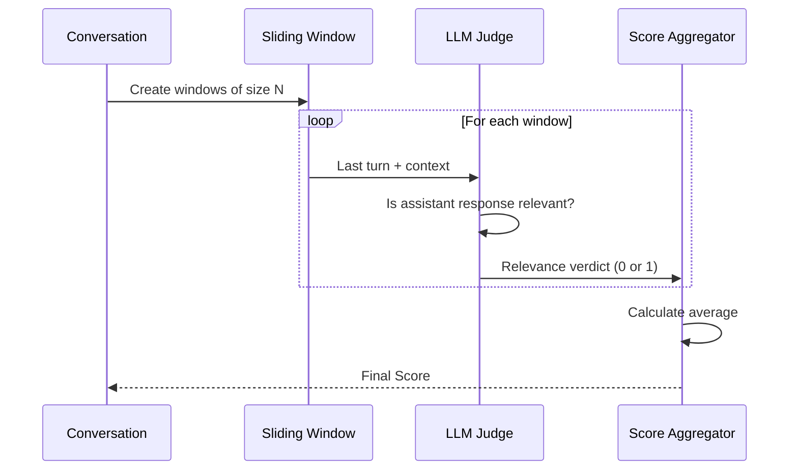

# Turn Relevancy Metric

## 1. Definition & Purpose

### What It Measures

The **Turn Relevancy** metric is a conversational metric that determines whether your LLM chatbot is able to consistently generate relevant responses **throughout a conversation**. It evaluates each assistant turn against the conversational context to ensure responses are contextually appropriate.

### Why It Matters

In multi-turn conversations, maintaining relevance is crucial for user experience. A chatbot that provides irrelevant responses, even occasionally, can frustrate users and reduce trust. This metric helps identify:

- Off-topic responses that don't address user queries
- Context drift where the chatbot loses track of the conversation
- Misunderstandings that lead to irrelevant answers

### When to Use This Metric

- **Chatbot quality assurance**: Ensure consistent relevance across conversations
- **Production monitoring**: Track relevance degradation over time
- **A/B testing**: Compare different chatbot configurations
- **Training data curation**: Identify conversations with relevance issues

## 2. Key Characteristics

| Property | Value |
|----------|-------|
| **Metric Type** | LLM-as-a-judge |
| **Evaluation Mode** | Multi-turn |
| **Reference Required** | No (referenceless) |
| **Score Range** | 0.0 to 1.0 |
| **Primary Use Case** | Chatbot, RAG |
| **Multimodal Support** | Yes |

### Required Arguments

When creating a `ConversationalTestCase`:

| Argument | Type | Description |
|----------|------|-------------|
| `turns` | List[Turn] | List of conversation turns with `role` and `content` |

Each `Turn` must have:
- `role`: Either "user" or "assistant"
- `content`: The message content

### Optional Parameters

| Parameter | Type | Default | Description |
|-----------|------|---------|-------------|
| `threshold` | float | 0.5 | Minimum passing score |
| `model` | str/DeepEvalBaseLLM | gpt-4.1 | LLM for evaluation |
| `include_reason` | bool | True | Include explanation for score |
| `strict_mode` | bool | False | Binary scoring (0 or 1) |
| `async_mode` | bool | True | Enable concurrent execution |
| `verbose_mode` | bool | False | Print intermediate steps |
| `window_size` | int | 10 | Sliding window size for evaluation |

## 3. Conceptual Visualization

### Evaluation Flow



### Sliding Window Evaluation



## 4. Measurement Formula

### Core Formula

```
Turn Relevancy = Number of Turns with Relevant Assistant Content / Total Number of Assistant Turns
```

### Detailed Calculation

The metric uses a sliding window approach:

1. **Window Construction**: For each assistant turn, construct a window of the previous N turns (default N=10)
2. **Relevance Evaluation**: Use LLM to determine if the assistant's response is relevant to the conversational context
3. **Score Aggregation**: Average the binary relevance verdicts across all assistant turns

### Scoring Rubric

| Score Range | Interpretation |
|-------------|----------------|
| 0.9 - 1.0 | Excellent - All responses highly relevant |
| 0.7 - 0.9 | Good - Most responses relevant with minor issues |
| 0.5 - 0.7 | Fair - Some irrelevant responses detected |
| 0.3 - 0.5 | Poor - Significant relevance issues |
| 0.0 - 0.3 | Critical - Majority of responses irrelevant |

## 5. Usage Examples

### Basic Usage

```python
from deepeval import evaluate
from deepeval.test_case import Turn, ConversationalTestCase
from deepeval.metrics import TurnRelevancyMetric

# Create a conversation test case
convo_test_case = ConversationalTestCase(
    turns=[
        Turn(role="user", content="What's the weather like today?"),
        Turn(role="assistant", content="It's sunny and 72°F with clear skies."),
        Turn(role="user", content="Should I bring a jacket?"),
        Turn(role="assistant", content="With 72°F weather, a light jacket is optional but not necessary."),
    ]
)

# Create metric
metric = TurnRelevancyMetric(threshold=0.5)

# Evaluate
evaluate(test_cases=[convo_test_case], metrics=[metric])
```

### Standalone Measurement

```python
metric = TurnRelevancyMetric(
    threshold=0.7,
    include_reason=True,
    verbose_mode=True,
)

metric.measure(convo_test_case)
print(f"Score: {metric.score}")
print(f"Reason: {metric.reason}")
```

### With Custom Model

```python
from deepeval.models.llms import LocalModel

model = LocalModel(
    model="gpt-4o-mini",
    api_key="your-api-key",
)

metric = TurnRelevancyMetric(
    model=model,
    threshold=0.5,
    window_size=5,  # Smaller context window
)
```

## 6. Example Scenarios

### Scenario 1: High Relevancy (Score ~1.0)

```python
# All responses directly address user queries
turns = [
    Turn(role="user", content="What are your store hours?"),
    Turn(role="assistant", content="We're open Monday-Friday 9AM-6PM, Saturday 10AM-4PM."),
    Turn(role="user", content="Are you open on holidays?"),
    Turn(role="assistant", content="We're closed on major holidays like Christmas and Thanksgiving."),
]
```

### Scenario 2: Low Relevancy (Score ~0.3)

```python
# Responses don't address user queries
turns = [
    Turn(role="user", content="What are your store hours?"),
    Turn(role="assistant", content="We have a great selection of products!"),  # Irrelevant
    Turn(role="user", content="I asked about your hours."),
    Turn(role="assistant", content="Our products are high quality."),  # Still irrelevant
]
```

## 7. Best Practices

### Do's

- **Provide sufficient context**: Include enough turns to establish conversation context
- **Use appropriate window size**: Adjust `window_size` based on conversation complexity
- **Set realistic thresholds**: Start with 0.5 and adjust based on your use case
- **Combine with other metrics**: Use alongside Conversation Completeness for comprehensive evaluation

### Don'ts

- **Don't use with very short conversations**: Single turn conversations may not provide enough context
- **Don't ignore the reason**: The explanation helps identify specific relevance issues
- **Don't set threshold too high initially**: Allow room for legitimate topic transitions

### Debugging Low Scores

1. Enable `verbose_mode=True` to see intermediate evaluations
2. Check if responses address the immediate query
3. Verify conversation context is coherent
4. Review the `reason` field for specific failure points

## 8. API Reference

### TurnRelevancyMetric

```python
from deepeval.metrics import TurnRelevancyMetric

metric = TurnRelevancyMetric(
    threshold=0.5,           # Minimum passing score
    model="gpt-4.1",         # Evaluation model
    include_reason=True,     # Include explanation
    strict_mode=False,       # Binary scoring
    async_mode=True,         # Concurrent execution
    verbose_mode=False,      # Detailed logging
    window_size=10,          # Context window size
)
```

### ConversationalTestCase

```python
from deepeval.test_case import Turn, ConversationalTestCase

test_case = ConversationalTestCase(
    turns=[
        Turn(role="user", content="..."),
        Turn(role="assistant", content="..."),
    ]
)
```

## 9. References

- [DeepEval Turn Relevancy Documentation](https://deepeval.com/docs/metrics-turn-relevancy)
- [ConversationalTestCase Documentation](https://deepeval.com/docs/evaluation-test-cases)
