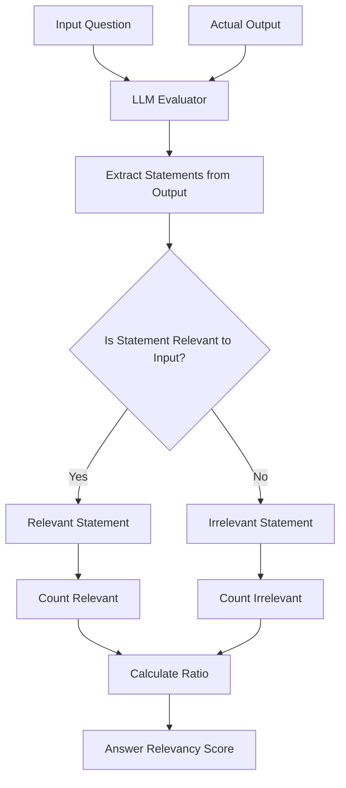
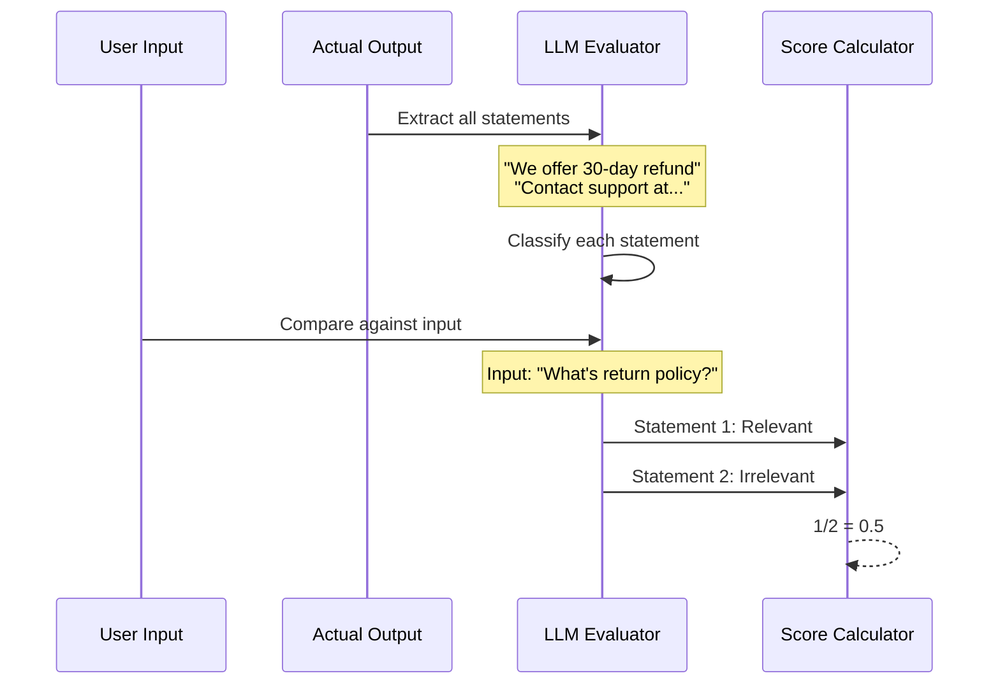

# Answer Relevancy Metric

## 1. Definition & Purpose

### What It Measures

The **Answer Relevancy** metric uses LLM-as-a-judge to measure the quality of your RAG pipeline's generator by evaluating how relevant the `actual_output` of your LLM application is compared to the provided `input`. It determines whether the response actually addresses the user's question.

### Why It Matters

Answer relevancy is critical for:

- **User satisfaction**: Ensuring responses address what users actually asked
- **Generator quality**: Validating that the LLM produces useful outputs
- **RAG effectiveness**: Confirming the generation step works correctly
- **Reducing noise**: Detecting off-topic or tangential responses

### When to Use This Metric

- **Question-answering systems**: Any RAG application that answers user queries
- **Customer support chatbots**: Ensuring helpful responses
- **Search applications**: Validating search result summaries
- **Information retrieval**: Confirming extracted information is relevant

## 2. Key Characteristics

| Property | Value |
|----------|-------|
| **Metric Type** | LLM-as-a-judge |
| **Evaluation Mode** | Single-turn |
| **Reference Required** | No (Referenceless) |
| **Score Range** | 0.0 to 1.0 |
| **Primary Use Case** | RAG Generator Evaluation |
| **Multimodal Support** | Yes |

### Required Arguments

When creating an `LLMTestCase`:

| Argument | Type | Description |
|----------|------|-------------|
| `input` | str | The user's question or query |
| `actual_output` | str | The LLM's generated response |

### Optional Parameters

| Parameter | Type | Default | Description |
|-----------|------|---------|-------------|
| `threshold` | float | 0.5 | Minimum passing score |
| `model` | str/DeepEvalBaseLLM | gpt-4.1 | LLM for evaluation |
| `include_reason` | bool | True | Include explanation for score |
| `strict_mode` | bool | False | Binary scoring (0 or 1) |
| `async_mode` | bool | True | Enable concurrent execution |
| `verbose_mode` | bool | False | Print intermediate steps |
| `evaluation_template` | AnswerRelevancyTemplate | Default | Custom prompt template |

## 3. Conceptual Visualization

### Evaluation Flow



### Statement Classification Process



## 4. Measurement Formula

### Core Formula

```
Answer Relevancy = Number of Relevant Statements / Total Number of Statements
```

### Evaluation Process

1. **Statement Extraction**: Extract all statements made in the `actual_output`
2. **Relevancy Classification**: Use LLM to classify each statement as relevant or not to the `input`
3. **Score Calculation**: Calculate ratio of relevant statements to total statements

### Scoring Rubric

| Score Range | Interpretation |
|-------------|----------------|
| 0.9 - 1.0 | Excellent - Response directly addresses the question |
| 0.7 - 0.9 | Good - Mostly relevant with minor tangents |
| 0.5 - 0.7 | Fair - Partially relevant response |
| 0.3 - 0.5 | Poor - Significant irrelevant content |
| 0.0 - 0.3 | Critical - Response doesn't address the question |

## 5. Usage Examples

### Basic Usage

```python
from deepeval import evaluate
from deepeval.metrics import AnswerRelevancyMetric
from deepeval.test_case import LLMTestCase

metric = AnswerRelevancyMetric(
    threshold=0.7,
    model="gpt-4.1",
    include_reason=True
)

test_case = LLMTestCase(
    input="What if these shoes don't fit?",
    actual_output="We offer a 30-day full refund at no extra cost."
)

evaluate(test_cases=[test_case], metrics=[metric])
```

### Standalone Measurement

```python
metric = AnswerRelevancyMetric(
    threshold=0.7,
    include_reason=True,
    verbose_mode=True,
)

metric.measure(test_case)
print(f"Score: {metric.score}")
print(f"Reason: {metric.reason}")
```

## 6. Example Scenarios

### Scenario 1: Highly Relevant (Score ~1.0)

```python
test_case = LLMTestCase(
    input="What are your store hours?",
    actual_output="Our store is open Monday through Friday from 9 AM to 6 PM, and Saturday from 10 AM to 4 PM. We are closed on Sundays."
)
# Response directly and completely answers the question
```

### Scenario 2: Irrelevant Response (Score ~0.2)

```python
test_case = LLMTestCase(
    input="What are your store hours?",
    actual_output="Our company was founded in 1985 by John Smith. We have grown to over 500 employees and operate in 12 countries worldwide."
)
# Response doesn't address the question at all
```

### Scenario 3: Partially Relevant (Score ~0.5)

```python
test_case = LLMTestCase(
    input="What are your store hours?",
    actual_output="We're open 9 AM to 6 PM on weekdays. By the way, we're having a 20% off sale this weekend on all electronics, and our new product line just launched!"
)
# First part relevant, rest is off-topic promotional content
```

## 7. Best Practices

### Do's

- **Keep questions focused**: Clear, specific inputs yield more accurate evaluations
- **Test edge cases**: Include questions that might produce tangential responses
- **Combine with Faithfulness**: Use together to ensure relevant AND accurate responses
- **Set appropriate thresholds**: Higher for critical applications

### Don'ts

- **Don't confuse with accuracy**: Relevancy doesn't mean correctness
- **Don't ignore low scores**: They indicate generation issues
- **Don't skip context**: Even without retrieval_context, the metric evaluates relevancy

### Improving Answer Relevancy Scores

1. **Better prompting**: Instruct the model to directly answer questions
2. **Response formatting**: Use structured output to stay on topic
3. **Length constraints**: Limit response length to reduce tangents
4. **Focus instructions**: Tell model to avoid promotional or unrelated content

## 8. Comparison with Other Metrics

| Metric | Evaluates | Requires Context | Requires Expected Output |
|--------|-----------|------------------|-------------------------|
| Answer Relevancy | Response relevance to input | No | No |
| Faithfulness | Factual alignment with context | Yes | No |
| Contextual Relevancy | Context relevance to input | Yes | No |

## 9. API Reference

### AnswerRelevancyMetric

```python
from deepeval.metrics import AnswerRelevancyMetric

metric = AnswerRelevancyMetric(
    threshold=0.5,                    # Minimum passing score
    model="gpt-4.1",                  # Evaluation model
    include_reason=True,              # Include explanation
    strict_mode=False,                # Binary scoring
    async_mode=True,                  # Concurrent execution
    verbose_mode=False,               # Detailed logging
    evaluation_template=None,         # Custom prompts
)
```

### LLMTestCase for Answer Relevancy

```python
from deepeval.test_case import LLMTestCase

test_case = LLMTestCase(
    input="User's question or query",
    actual_output="LLM's generated response"
)
```

## 10. References

- [DeepEval Answer Relevancy Documentation](https://deepeval.com/docs/metrics-answer-relevancy)
- [LLMTestCase Documentation](https://deepeval.com/docs/evaluation-test-cases)
- [RAG Evaluation Guide](https://deepeval.com/docs/guides-rag-evaluation)
