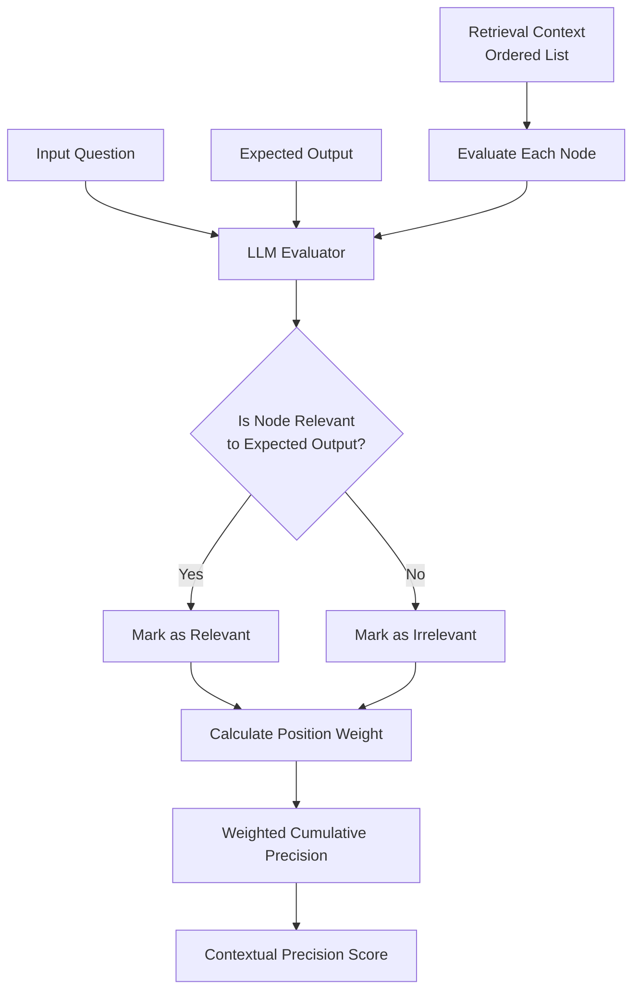
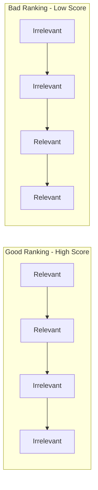
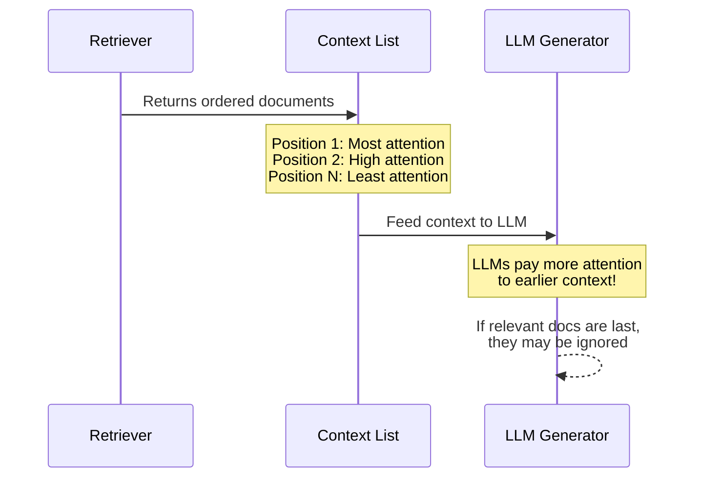

# Contextual Precision Metric

## 1. Definition & Purpose

### What It Measures

The **Contextual Precision** metric uses LLM-as-a-judge to measure your RAG pipeline's retriever by evaluating whether nodes in your `retrieval_context` that are relevant to the given `input` are ranked higher than irrelevant ones. It focuses on the **re-ranking quality** of your retrieval system.

### Why It Matters

Contextual precision is critical for:

- **Re-ranker evaluation**: Assessing if relevant documents appear first
- **LLM attention optimization**: LLMs focus more on earlier context
- **Downstream accuracy**: Poor ranking can cause hallucinations
- **Retrieval efficiency**: Ensuring top-k results are actually useful

### When to Use This Metric

- **RAG systems with re-rankers**: Evaluating re-ranking model performance
- **Multi-document retrieval**: When order of documents matters
- **Long-context applications**: Where LLM may ignore later context
- **Search result ranking**: Validating search result ordering

## 2. Key Characteristics

| Property | Value |
|----------|-------|
| **Metric Type** | LLM-as-a-judge |
| **Evaluation Mode** | Single-turn |
| **Reference Required** | Yes (expected_output, retrieval_context) |
| **Score Range** | 0.0 to 1.0 |
| **Primary Use Case** | RAG Retriever/Re-ranker Evaluation |
| **Multimodal Support** | Yes |

### Required Arguments

When creating an `LLMTestCase`:

| Argument | Type | Description |
|----------|------|-------------|
| `input` | str | The user's question or query |
| `actual_output` | str | The LLM's generated response |
| `expected_output` | str | The ideal/ground truth response |
| `retrieval_context` | List[str] | Retrieved documents/chunks (ordered) |

### Optional Parameters

| Parameter | Type | Default | Description |
|-----------|------|---------|-------------|
| `threshold` | float | 0.5 | Minimum passing score |
| `model` | str/DeepEvalBaseLLM | gpt-4.1 | LLM for evaluation |
| `include_reason` | bool | True | Include explanation for score |
| `strict_mode` | bool | False | Binary scoring (0 or 1) |
| `async_mode` | bool | True | Enable concurrent execution |
| `verbose_mode` | bool | False | Print intermediate steps |
| `evaluation_template` | ContextualPrecisionTemplate | Default | Custom prompt template |

## 3. Conceptual Visualization

### Evaluation Flow



### Ranking Impact Visualization



### Why Order Matters



## 4. Measurement Formula

### Core Formula (Weighted Cumulative Precision)

```
Contextual Precision = (1 / R) × Σ(k=1 to n) [(Relevant Nodes up to k / k) × r_k]

Where:
- R = Total number of relevant nodes
- k = Position in the retrieval context (1-indexed)
- n = Total number of nodes in retrieval context
- r_k = Binary relevance (1 if relevant, 0 if not) for node at position k
```

### Why Weighted Cumulative Precision?

1. **Emphasizes Top Results**: Stronger emphasis on relevance of top-ranked results
2. **Rewards Relevant Ordering**: Higher scores when relevant docs appear early
3. **Handles Varying Relevance**: Can distinguish between good and bad rankings

### Evaluation Process

1. **Relevancy Classification**: For each node in `retrieval_context`, determine if it's relevant to `input` based on `expected_output`
2. **Position Weighting**: Apply weights based on position (earlier = more weight)
3. **Cumulative Calculation**: Calculate weighted cumulative precision
4. **Score Normalization**: Normalize to 0-1 range

### Scoring Rubric

| Score Range | Interpretation |
|-------------|----------------|
| 0.9 - 1.0 | Excellent - Relevant nodes ranked at top |
| 0.7 - 0.9 | Good - Mostly correct ranking |
| 0.5 - 0.7 | Fair - Some relevant nodes ranked low |
| 0.3 - 0.5 | Poor - Many relevant nodes ranked low |
| 0.0 - 0.3 | Critical - Relevant nodes at bottom |

## 5. Usage Examples

### Basic Usage

```python
from deepeval import evaluate
from deepeval.test_case import LLMTestCase
from deepeval.metrics import ContextualPrecisionMetric

actual_output = "We offer a 30-day full refund at no extra cost."
expected_output = "You are eligible for a 30 day full refund at no extra cost."

# Context is ordered - first item is ranked highest
retrieval_context = [
    "All customers are eligible for a 30 day full refund at no extra cost.",  # Relevant
    "Our company was founded in 1995.",  # Irrelevant
    "Contact support at help@company.com",  # Irrelevant
]

metric = ContextualPrecisionMetric(
    threshold=0.7,
    model="gpt-4.1",
    include_reason=True
)

test_case = LLMTestCase(
    input="What if these shoes don't fit?",
    actual_output=actual_output,
    expected_output=expected_output,
    retrieval_context=retrieval_context
)

evaluate(test_cases=[test_case], metrics=[metric])
```

### Standalone Measurement

```python
metric = ContextualPrecisionMetric(
    threshold=0.7,
    include_reason=True,
    verbose_mode=True,
)

metric.measure(test_case)
print(f"Score: {metric.score}")
print(f"Reason: {metric.reason}")
```

## 6. Example Scenarios

### Scenario 1: Perfect Ranking (Score ~1.0)

```python
test_case = LLMTestCase(
    input="What's the return policy?",
    actual_output="You can return within 30 days.",
    expected_output="Returns accepted within 30 days with receipt.",
    retrieval_context=[
        "Return Policy: 30-day returns with original receipt.",  # Relevant - Position 1
        "Refund processed within 5-7 business days.",  # Relevant - Position 2
        "Store founded in 1990.",  # Irrelevant - Position 3
        "We have 500 employees.",  # Irrelevant - Position 4
    ]
)
# All relevant nodes ranked before irrelevant ones
```

### Scenario 2: Poor Ranking (Score ~0.3)

```python
test_case = LLMTestCase(
    input="What's the return policy?",
    actual_output="You can return within 30 days.",
    expected_output="Returns accepted within 30 days with receipt.",
    retrieval_context=[
        "Store founded in 1990.",  # Irrelevant - Position 1
        "We have 500 employees.",  # Irrelevant - Position 2
        "Contact: support@store.com",  # Irrelevant - Position 3
        "Return Policy: 30-day returns with original receipt.",  # Relevant - Position 4 (bad!)
    ]
)
# Relevant node buried at the bottom
```

### Scenario 3: Mixed Ranking (Score ~0.6)

```python
test_case = LLMTestCase(
    input="What's the warranty coverage?",
    actual_output="2-year warranty on defects.",
    expected_output="2-year warranty covers manufacturing defects.",
    retrieval_context=[
        "Warranty: 2-year coverage for defects.",  # Relevant - Position 1 (good)
        "Store hours: 9AM-6PM",  # Irrelevant - Position 2
        "Extended warranty available for $50.",  # Relevant - Position 3 (should be 2)
        "Free shipping over $100",  # Irrelevant - Position 4
    ]
)
# One relevant at top, but another buried in middle
```

## 7. Best Practices

### Do's

- **Provide ground truth**: Use accurate `expected_output` for relevancy classification
- **Maintain context order**: Ensure `retrieval_context` list preserves retriever ranking
- **Test various rankings**: Include scenarios with different ranking qualities
- **Combine with recall**: Use with Contextual Recall for complete retriever evaluation

### Don'ts

- **Don't ignore order**: The list order IS the ranking being evaluated
- **Don't skip expected_output**: Required for determining what's "relevant"
- **Don't confuse with relevancy**: This measures RANKING, not just relevance

### Improving Contextual Precision Scores

1. **Better re-rankers**: Use cross-encoder re-ranking models
2. **Query expansion**: Improve initial retrieval quality
3. **Relevance scoring**: Tune retrieval score thresholds
4. **Hybrid search**: Combine semantic and keyword search

## 8. Comparison with Other Contextual Metrics

| Metric | Evaluates | Requires expected_output |
|--------|-----------|-------------------------|
| Contextual Precision | Ranking order of relevant nodes | Yes |
| Contextual Recall | Completeness of retrieved info | Yes |
| Contextual Relevancy | Overall relevance of context | No |

## 9. API Reference

### ContextualPrecisionMetric

```python
from deepeval.metrics import ContextualPrecisionMetric

metric = ContextualPrecisionMetric(
    threshold=0.5,                    # Minimum passing score
    model="gpt-4.1",                  # Evaluation model
    include_reason=True,              # Include explanation
    strict_mode=False,                # Binary scoring
    async_mode=True,                  # Concurrent execution
    verbose_mode=False,               # Detailed logging
    evaluation_template=None,         # Custom prompts
)
```

### LLMTestCase for Contextual Precision

```python
from deepeval.test_case import LLMTestCase

test_case = LLMTestCase(
    input="User's question",
    actual_output="LLM's response",
    expected_output="Ideal/ground truth response",
    retrieval_context=[
        "Highest ranked document",
        "Second ranked document",
        "Third ranked document",
        # ... order matters!
    ]
)
```

## 10. References

- [DeepEval Contextual Precision Documentation](https://deepeval.com/docs/metrics-contextual-precision)
- [LLMTestCase Documentation](https://deepeval.com/docs/evaluation-test-cases)
- [RAG Evaluation Guide](https://deepeval.com/docs/guides-rag-evaluation)
