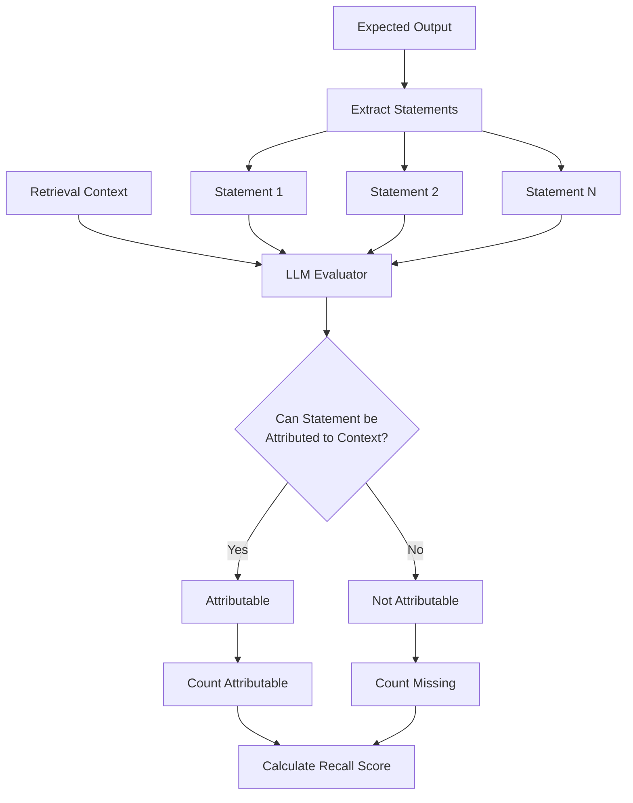
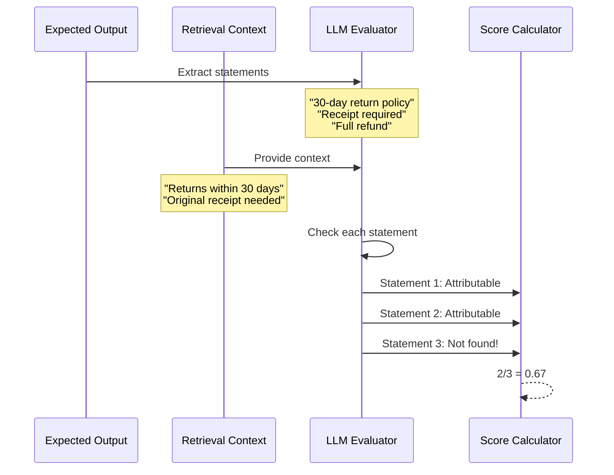
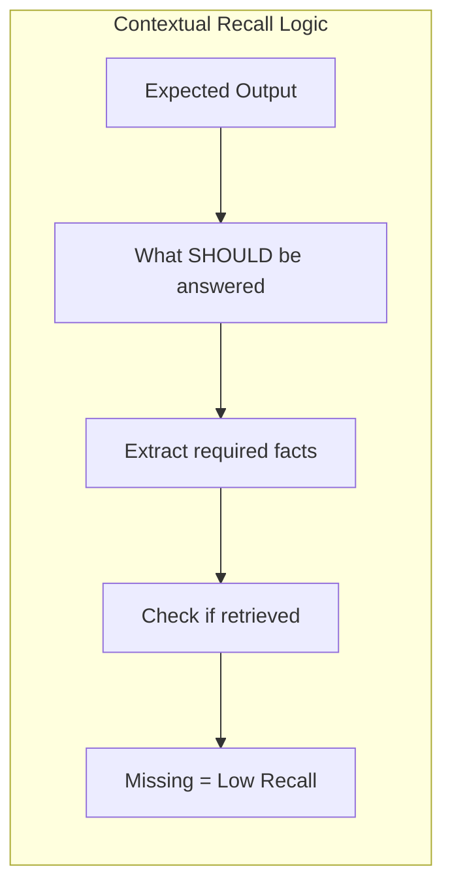
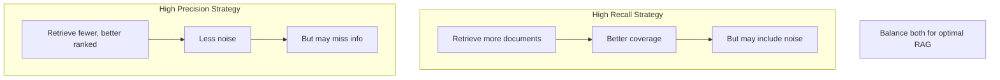

# Contextual Recall Metric

## 1. Definition & Purpose

### What It Measures

The **Contextual Recall** metric uses LLM-as-a-judge to measure the quality of your RAG pipeline's retriever by evaluating the extent to which the `retrieval_context` aligns with the `expected_output`. It measures whether all the information needed to produce the ideal answer was actually retrieved.

### Why It Matters

Contextual recall is critical for:

- **Retrieval completeness**: Ensuring all necessary information is retrieved
- **Coverage assessment**: Validating the retriever captures all relevant facts
- **Gap identification**: Finding what information is missing from retrieval
- **RAG quality**: If needed info isn't retrieved, the generator can't use it

### When to Use This Metric

- **RAG systems**: Evaluating retriever comprehensiveness
- **Knowledge base Q&A**: Ensuring complete information retrieval
- **Document search**: Validating search covers all relevant content
- **Multi-fact queries**: Questions requiring multiple pieces of information

## 2. Key Characteristics

| Property | Value |
|----------|-------|
| **Metric Type** | LLM-as-a-judge |
| **Evaluation Mode** | Single-turn |
| **Reference Required** | Yes (expected_output, retrieval_context) |
| **Score Range** | 0.0 to 1.0 |
| **Primary Use Case** | RAG Retriever Evaluation |
| **Multimodal Support** | Yes |

### Required Arguments

When creating an `LLMTestCase`:

| Argument | Type | Description |
|----------|------|-------------|
| `input` | str | The user's question or query |
| `actual_output` | str | The LLM's generated response |
| `expected_output` | str | The ideal/ground truth response |
| `retrieval_context` | List[str] | Retrieved documents/chunks |

### Optional Parameters

| Parameter | Type | Default | Description |
|-----------|------|---------|-------------|
| `threshold` | float | 0.5 | Minimum passing score |
| `model` | str/DeepEvalBaseLLM | gpt-4.1 | LLM for evaluation |
| `include_reason` | bool | True | Include explanation for score |
| `strict_mode` | bool | False | Binary scoring (0 or 1) |
| `async_mode` | bool | True | Enable concurrent execution |
| `verbose_mode` | bool | False | Print intermediate steps |
| `evaluation_template` | ContextualRecallTemplate | Default | Custom prompt template |

## 3. Conceptual Visualization

### Evaluation Flow



### Attribution Process



### Why We Use expected_output



## 4. Measurement Formula

### Core Formula

```
Contextual Recall = Number of Attributable Statements / Total Number of Statements
```

### Key Definition

**Statements are extracted from `expected_output`** (not actual_output) because we're measuring:
- Did the retriever fetch the information needed for the IDEAL answer?
- If statements in the expected output can't be found in context, the retriever failed

### Evaluation Process

1. **Statement Extraction**: Extract all statements from `expected_output`
2. **Attribution Check**: For each statement, determine if it can be attributed to nodes in `retrieval_context`
3. **Score Calculation**: Ratio of attributable statements to total statements

### Scoring Rubric

| Score Range | Interpretation |
|-------------|----------------|
| 0.9 - 1.0 | Excellent - All needed info was retrieved |
| 0.7 - 0.9 | Good - Most needed info retrieved |
| 0.5 - 0.7 | Fair - Some information missing |
| 0.3 - 0.5 | Poor - Significant info missing |
| 0.0 - 0.3 | Critical - Most needed info not retrieved |

## 5. Usage Examples

### Basic Usage

```python
from deepeval import evaluate
from deepeval.test_case import LLMTestCase
from deepeval.metrics import ContextualRecallMetric

actual_output = "We offer a 30-day full refund at no extra cost."
expected_output = "You are eligible for a 30 day full refund at no extra cost."

retrieval_context = [
    "All customers are eligible for a 30 day full refund at no extra cost."
]

metric = ContextualRecallMetric(
    threshold=0.7,
    model="gpt-4.1",
    include_reason=True
)

test_case = LLMTestCase(
    input="What if these shoes don't fit?",
    actual_output=actual_output,
    expected_output=expected_output,
    retrieval_context=retrieval_context
)

evaluate(test_cases=[test_case], metrics=[metric])
```

### Standalone Measurement

```python
metric = ContextualRecallMetric(
    threshold=0.7,
    include_reason=True,
    verbose_mode=True,
)

metric.measure(test_case)
print(f"Score: {metric.score}")
print(f"Reason: {metric.reason}")
```

## 6. Example Scenarios

### Scenario 1: Complete Recall (Score ~1.0)

```python
test_case = LLMTestCase(
    input="What's the return and refund policy?",
    actual_output="30-day returns with receipt, refund in 5-7 days.",
    expected_output="Returns accepted within 30 days with receipt. Refunds processed in 5-7 business days.",
    retrieval_context=[
        "Return Policy: Items can be returned within 30 days of purchase with original receipt.",
        "Refund Processing: All refunds are processed within 5-7 business days after return is received.",
    ]
)
# All statements in expected_output can be found in context
```

### Scenario 2: Missing Information (Score ~0.5)

```python
test_case = LLMTestCase(
    input="What's the return and refund policy?",
    actual_output="30-day returns available.",
    expected_output="Returns accepted within 30 days with receipt. Refunds processed in 5-7 business days.",
    retrieval_context=[
        "Return Policy: Items can be returned within 30 days of purchase with original receipt.",
        # Missing: Refund processing time information!
    ]
)
# Only half the expected information was retrieved
```

### Scenario 3: No Relevant Context (Score ~0.0)

```python
test_case = LLMTestCase(
    input="What's the return policy?",
    actual_output="I don't have that information.",
    expected_output="30-day returns with full refund and original receipt required.",
    retrieval_context=[
        "Store hours: Monday-Friday 9AM-6PM",
        "Contact us at support@store.com",
    ]
)
# None of the expected information is in the retrieved context
```

## 7. Best Practices

### Do's

- **Use accurate expected_output**: The ground truth determines what's measured
- **Cover all required facts**: Include complete information in expected_output
- **Combine with Precision**: Use with Contextual Precision for complete picture
- **Test edge cases**: Include queries needing multiple pieces of information

### Don'ts

- **Don't confuse with Faithfulness**: Recall measures retrieval, not generation
- **Don't skip expected_output**: It's required for this metric
- **Don't ignore low scores**: They indicate retrieval gaps

### Improving Contextual Recall Scores

1. **Chunk size optimization**: Smaller chunks may miss context, larger may be too noisy
2. **Better embeddings**: Use domain-specific or fine-tuned embedding models
3. **Hybrid search**: Combine semantic and keyword search
4. **Query expansion**: Expand queries to match more relevant documents
5. **Increase top-k**: Retrieve more documents to improve coverage

## 8. Comparison with Other Contextual Metrics

| Metric | Question It Answers | Requires expected_output |
|--------|---------------------|-------------------------|
| Contextual Recall | Did we retrieve ALL needed info? | Yes |
| Contextual Precision | Are relevant docs ranked FIRST? | Yes |
| Contextual Relevancy | Is the retrieved context USEFUL? | No |

### Precision vs Recall Trade-off



## 9. API Reference

### ContextualRecallMetric

```python
from deepeval.metrics import ContextualRecallMetric

metric = ContextualRecallMetric(
    threshold=0.5,                    # Minimum passing score
    model="gpt-4.1",                  # Evaluation model
    include_reason=True,              # Include explanation
    strict_mode=False,                # Binary scoring
    async_mode=True,                  # Concurrent execution
    verbose_mode=False,               # Detailed logging
    evaluation_template=None,         # Custom prompts
)
```

### LLMTestCase for Contextual Recall

```python
from deepeval.test_case import LLMTestCase

test_case = LLMTestCase(
    input="User's question",
    actual_output="LLM's response",
    expected_output="Complete ideal answer with all required facts",
    retrieval_context=[
        "Retrieved document 1",
        "Retrieved document 2",
    ]
)
```

## 10. References

- [DeepEval Contextual Recall Documentation](https://deepeval.com/docs/metrics-contextual-recall)
- [LLMTestCase Documentation](https://deepeval.com/docs/evaluation-test-cases)
- [RAG Evaluation Guide](https://deepeval.com/docs/guides-rag-evaluation)
