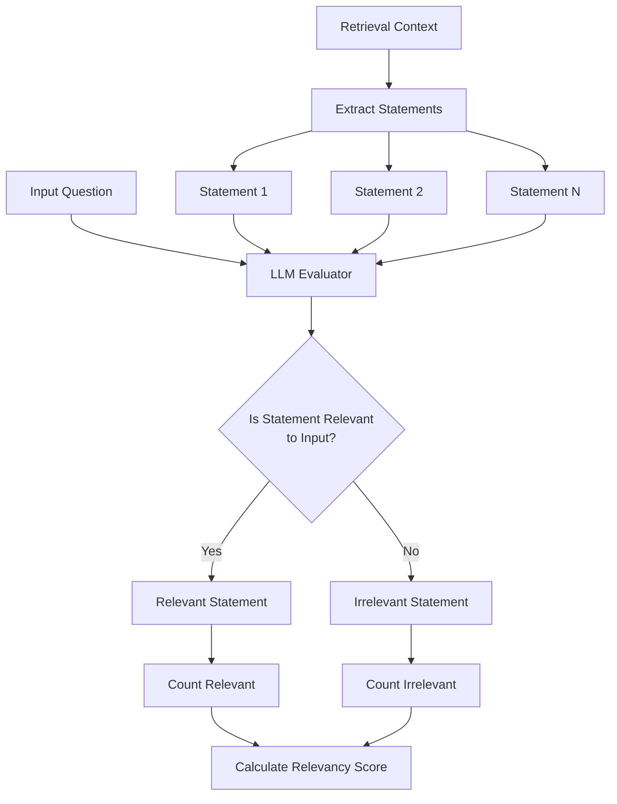
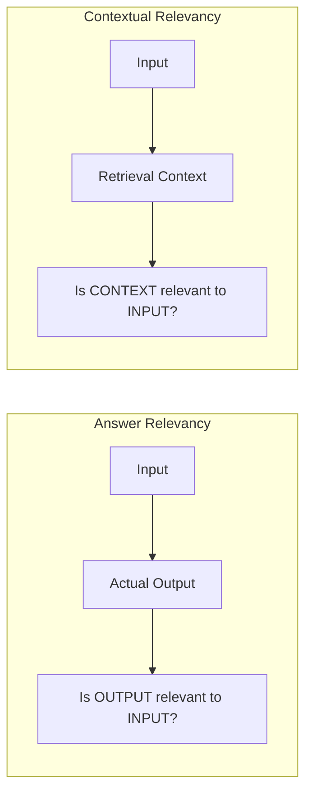
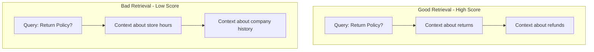
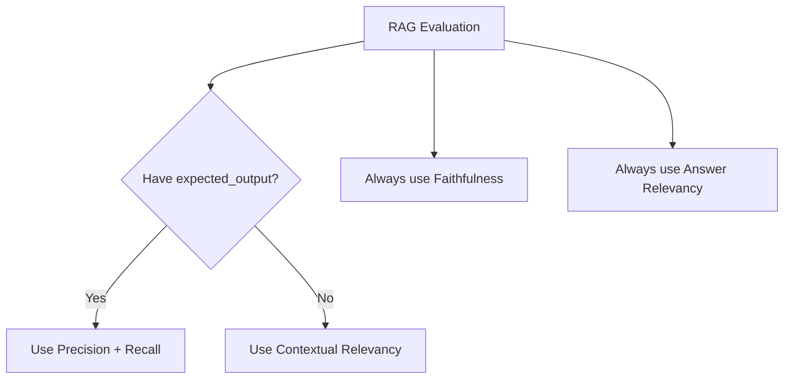

# Contextual Relevancy Metric

## 1. Definition & Purpose

### What It Measures

The **Contextual Relevancy** metric uses LLM-as-a-judge to measure the quality of your RAG pipeline's retriever by evaluating the overall relevance of the information presented in your `retrieval_context` for a given `input`. It measures whether the retrieved documents are actually useful for answering the question.

### Why It Matters

Contextual relevancy is critical for:

- **Retrieval quality**: Ensuring retrieved documents are on-topic
- **Noise reduction**: Identifying irrelevant content that could confuse the LLM
- **Efficiency**: Validating retrieval isn't returning useless documents
- **Hallucination prevention**: Irrelevant context can lead to poor generation

### When to Use This Metric

- **RAG systems**: Basic evaluation of retriever quality
- **Search applications**: Validating search result relevance
- **Document retrieval**: Checking if right documents are being fetched
- **Quick evaluation**: When you don't have ground truth expected_output

## 2. Key Characteristics

| Property | Value |
|----------|-------|
| **Metric Type** | LLM-as-a-judge |
| **Evaluation Mode** | Single-turn |
| **Reference Required** | Yes (retrieval_context only) |
| **Score Range** | 0.0 to 1.0 |
| **Primary Use Case** | RAG Retriever Evaluation |
| **Multimodal Support** | Yes |

### Required Arguments

When creating an `LLMTestCase`:

| Argument | Type | Description |
|----------|------|-------------|
| `input` | str | The user's question or query |
| `actual_output` | str | The LLM's generated response |
| `retrieval_context` | List[str] | Retrieved documents/chunks |

**Note**: Unlike Contextual Precision and Recall, this metric does NOT require `expected_output`.

### Optional Parameters

| Parameter | Type | Default | Description |
|-----------|------|---------|-------------|
| `threshold` | float | 0.5 | Minimum passing score |
| `model` | str/DeepEvalBaseLLM | gpt-4.1 | LLM for evaluation |
| `include_reason` | bool | True | Include explanation for score |
| `strict_mode` | bool | False | Binary scoring (0 or 1) |
| `async_mode` | bool | True | Enable concurrent execution |
| `verbose_mode` | bool | False | Print intermediate steps |
| `evaluation_template` | ContextualRelevancyTemplate | Default | Custom prompt template |

## 3. Conceptual Visualization

### Evaluation Flow



### Comparison with Answer Relevancy



### What This Metric Catches



## 4. Measurement Formula

### Core Formula

```
Contextual Relevancy = Number of Relevant Statements / Total Number of Statements
```

### Key Difference from Answer Relevancy

| Metric | Extracts Statements From | Checks Relevance To |
|--------|-------------------------|---------------------|
| Answer Relevancy | `actual_output` | `input` |
| Contextual Relevancy | `retrieval_context` | `input` |

### Evaluation Process

1. **Statement Extraction**: Extract all statements from `retrieval_context`
2. **Relevancy Classification**: Use LLM to classify each statement as relevant or not to the `input`
3. **Score Calculation**: Ratio of relevant statements to total statements

### Scoring Rubric

| Score Range | Interpretation |
|-------------|----------------|
| 0.9 - 1.0 | Excellent - Retrieved context is highly relevant |
| 0.7 - 0.9 | Good - Most context is relevant |
| 0.5 - 0.7 | Fair - Mixed relevant and irrelevant content |
| 0.3 - 0.5 | Poor - Significant irrelevant content |
| 0.0 - 0.3 | Critical - Mostly irrelevant context |

## 5. Usage Examples

### Basic Usage

```python
from deepeval import evaluate
from deepeval.test_case import LLMTestCase
from deepeval.metrics import ContextualRelevancyMetric

actual_output = "We offer a 30-day full refund at no extra cost."

retrieval_context = [
    "All customers are eligible for a 30 day full refund at no extra cost."
]

metric = ContextualRelevancyMetric(
    threshold=0.7,
    model="gpt-4.1",
    include_reason=True
)

test_case = LLMTestCase(
    input="What if these shoes don't fit?",
    actual_output=actual_output,
    retrieval_context=retrieval_context
)

evaluate(test_cases=[test_case], metrics=[metric])
```

### Standalone Measurement

```python
metric = ContextualRelevancyMetric(
    threshold=0.7,
    include_reason=True,
    verbose_mode=True,
)

metric.measure(test_case)
print(f"Score: {metric.score}")
print(f"Reason: {metric.reason}")
```

## 6. Example Scenarios

### Scenario 1: Highly Relevant Context (Score ~1.0)

```python
test_case = LLMTestCase(
    input="What's the return policy?",
    actual_output="30-day returns with full refund.",
    retrieval_context=[
        "Return Policy: Items can be returned within 30 days.",
        "Full refunds are processed for all eligible returns.",
        "Original receipt is required for all returns.",
    ]
)
# All retrieved documents are about return policy - relevant to the question
```

### Scenario 2: Irrelevant Context (Score ~0.2)

```python
test_case = LLMTestCase(
    input="What's the return policy?",
    actual_output="I apologize, I don't have information about returns.",
    retrieval_context=[
        "Our company was founded in 1985 in San Francisco.",
        "We now have over 500 employees worldwide.",
        "Our CEO received the Innovation Award in 2020.",
    ]
)
# Retrieved context has nothing to do with return policy
```

### Scenario 3: Mixed Relevancy (Score ~0.5)

```python
test_case = LLMTestCase(
    input="What's the return policy?",
    actual_output="Returns are accepted within 30 days.",
    retrieval_context=[
        "Return Policy: Items can be returned within 30 days.",  # Relevant
        "Our stores are open Monday through Friday 9AM-6PM.",  # Irrelevant
        "Refunds are processed within 5-7 business days.",  # Relevant
        "Join our loyalty program for exclusive discounts.",  # Irrelevant
    ]
)
# Half the context is relevant, half is not
```

## 7. Best Practices

### Do's

- **Use as first check**: Quick way to validate retriever without ground truth
- **Combine with other metrics**: Use alongside Precision and Recall
- **Monitor over time**: Track relevancy trends in production
- **Test diverse queries**: Different query types may have different retrieval quality

### Don'ts

- **Don't use alone**: Combine with Faithfulness to ensure generation quality
- **Don't ignore low scores**: They indicate fundamental retrieval issues
- **Don't confuse with completeness**: High relevancy doesn't mean all info is retrieved

### Improving Contextual Relevancy Scores

1. **Better embeddings**: Use domain-specific embedding models
2. **Query preprocessing**: Clean and expand queries before retrieval
3. **Filter irrelevant documents**: Post-retrieval filtering based on scores
4. **Tune similarity thresholds**: Adjust retrieval score cutoffs
5. **Hybrid search**: Combine semantic and keyword matching

## 8. Comparison with All RAG Metrics

| Metric | Evaluates | Required Fields | Best For |
|--------|-----------|----------------|----------|
| **Answer Relevancy** | Is response relevant to question? | input, actual_output | Generator evaluation |
| **Faithfulness** | Does response match context? | input, actual_output, retrieval_context | Hallucination detection |
| **Contextual Precision** | Are relevant docs ranked first? | input, actual_output, expected_output, retrieval_context | Re-ranker evaluation |
| **Contextual Recall** | Was all needed info retrieved? | input, actual_output, expected_output, retrieval_context | Retrieval completeness |
| **Contextual Relevancy** | Is context relevant to question? | input, actual_output, retrieval_context | Quick retriever check |

### When to Use Each



## 9. API Reference

### ContextualRelevancyMetric

```python
from deepeval.metrics import ContextualRelevancyMetric

metric = ContextualRelevancyMetric(
    threshold=0.5,                    # Minimum passing score
    model="gpt-4.1",                  # Evaluation model
    include_reason=True,              # Include explanation
    strict_mode=False,                # Binary scoring
    async_mode=True,                  # Concurrent execution
    verbose_mode=False,               # Detailed logging
    evaluation_template=None,         # Custom prompts
)
```

### LLMTestCase for Contextual Relevancy

```python
from deepeval.test_case import LLMTestCase

test_case = LLMTestCase(
    input="User's question",
    actual_output="LLM's response",
    retrieval_context=[
        "Retrieved document 1",
        "Retrieved document 2",
    ]
    # Note: expected_output is NOT required
)
```

## 10. References

- [DeepEval Contextual Relevancy Documentation](https://deepeval.com/docs/metrics-contextual-relevancy)
- [LLMTestCase Documentation](https://deepeval.com/docs/evaluation-test-cases)
- [RAG Evaluation Guide](https://deepeval.com/docs/guides-rag-evaluation)
