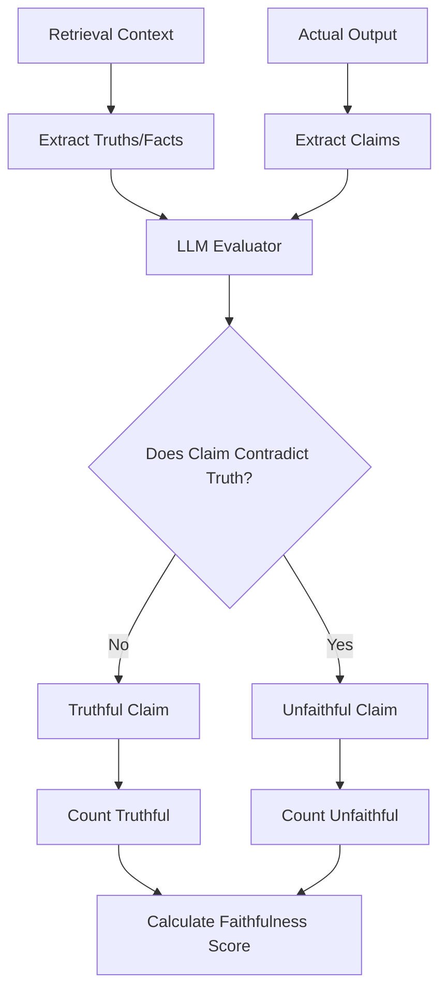
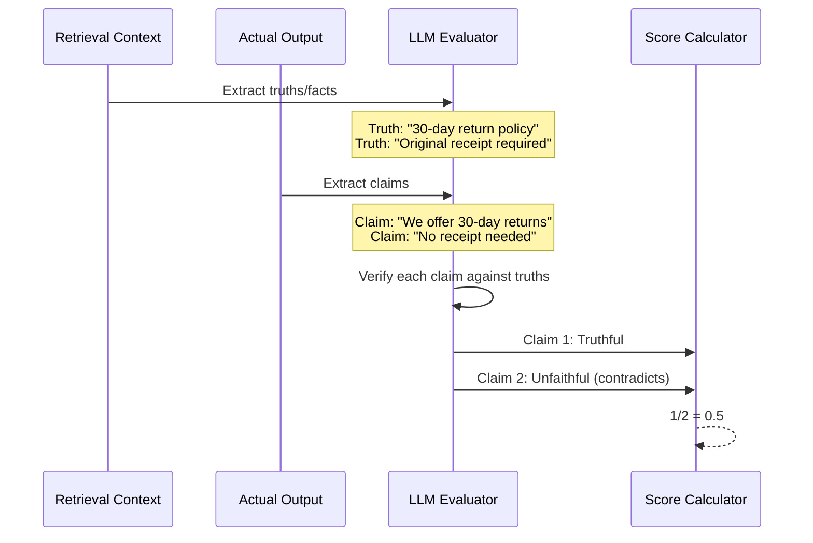
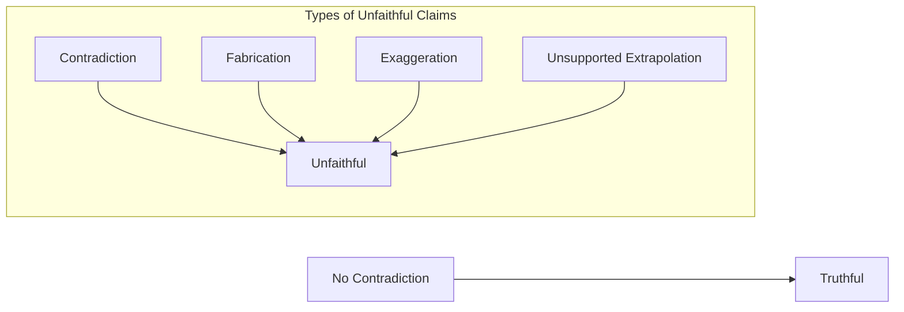

# Faithfulness Metric

## 1. Definition & Purpose

### What It Measures

The **Faithfulness** metric uses LLM-as-a-judge to measure the quality of your RAG pipeline's generator by evaluating whether the `actual_output` factually aligns with the contents of your `retrieval_context`. It detects hallucinations - claims made by the LLM that are not supported by the retrieved documents.

### Why It Matters

Faithfulness is critical for:

- **Hallucination detection**: Identifying when the model makes up information
- **Factual accuracy**: Ensuring responses are grounded in retrieved context
- **Trust and reliability**: Building user confidence in the system
- **RAG quality assurance**: Validating the generation step works correctly

### When to Use This Metric

- **RAG applications**: Any system that retrieves and generates based on documents
- **Knowledge base Q&A**: Where accuracy based on sources is critical
- **Customer support**: Ensuring policy-based responses are correct
- **Legal/medical applications**: Where factual accuracy is paramount

## 2. Key Characteristics

| Property | Value |
|----------|-------|
| **Metric Type** | LLM-as-a-judge |
| **Evaluation Mode** | Single-turn |
| **Reference Required** | Yes (retrieval_context) |
| **Score Range** | 0.0 to 1.0 |
| **Primary Use Case** | RAG Generator Evaluation |
| **Multimodal Support** | Yes |

### Required Arguments

When creating an `LLMTestCase`:

| Argument | Type | Description |
|----------|------|-------------|
| `input` | str | The user's question or query |
| `actual_output` | str | The LLM's generated response |
| `retrieval_context` | List[str] | Retrieved documents/chunks |

### Optional Parameters

| Parameter | Type | Default | Description |
|-----------|------|---------|-------------|
| `threshold` | float | 0.5 | Minimum passing score |
| `model` | str/DeepEvalBaseLLM | gpt-4.1 | LLM for evaluation |
| `include_reason` | bool | True | Include explanation for score |
| `strict_mode` | bool | False | Binary scoring (0 or 1) |
| `async_mode` | bool | True | Enable concurrent execution |
| `verbose_mode` | bool | False | Print intermediate steps |
| `truths_extraction_limit` | int | None | Max truths to extract from context |
| `penalize_ambiguous_claims` | bool | False | Penalize unverifiable claims |
| `evaluation_template` | FaithfulnessTemplate | Default | Custom prompt template |

## 3. Conceptual Visualization

### Evaluation Flow



### Claim Verification Process



### What Counts as Unfaithful



## 4. Measurement Formula

### Core Formula

```
Faithfulness = Number of Truthful Claims / Total Number of Claims
```

### Key Definition

**A claim is considered truthful if it does NOT contradict any facts** presented in the `retrieval_context`. This means:
- Claims can be truthful even if not explicitly stated (as long as they don't contradict)
- Claims that contradict the context are unfaithful
- With `penalize_ambiguous_claims=True`, ambiguous claims count as unfaithful

### Evaluation Process

1. **Truth Extraction**: Extract factual statements from `retrieval_context`
2. **Claim Generation**: Extract claims made in `actual_output`
3. **Verdict Evaluation**: Check if each claim contradicts extracted truths
4. **Score Calculation**: Ratio of truthful claims to total claims

### Scoring Rubric

| Score Range | Interpretation |
|-------------|----------------|
| 0.9 - 1.0 | Excellent - All claims grounded in context |
| 0.7 - 0.9 | Good - Minor unsupported claims |
| 0.5 - 0.7 | Fair - Some hallucinations detected |
| 0.3 - 0.5 | Poor - Significant hallucinations |
| 0.0 - 0.3 | Critical - Mostly unfaithful to context |

## 5. Usage Examples

### Basic Usage

```python
from deepeval import evaluate
from deepeval.test_case import LLMTestCase
from deepeval.metrics import FaithfulnessMetric

actual_output = "We offer a 30-day full refund at no extra cost."

retrieval_context = [
    "All customers are eligible for a 30 day full refund at no extra cost."
]

metric = FaithfulnessMetric(
    threshold=0.7,
    model="gpt-4.1",
    include_reason=True
)

test_case = LLMTestCase(
    input="What if these shoes don't fit?",
    actual_output=actual_output,
    retrieval_context=retrieval_context
)

evaluate(test_cases=[test_case], metrics=[metric])
```

### Standalone Measurement

```python
metric = FaithfulnessMetric(
    threshold=0.7,
    include_reason=True,
    verbose_mode=True,
    truths_extraction_limit=10,
    penalize_ambiguous_claims=True,
)

metric.measure(test_case)
print(f"Score: {metric.score}")
print(f"Reason: {metric.reason}")
```

## 6. Example Scenarios

### Scenario 1: Fully Faithful (Score ~1.0)

```python
test_case = LLMTestCase(
    input="What's the return policy?",
    actual_output="You can return items within 30 days for a full refund with the original receipt.",
    retrieval_context=[
        "Return Policy: Full refund within 30 days with original receipt. Items must be unused."
    ]
)
# All claims are supported by the context
```

### Scenario 2: Hallucination (Score ~0.3)

```python
test_case = LLMTestCase(
    input="What's the return policy?",
    actual_output="You can return items within 90 days, no receipt needed, and we'll give you store credit plus a 10% bonus.",
    retrieval_context=[
        "Return Policy: Full refund within 30 days with original receipt. Items must be unused."
    ]
)
# Multiple hallucinated claims: 90 days (vs 30), no receipt (vs required), 10% bonus (fabricated)
```

### Scenario 3: Partial Faithfulness (Score ~0.6)

```python
test_case = LLMTestCase(
    input="Tell me about the warranty.",
    actual_output="The product has a 2-year warranty covering defects. We also offer free repairs for life.",
    retrieval_context=[
        "Warranty: 2-year limited warranty covers manufacturing defects. Does not cover accidental damage."
    ]
)
# First claim faithful, "free repairs for life" is hallucinated
```

## 7. Best Practices

### Do's

- **Provide comprehensive context**: Include all relevant information in retrieval_context
- **Use `truths_extraction_limit`**: For large contexts, limit to most important truths
- **Enable `penalize_ambiguous_claims`**: When strict accuracy is required
- **Combine with other metrics**: Use with Answer Relevancy and Contextual metrics

### Don'ts

- **Don't skip retrieval_context**: The metric requires context to evaluate against
- **Don't ignore low scores**: They indicate generation issues that need fixing
- **Don't confuse with relevancy**: Faithful doesn't mean relevant, and vice versa

### Improving Faithfulness Scores

1. **Better prompting**: Instruct model to only use provided context
2. **Citation requirements**: Ask model to cite sources for claims
3. **Confidence thresholds**: Have model express uncertainty when context is insufficient
4. **Retrieval quality**: Ensure comprehensive, relevant context is retrieved

## 8. Comparison with Other Metrics

| Metric | What It Checks | Key Difference |
|--------|---------------|----------------|
| Faithfulness | Claims don't contradict context | Focuses on hallucination |
| Answer Relevancy | Response addresses the input | Doesn't require context |
| Contextual Relevancy | Context is relevant to input | Evaluates retriever, not generator |

## 9. API Reference

### FaithfulnessMetric

```python
from deepeval.metrics import FaithfulnessMetric

metric = FaithfulnessMetric(
    threshold=0.5,                    # Minimum passing score
    model="gpt-4.1",                  # Evaluation model
    include_reason=True,              # Include explanation
    strict_mode=False,                # Binary scoring
    async_mode=True,                  # Concurrent execution
    verbose_mode=False,               # Detailed logging
    truths_extraction_limit=None,     # Limit truths per document
    penalize_ambiguous_claims=False,  # Penalize unverifiable claims
    evaluation_template=None,         # Custom prompts
)
```

### LLMTestCase for Faithfulness

```python
from deepeval.test_case import LLMTestCase

test_case = LLMTestCase(
    input="User's question",
    actual_output="LLM's response",
    retrieval_context=["Document 1 content", "Document 2 content"]
)
```

## 10. References

- [DeepEval Faithfulness Documentation](https://deepeval.com/docs/metrics-faithfulness)
- [LLMTestCase Documentation](https://deepeval.com/docs/evaluation-test-cases)
- [RAG Evaluation Guide](https://deepeval.com/docs/guides-rag-evaluation)
