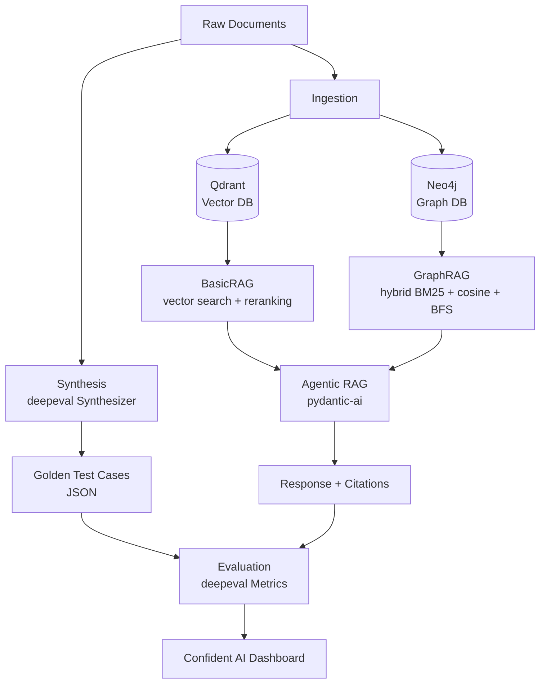

# newbieAR — Newbie Agentic RAG

> An end-to-end pipeline for building, evaluating, and improving a Retrieval-Augmented Generation system.


---

## Overview

**newbieAR** is a self-contained RAG research platform that covers every stage of the RAG lifecycle: document ingestion into both a vector store and a knowledge graph, hybrid retrieval, an agentic layer with tool-calling, synthetic test-case generation, and automated metric-based evaluation. It is designed to be a hands-on learning project and a starting point for experimenting with modern RAG architectures — combining dense vector search (Qdrant) with graph-based retrieval (Neo4j via Graphiti), orchestrated by a [pydantic-ai](https://github.com/pydantic/pydantic-ai) agent and evaluated with [deepeval](https://github.com/confident-ai/deepeval).

---

## Pipeline Architecture



---

## Project Structure

```
newbieAR/
├── src/
│   ├── agents/          # pydantic-ai agentic RAG (agent, tools, deps)
│   ├── deps/            # infra clients: Qdrant, Graphiti, OpenAI, CrossEncoder, MinIO
│   ├── evaluation/      # deepeval metrics runner + Bedrock wrapper
│   ├── ingestion/       # vector DB and graph DB ingestion pipelines
│   ├── models/          # pydantic data models (ChunkInfo, RetrievalInfo, etc.)
│   ├── prompts/         # system prompts and generation templates
│   ├── retrieval/       # BasicRAG and GraphRAG implementations
│   ├── synthesis/       # deepeval Synthesizer + golden test case generation
│   └── settings.py      # ProjectSettings singleton (pydantic-settings)
├── infras/
│   ├── docker-compose.qdrant.yaml
│   ├── docker-compose.neo4j.yaml
│   └── docker-compose.minio.yaml
├── tests/               # pytest test suite (asyncio_mode = auto)
├── scripts/             # convenience shell scripts
├── data/                # documents, goldens (git-ignored)
└── pyproject.toml
```

---

## Prerequisites

- **Python** `>= 3.12`
- **[uv](https://docs.astral.sh/uv/)** — the only supported package manager
- **Docker** — for Qdrant, Neo4j, and MinIO
- **API keys** — OpenAI-compatible LLM + embedding endpoint, AWS credentials (Bedrock), deepeval Confident AI key, Langfuse (optional)

---

## Quick Start

```bash
# 1. Clone the repo
git clone https://github.com/your-username/newbieAR.git
cd newbieAR

# 2. Install dependencies
uv sync

# 3. Configure environment
cp .env.example .env
# Fill in all required values — see Configuration section below

# 4. Start infrastructure
docker compose -f infras/docker-compose.qdrant.yaml up -d
docker compose -f infras/docker-compose.neo4j.yaml up -d

# 5. Ingest documents
uv run python -m src.ingestion.ingest_vectordb \
  --file_path data/papers/files/docling.pdf \
  --collection_name research_papers \
  --chunk_strategy hybrid

# 6. Ask a question
uv run python -m src.agents.agentic_rag \
  --collection_name research_papers --top_k 5
```

---

## Infrastructure

| Service | Compose file | Ports | Purpose |
|---------|-------------|-------|---------|
| **Qdrant** | `docker-compose.qdrant.yaml` | 6333, 6334 | Vector store for dense retrieval |
| **Neo4j** | `docker-compose.neo4j.yaml` | 7474, 7687 | Graph DB for Graphiti knowledge graph |
| **MinIO** | `docker-compose.minio.yaml` | 9000, 9001 | Object storage (optional) |

```bash
# Start all services
docker compose -f infras/docker-compose.qdrant.yaml up -d
docker compose -f infras/docker-compose.neo4j.yaml up -d
docker compose -f infras/docker-compose.minio.yaml up -d

# Stop all services
docker compose -f infras/docker-compose.qdrant.yaml down
docker compose -f infras/docker-compose.neo4j.yaml down
docker compose -f infras/docker-compose.minio.yaml down
```

---

## Usage

### 1. Ingest — Vector DB

Loads a document, chunks it, embeds, and upserts to Qdrant.

```bash
uv run python -m src.ingestion.ingest_vectordb \
  --file_path data/papers/files/docling.pdf \
  --collection_name research_papers \
  --chunk_strategy hybrid        # hybrid (default) or hierarchical
```

### 2. Ingest — Graph DB

Loads a document and adds episodes to Neo4j via Graphiti.

```bash
uv run python -m src.ingestion.ingest_graphdb \
  --file_path data/papers/files/docling.pdf
```

### 3. Retrieve — BasicRAG (interactive CLI)

Dense vector search with optional score-threshold filtering and cross-encoder reranking.

```bash
uv run python -m src.retrieval.basic_rag \
  --qdrant_collection_name research_papers \
  --top_k 10
```

### 4. Retrieve — GraphRAG (interactive CLI)

Hybrid BM25 + cosine similarity + BFS over the knowledge graph, reranked with RRF.

```bash
uv run python -m src.retrieval.graph_rag
```

### 5. Agentic RAG (streaming, multi-turn)

A pydantic-ai agent with two tools: `search_basic_rag` and `search_graphiti`. Streams responses to the terminal with context and citation display.

```bash
uv run python -m src.agents.agentic_rag \
  --collection_name research_papers \
  --top_k 5
```

### 6. Synthesize Golden Test Cases

Generates `(input, expected_output, context)` test cases from documents using deepeval's `Synthesizer` backed by AWS Bedrock.

```bash
uv run python -m src.synthesis.synthesize \
  --topic paper \                        # paper or article
  --file_dir data/papers/files \
  --output_dir data/goldens
```

### 7. Evaluate

Runs deepeval metrics against goldens and writes scores back to the JSON files. Results are also logged to Confident AI.

```bash
uv run python -m src.evaluation.evaluate \
  --file_dir data/goldens \
  --retrieval_window_size 5 \
  --collection_name research_papers \
  --threshold 0.5
```

**Metrics evaluated:**
- `AnswerRelevancy`
- `Faithfulness`
- `ContextualPrecision`
- `ContextualRecall`
- `ContextualRelevancy`

---

## Running Tests

```bash
uv sync --extra test

uv run pytest tests/                                          # all tests
uv run pytest tests/retrieval/test_basic_rag.py              # single file
uv run pytest tests/agents/test_agentic_rag_tools.py -v      # verbose
```

`asyncio_mode = "auto"` is set in `pyproject.toml` — async test functions work without decorators.

---

## Configuration

Copy `.env.example` to `.env` and fill in the values below.

| Variable | Group | Description |
|----------|-------|-------------|
| `LLM_MODEL` | LLM | Model name for generation |
| `LLM_API_KEY` | LLM | API key for OpenAI-compatible endpoint |
| `LLM_BASE_URL` | LLM | Base URL for OpenAI-compatible endpoint |
| `EMBEDDING_MODEL` | Embedding | Embedding model name |
| `EMBEDDING_API_KEY` | Embedding | API key for embedding endpoint |
| `EMBEDDING_BASE_URL` | Embedding | Base URL for embedding endpoint |
| `EMBEDDING_DIMENSIONS` | Embedding | Vector dimensionality |
| `QDRANT_URI` | Qdrant | Qdrant server URI (e.g. `http://localhost:6333`) |
| `QDRANT_COLLECTION_NAME` | Qdrant | Default collection name |
| `GRAPH_DB_URI` | Neo4j | Neo4j Bolt URI (e.g. `bolt://localhost:7687`) |
| `GRAPH_DB_USERNAME` | Neo4j | Neo4j username |
| `GRAPH_DB_PASSWORD` | Neo4j | Neo4j password |
| `AWS_ACCESS_KEY_ID` | AWS Bedrock | AWS access key |
| `AWS_SECRET_ACCESS_KEY` | AWS Bedrock | AWS secret key |
| `CRITIQUE_MODEL_NAME` | AWS Bedrock | Bedrock model ID for synthesis/eval |
| `CRITIQUE_MODEL_REGION_NAME` | AWS Bedrock | AWS region (e.g. `us-east-1`) |
| `CONFIDENT_API_KEY` | deepeval | Confident AI API key for result logging |
| `LANGFUSE_PUBLIC_KEY` | Langfuse | Langfuse public key (observability) |
| `LANGFUSE_SECRET_KEY` | Langfuse | Langfuse secret key |
| `LANGFUSE_BASE_URL` | Langfuse | Langfuse server URL |

---

## Tech Stack

| Library | Role |
|---------|------|
| [pydantic-ai](https://github.com/pydantic/pydantic-ai) | Agentic RAG orchestration and tool calling |
| [deepeval](https://github.com/confident-ai/deepeval) | Synthetic data generation and RAG evaluation |
| [Qdrant](https://qdrant.tech/) | Vector database for dense retrieval |
| [Graphiti](https://github.com/getzep/graphiti) | Knowledge graph construction and retrieval over Neo4j |
| [docling](https://github.com/DS4SD/docling) | Document loading and conversion |
| [sentence-transformers](https://www.sbert.net/) | Cross-encoder reranking |
| [loguru](https://github.com/Delgan/loguru) | Structured logging |
| [pydantic-settings](https://docs.pydantic.dev/latest/concepts/pydantic_settings/) | Settings management from `.env` |
| [uv](https://docs.astral.sh/uv/) | Package and environment management |

---

## Contributing

1. Fork the repository and create a feature branch: `git checkout -b features/my-feature`
2. Make your changes and add tests where appropriate
3. Open a pull request with a clear description of what changed and why

---

## License

MIT License — see [LICENSE](LICENSE) for details.
