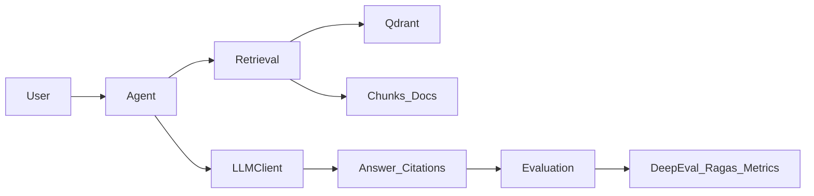

# NewbieAR – Newbie Agentic RAG

NewbieAR is a minimal, agentic Retrieval-Augmented Generation (RAG) system for experimenting with **retrieval**, **agents**, **answer synthesis**, and **evaluation** on your own document collections.  
It combines a Qdrant-based vector store, LLM-powered synthesis, and DeepEval-based evaluation over golden datasets so you can quickly prototype and assess RAG behavior.

### Core Pillars

- **Retrieval**: Semantic search over chunked documents in Qdrant, with configurable `top_k` and collection names.
- **Agents**: Interactive agents that orchestrate retrieval and reasoning using `pydantic-ai` and an OpenAI-compatible chat model.
- **Synthesis**: LLM-based answer generation with rich prompts and optional citations from retrieved chunks.
- **Evaluation**: Automated quality checks on RAG outputs using DeepEval (and optionally Ragas) over JSON golden files.

---

### Features (RAG & Evaluation Focus)

- **Basic RAG retrieval**:  
  Backed by `QdrantVectorStore` and `OpenAIEmbedding` in `BasicRAG`, with a simple CLI loop for inspecting retrieved chunks and answers.
- **Agentic RAG console**:  
  A conversational `BasicRAG` agent (`agentic_basic_rag.py`) that uses tools to search your collection and stream Markdown answers.
- **End-to-end evaluation with DeepEval**:  
  Metrics such as answer relevancy, faithfulness, contextual precision/recall/relevancy via `src/evaluation/evaluate.py`.
- **Golden-based workflows**:  
  JSON goldens in `data/goldens/` drive consistent evaluation runs and enable regression-style RAG testing.

---

### Quickstart (Minimal, RAG-First)

- **Install**
  - Create a virtual environment and install NewbieAR:
    - `python -m venv .venv && source .venv/bin/activate`
    - `pip install -e .`

- **Configure LLM & Qdrant**
  - Export the minimum required environment variables (see `src/settings.py` for full list):
    - `OPENAI_API_KEY` (or your OpenAI-compatible key)
    - `LLM_BASE_URL` (if using a non-default OpenAI-compatible endpoint)
    - `QDRANT_URI` and `QDRANT_API_KEY`
    - `QDRANT_COLLECTION_NAME` (default can be set in `settings.qdrant_collection_name`)

- **Load or ingest example data**
  - Place your PDFs/Markdowns under a documents directory, e.g. `data/research_papers/files/`.
  - Use the `newbieAR` class in `src/main.py` to ingest:
    - Initialize:
      - `from src.main import newbieAR`
      - `app = newbieAR(documents_dir="data/research_papers/files", chunks_dir="data/research_papers/chunks", qdrant_collection_name="research-papers")`
    - Ingest:
      - `app.ingest_files([...])` or `app.ingest_file("path/to/file.pdf")`

- **Run a basic agentic RAG query (console agent)**
  - Start the conversational BasicRAG agent:
    - `python -m src.agents.agentic_basic_rag --collection_name research-papers --top_k 5`
  - Type your question when prompted; the agent will:
    - Retrieve top-k chunks from Qdrant
    - Stream a synthesized Markdown answer in the terminal

- **Run the low-level BasicRAG CLI**
  - For a lower-level view of retrieval and synthesis:
    - `python -m src.retrieval.basic_rag --collection_name research-papers --top_k 10`
  - Enter a question and inspect retrieved chunks + answer panels.

---

### Architecture Overview (Retrieval–Agent–Synthesis–Evaluation Loop)

- **Retrieval** (`src/retrieval/basic_rag.py`): wraps Qdrant + embeddings and exposes `retrieve` and `generate`.
- **Agents** (`src/agents/agentic_basic_rag.py`): interactive agent that calls retrieval via a tool and streams Markdown responses.
- **Synthesis** (inside `BasicRAG.generate`): builds a RAG prompt, calls the LLM client, and formats responses.
- **Evaluation** (`src/evaluation/evaluate.py`): loads goldens, runs RAG calls, and computes DeepEval metrics.

---

### Retrieval

- **BasicRAG core**
  - Implemented in `src/retrieval/basic_rag.py`.
  - Uses:
    - `QdrantVectorStore` for vector search (configured via `settings.qdrant_uri`, `settings.qdrant_api_key`).
    - `OpenAIEmbedding` for encoding queries.
    - `OpenAILLMClient` for answer generation.

- **APIs**
  - `BasicRAG.retrieve(query: str, top_k: int = 5) -> list[RetrievalInfo]`  
    Returns scored `RetrievalInfo` objects containing `content`, `source`, and similarity score.
  - `BasicRAG.generate(query: str, top_k: int = 5, return_context: bool = False)`  
    - If `return_context=True`, returns `(retrieval_infos, answer)`.  
    - Otherwise returns just the synthesized answer string.

- **Example (Python)**
  - `from src.retrieval.basic_rag import BasicRAG`
  - `rag = BasicRAG(qdrant_collection_name="research-papers")`
  - `infos, answer = rag.generate("What is DeepEval?", top_k=5, return_context=True)`

---

### Agents

- **BasicRAG agent (`agentic_basic_rag.py`)**
  - Built with `pydantic_ai.Agent` and an OpenAI-compatible chat model (`get_openai_model`).
  - Registers a tool `search_basic_rag` that:
    - Validates the user query
    - Calls `BasicRAG.generate(..., return_context=True)`
    - Returns both retrieval infos and answer to the agent.
  - Provides a console loop with streaming Markdown answers using `rich`.

- **Running the agent**
  - CLI:
    - `python -m src.agents.agentic_basic_rag --collection_name research-papers --top_k 5`
  - In the session:
    - Ask questions like “Explain the DeepEval evaluation pipeline” or “What metrics are available?”.

- **Extending agents**
  - You can:
    - Add more tools to the agent for alternate retrieval strategies.
    - Change the system prompt in `src/prompts/basic_rag_instruction.py`.
    - Swap in a different model via `settings.llm_model`.

---

### Synthesis (Answer Generation)

- **Where synthesis happens**
  - Implemented inside `BasicRAG.generate`:
    - Builds a `context` string from `RetrievalInfo` objects.
    - Formats the final prompt using `RAG_GENERATION_PROMPT` from `src/prompts/generation.py` (imported in `basic_rag.py` as `RAG_GENERATION_PROMPT`).
    - Calls `OpenAILLMClient.chat_completion` with configured temperature and max tokens from `settings`.

- **Configuring synthesis**
  - In `src/settings.py`, adjust:
    - `llm_model`, `llm_base_url`, `llm_api_key`
    - `llm_temperature`, `llm_max_tokens`
  - To change prompt structure, update `RAG_GENERATION_PROMPT` in the prompts module.

---

### Evaluation (DeepEval & Ragas)

- **DeepEval integration**
  - Implemented in `src/evaluation/evaluate.py`:
    - Logs into DeepEval using `settings.confident_api_key`.
    - Creates metrics via `create_metrics`, wrapping:
      - `AnswerRelevancyMetric`
      - `FaithfulnessMetric`
      - `ContextualPrecisionMetric`
      - `ContextualRecallMetric`
      - `ContextualRelevancyMetric`
    - Uses `BedrockLLMWrapper` as the critique model for scoring.

- **Golden test cases**
  - JSON files under `data/goldens/*/*.json` define:
    - `input` (question)
    - `expectedOutput` (reference answer)
    - `context` and `additionalMetadata`
  - `create_llm_test_case`:
    - Loads each golden.
    - Calls `BasicRAG.generate` to get `actual_output` and `retrieval_context`.
    - Writes results and metrics back into the JSON.

- **Running evaluation**
  - CLI:
    - `python -m src.evaluation.evaluate --file_dir data/goldens/Albert_Einstein --retrieval_window_size 5 --collection_name research-papers --threshold 0.5 --include_reason --async_mode`
  - After running:
    - Each JSON will contain `actual_output`, `retrieval_contexts`, and a `metrics` block with scores, reasons, verdicts, and token usage.

- **Ragas**
  - Ragas can be added as complementary metrics (e.g. for context quality), but DeepEval is the primary evaluation driver in this project.

---

### Data & Configuration

- **Data layout**
  - `data/research_papers/files/`: raw PDFs and other document files.
  - `data/research_papers/chunks/`: precomputed text chunks used for vectorization.
  - `data/wikipedia/`: Wikipedia documents and chunks.
  - `data/goldens/`: golden JSONs grouped by dataset (e.g. `Albert_Einstein/`, `deepseek-ocrv2/`, `docling/`).

- **Key configuration knobs** (see `src/settings.py`)
  - **LLM**
    - `llm_model`, `llm_base_url`, `llm_api_key`, `llm_temperature`, `llm_max_tokens`
  - **Embeddings**
    - `embedding_model`, `embedding_base_url`, `embedding_api_key`
  - **Vector DB (Qdrant)**
    - `qdrant_uri`, `qdrant_api_key`, `qdrant_collection_name`
  - **Evaluation**
    - `confident_api_key`, `critique_model_name`, `critique_model_region_name`

---

### Extending NewbieAR

- **Add a new retriever**
  - Implement a new class in `src/retrieval/` that:
    - Uses a different vector store or hybrid signals.
    - Exposes a similar `retrieve`/`generate` interface for easy agent reuse.

- **Add a new agent**
  - Create a new agent module in `src/agents/`:
    - Wire it to your retriever(s) via tools.
    - Customize prompts and conversation behavior using `pydantic_ai`.

- **Add a new evaluation metric**
  - Implement a new `BaseMetricWrapper` in `src/evaluation/` that wraps a DeepEval or custom metric.
  - Register it in `create_metrics` and rerun `src/evaluation/evaluate.py` over your golden sets.

NewbieAR is designed to stay small and hackable—use it as a playground for iterating on retrieval strategies, agent behaviors, synthesis prompts, and evaluation metrics.
